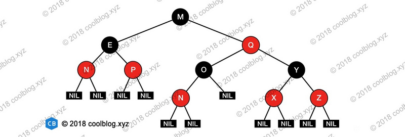

#### TreeMap

TreeMap是Map接口基于红黑树的实现，键值对是有序的。

TreeMap是基于NavigableMap的红黑树实现。TreeMap根据键的自然顺序进行排序，或者根据创建map时提供的Comparator进行排序，使用哪种取决于使用的哪个构造方法。

TreeMap提供时间复杂度为log(n)的containsKey，get，put ，remove操作。

```
public class TreeMap<K,V> extends AbstractMap<K,V> implements NavigableMap<K,V>, Cloneable, java.io.Serializable
```

**红黑树**

红黑树又称红-黑二叉树，它首先是一颗二叉树，它具体二叉树所有的特性。同时红黑树更是一颗自平衡的排序二叉树。

我们知道一颗基本的查找二叉树他们都需要满足一个基本性质--即树中的任何节点的值大于它的左子节点，且小于它的右子节点。按照这个基本性质使得树的检索效率大大提高。

我们知道在生成二叉树的过程是非常容易失衡的，最坏的情况就是一边倒（只有右/左子树），这样势必会导致二叉树的检索效率大大降低（O(n)），所以为了维持二叉树的平衡，大牛们提出了各种实现的算法，如：AVL，SBT，伸展树，TREAP ，红黑树等等。

> AVL树是最先发明的自平衡二叉查找树，在AVL树中任何节点的两个子树的高度最大差别为1，所以它也被称为高度平衡树。增加和删除可能需要通过一次或多次树旋转来重新平衡这个树。AVL树得名于它的发明者G. M. Adelson-Velsky和E. M. Landis

平衡二叉树必须具备如下特性：它是一棵空树或它的左右两个子树的高度差的绝对值不超过1，并且左右两个子树都是一棵平衡二叉树。也就是说该二叉树的任何一个子节点，其左右子树的高度都相近。

红黑树顾名思义就是节点是红色或者黑色的平衡二叉树，它通过颜色的约束来维持着二叉树的平衡。对于一棵有效的红黑树二叉树而言我们必须增加如下规则：
```
节点分为红色或者黑色；
根节点必为黑色；
叶子节点都为黑色，且为null；
连接红色节点的两个子节点都为黑色（红黑树不会出现相邻的红色节点）；
从任意节点出发，到其每个叶子节点的路径中包含相同数量的黑色节点；
新加入到红黑树的节点为红色节点；
```


这些约束强制了红黑树的关键性质:
> 从根到叶子的最长的可能路径不多于最短的可能路径的两倍长。结果是这棵树大致上是平衡的。因为操作比如插入. 删除和查找某个值的最坏情况时间都要求与树的高度成比例，这个在高度上的理论上限允许红黑树在最坏情况下都是高效的，而不同于普通的二叉查找树。所以红黑树它是复杂而高效的，其检索效率O(log n)。下图为一颗典型的红黑二叉树。

**对于红黑二叉树而言它主要包括三大基本操作：左旋. 右旋. 着色。**


左旋：父节点变左节点，左节点变左节点的右节点 ——> 左左右右
右旋：左节点变父节点，父节点的右节点变本节点的左节点 -》 左右左

新节点的插入有如下三个关键地方：
```
插入新节点总是红色节点 。
如果插入节点的父节点是黑色, 能维持性质 。
如果插入节点的父节点是红色, 破坏了性质. 故插入算法就是通过重新着色或旋转, 来维持性质 。
```
