#### HashMap

JDK 1.8 对 HashMap 进行了比较大的优化，底层实现由之前的 “数组+链表” 改为 “数组+链表+红黑树”,当链表节点较少时仍然是以链表存在，当链表节点较多时（大于8）会转为红黑树。

**为什么说HashMap不是线程安全的？**

- jdk1.7 扩容时采用头插法，会造成闭环，cpu占用率百分百问题。(https://blog.csdn.net/loveliness_peri/article/details/81092360)

- jdk1.8,hashmap采用了尾插法，不存在这种循环带来的问题，但是在put的时候，由于put的动作不是原子性的，线程A在计算好链表位置后，挂起，线程B正常执行put操作，之后线程A恢复，会直接替换掉线程b put的值，**导致数据丢失**，所以依然不是线程安全的


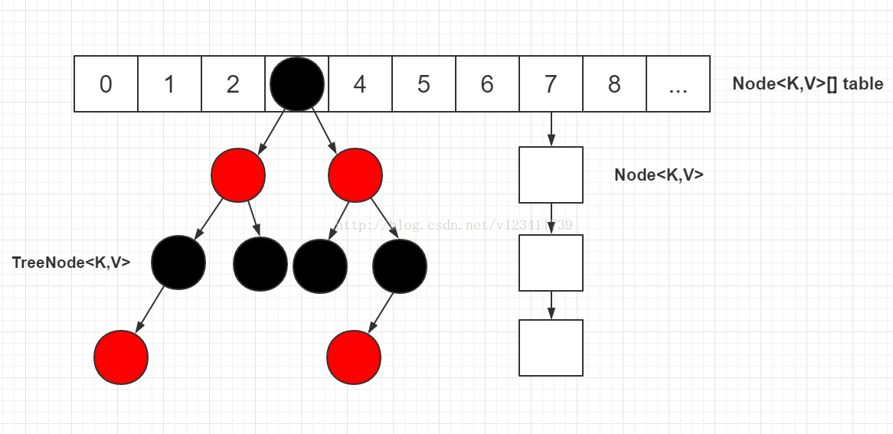

> HashMap的构造函数只是设置属性，并没有初始化数组，在放入第一个元素的时候才正式初始化。

1、本文中头节点指的是 table 表上索引位置的节点，也就是 **链表** 的头节点。

2、根节点（root 节点）指的是 **红黑树** 最上面的那个节点，也就是没有父节点的节点。

3、红黑树的根节点不一定是索引位置的头节点（也就是链表的头节点），HashMap 通过 moveRootToFront 方法来维持红黑树的根结点就是索引位置的头结点，但是在 removeTreeNode 方法中，当 movable 为 false 时，不会调用 moveRootToFront 方法，此时红黑树的根节点不一定是索引位置的头节点，该场景发生在 HashIterator 的 remove 方法中。

4、**转为红黑树节点后，链表的结构还存在，通过 next 属性维持，红黑树节点在进行操作时都会维护链表的结构，并不是转为红黑树节点，链表结构就不存在了。**

5、在红黑树上，叶子节点也可能有 next 节点，因为红黑树的结构跟链表的结构是互不影响的，不会因为是叶子节点就说该节点已经没有 next 节点。

6、源码中一些变量定义：如果定义了一个节点 p，则 pl（p left）为 p 的左节点，pr（p right）为 p 的右节点，pp（p parent）为 p 的父节点，ph（p hash）为 p 的 hash 值，pk（p key）为 p 的 key 值，kc（key class）为 key 的类等等。源码中很喜欢在 if/for 等语句中进行赋值并判断。

7、链表中移除一个节点只需如下图操作，其他操作同理。

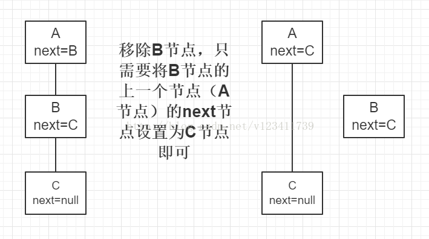

8、红黑树在维护链表结构时，移除一个节点只需如下图操作（红黑树中增加了一个 prev 属性），其他操作同理。注：此处只是红黑树维护链表结构的操作，红黑树还需要单独进行红黑树的移除或者其他操作。

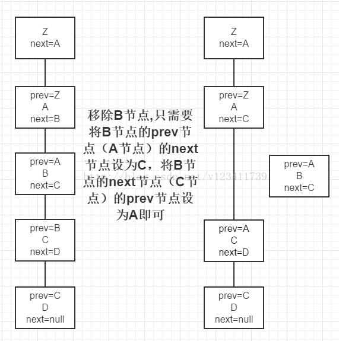

9、源码中进行红黑树的查找时，会反复用到以下两条规则：1）如果目标节点的 hash 值小于 p 节点的 hash 值，则向 p 节点的左边遍历；否则向 p 节点的右边遍历。2）如果目标节点的 key 值小于 p 节点的 key 值，则向 p 节点的左边遍历；否则向 p 节点的右边遍历。这两条规则是利用了红黑树的特性（左节点 < 根节点 < 右节点）。

10、源码中进行红黑树的查找时，会用 dir（direction）来表示向左还是向右查找，dir 存储的值是目标节点的 hash/key 与 p 节点的 hash/key 的比较结果。

```
// 默认容量16
static final int DEFAULT_INITIAL_CAPACITY = 1 << 4;

// 最大容量
static final int MAXIMUM_CAPACITY = 1 << 30;    

// 默认负载因子0.75
static final float DEFAULT_LOAD_FACTOR = 0.75f;

// 链表节点转换红黑树节点的阈值, 9个节点转
static final int TREEIFY_THRESHOLD = 8;

// 红黑树节点转换链表节点的阈值, 6个节点转
static final int UNTREEIFY_THRESHOLD = 6;   

// 转红黑树时, table的最小长度
static final int MIN_TREEIFY_CAPACITY = 64;

// 链表节点, 继承自Entry
static class Node<K,V> implements Map.Entry<K,V> {  
    final int hash;
    final K key;
    V value;
    Node<K,V> next;

    // ... ...
}

// 红黑树节点
static final class TreeNode<K,V> extends LinkedHashMap.Entry<K,V> {
    TreeNode<K,V> parent;  // red-black tree links
    TreeNode<K,V> left;
    TreeNode<K,V> right;
    TreeNode<K,V> prev;    // needed to unlink next upon deletion
    boolean red;

    // ...
}
```

**MIN_TREEIFY_CAPACITY**

当链表长度> TREEIFY_THRESHOLD的时候需要树化，但这个时候还要再加个判断才能确定是否树化，如果table.length > MIN_TREEIFY_CAPACITY，直接树化，否则直接扩容。table 指的是存储链表头节点的数组。

红黑树节点TreeNode继承了LinkedHashMap.Entry，而LinkedHashMap.Entry又继承了HashMap的静态内部类

```
/**
     * HashMap.Node subclass for normal LinkedHashMap entries.
     */
    static class Entry<K,V> extends HashMap.Node<K,V> {
        Entry<K,V> before, after;
        Entry(int hash, K key, V value, Node<K,V> next) {
            super(hash, key, value, next);
        }
    }
```

**定位哈希桶数组索引位置**

不管增加、删除、查找键值对，定位到哈希桶数组的位置都是很关键的第一步。

前面说过 HashMap 的数据结构是“数组+链表+红黑树”的结合，所以我们当然希望这个 HashMap 里面的元素位置尽量分布均匀些，尽量使得每个位置上的元素数量只有一个，那么当我们用 hash 算法求得这个位置的时候，马上就可以知道对应位置的元素就是我们要的，不用遍历链表/红黑树，大大优化了查询的效率。

HashMap 定位数组索引位置，直接决定了 hash 方法的离散性能。
```
// 代码1
static final int hash(Object key) { // 计算key的hash值
    int h;
    // 1.先拿到key的hashCode值; 2.将hashCode的高16位参与运算
    return (key == null) ? 0 : (h = key.hashCode()) ^ (h >>> 16);
}
// 代码2
int n = tab.length;
// 将(tab.length - 1) 与 hash值进行&运算
int index = (n - 1) & hash;
```

整个过程本质上就是三步：

1. 拿到 key 的 hashCode 值
2. 将 hashCode 的高位参与运算，重新计算 hash 值
3. 将计算出来的 hash 值与 (table.length - 1) 进行 & 运算

对于任意给定的对象，只要它的 hashCode() 返回值相同，那么计算得到的 hash 值总是相同的。我们首先想到的就是把 hash 值对 table 长度取模运算，这样一来，元素的分布相对来说是比较均匀的。

**但是模运算消耗还是比较大的**，我们知道计算机比较快的运算为位运算，因此 JDK 团队对取模运算进行了优化，使用上面代码2的位与运算来代替模运算。

这个方法非常巧妙，它通过 “(table.length -1) & h” 来得到该对象的索引位置，这个优化是基于以下公式：
```
x mod 2^n = x & (2^n - 1)
```
**我们知道 HashMap 底层数组的长度总是 2 的 n 次方，并且取模运算为 “h mod table.length”，对应上面的公式，可以得到该运算等同于“h & (table.length - 1)”。这是 HashMap 在速度上的优化，因为 & 比 % 具有更高的效率。**

在 JDK1.8 的实现中，还优化了高位运算的算法，将 hashCode 的高 16 位与 hashCode 进行异或运算，**主要是为了在 table 的 length 较小的时候，让高位也参与运算，并且不会有太大的开销**。

> 比如length=16的时候，n-1=00000000 00001111，如果直接与上key的hash，那这个hash只有低位参与了运算，如果随着map的元素增加，最后得到的索引就不够均匀，所以直接先让hash高低位异或处理，让高低位都参与运算，这样最终得到的索引就会比较均匀。


当 table 长度为 16 时，table.length - 1 = 15 ，用二进制来看，此时低 4 位全是 1，高 28 位全是 0，与 0 进行 & 运算必然为 0，因此此时 hashCode 与 “table.length - 1” 的 & 运算结果只取决于 hashCode 的低 4 位，在这种情况下，hashCode 的高 28 位就没有任何作用，并且由于 hash 结果只取决于 hashCode 的低 4 位，hash 冲突的概率也会增加。因此，在 JDK 1.8 中，将高位也参与计算，目的是为了降低 hash 冲突的概率。

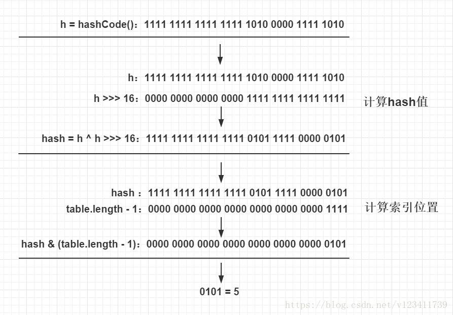

get方法
```
public V get(Object key) {
    Node<K,V> e;
    return (e = getNode(hash(key), key)) == null ? null : e.value;
}

final Node<K,V> getNode(int hash, Object key) {
    Node<K,V>[] tab; Node<K,V> first, e; int n; K k;
    // 1.对table进行校验：table不为空 && table长度大于0 &&
    // table索引位置(使用table.length - 1和hash值进行位与运算)的节点不为空
    if ((tab = table) != null && (n = tab.length) > 0 &&
        (first = tab[(n - 1) & hash]) != null) {
        // 2.检查first节点的hash值和key是否和入参的一样，如果一样则first即为目标节点，直接返回first节点
        if (first.hash == hash && // always check first node
            ((k = first.key) == key || (key != null && key.equals(k))))
            return first;
        // 3.如果first不是目标节点，并且first的next节点不为空则继续遍历
        if ((e = first.next) != null) {
            if (first instanceof TreeNode)
                // 4.如果是红黑树节点，则调用红黑树的查找目标节点方法getTreeNode
                return ((TreeNode<K,V>)first).getTreeNode(hash, key);
            do {
                // 5.执行链表节点的查找，向下遍历链表, 直至找到节点的key和入参的key相等时,返回该节点
                if (e.hash == hash &&
                    ((k = e.key) == key || (key != null && key.equals(k))))
                    return e;
            } while ((e = e.next) != null);
        }
    }
    // 6.找不到符合的返回空
    return null;
}

final TreeNode<K,V> getTreeNode(int h, Object k) {
    // 1.首先找到红黑树的根节点；2.使用根节点调用find方法
    return ((parent != null) ? root() : this).find(h, k, null);
}

找到根节点：即父节点为空的节点，挨个遍历寻找
final TreeNode<K,V> root() {
    for (TreeNode<K,V> r = this, p;;) {
        if ((p = r.parent) == null)
            return r;
        r = p;
    }
}

/**
 * 从调用此方法的节点开始查找, 通过hash值和key找到对应的节点
 * 此方法是红黑树节点的查找, 红黑树是特殊的自平衡二叉查找树
 * 平衡二叉查找树的特点：左节点<根节点<右节点
 */
final TreeNode<K,V> find(int h, Object k, Class<?> kc) {
    // 1.将p节点赋值为调用此方法的节点，即为红黑树根节点
    TreeNode<K,V> p = this;
    // 2.从p节点开始向下遍历
    do {
        int ph, dir; K pk;
        TreeNode<K,V> pl = p.left, pr = p.right, q;
        // 3.如果传入的hash值小于p节点的hash值，则往p节点的左边遍历
        if ((ph = p.hash) > h)
            p = pl;
        else if (ph < h) // 4.如果传入的hash值大于p节点的hash值，则往p节点的右边遍历
            p = pr;
        // 5.如果传入的hash值和key值等于p节点的hash值和key值,则p节点为目标节点,返回p节点
        else if ((pk = p.key) == k || (k != null && k.equals(pk)))
            return p;
        else if (pl == null)    // 6.p节点的左节点为空则将向右遍历
            p = pr;
        else if (pr == null)    // 7.p节点的右节点为空则向左遍历
            p = pl;
        // 8.将p节点与k进行比较
        else if ((kc != null ||
                  (kc = comparableClassFor(k)) != null) && // 8.1 kc不为空代表k实现了Comparable
                 (dir = compareComparables(kc, k, pk)) != 0)// 8.2 k<pk则dir<0, k>pk则dir>0
            // 8.3 k<pk则向左遍历(p赋值为p的左节点), 否则向右遍历
            p = (dir < 0) ? pl : pr;
        // 9.代码走到此处, 代表key所属类没有实现Comparable, 直接指定向p的右边遍历
        else if ((q = pr.find(h, k, kc)) != null)
            return q;
        // 10.代码走到此处代表“pr.find(h, k, kc)”为空, 因此直接向左遍历
        else
            p = pl;
    } while (p != null);
    return null;
}
```

put方法
```
public V put(K key, V value) {
    return putVal(hash(key), key, value, false, true);
}

final V putVal(int hash, K key, V value, boolean onlyIfAbsent,
               boolean evict) {
    Node<K,V>[] tab; Node<K,V> p; int n, i;
    // 1.校验table是否为空或者length等于0，如果是则调用resize方法进行初始化
    if ((tab = table) == null || (n = tab.length) == 0)
        n = (tab = resize()).length;
    // 2.通过hash值计算索引位置，将该索引位置的头节点赋值给p，如果p为空则直接在该索引位置新增一个节点即可
    if ((p = tab[i = (n - 1) & hash]) == null)
        tab[i] = newNode(hash, key, value, null);
    else {
        // table表该索引位置不为空，则进行查找
        Node<K,V> e; K k;
        // 3.判断p节点的key和hash值是否跟传入的相等，如果相等, 则p节点即为要查找的目标节点，将p节点赋值给e节点
        if (p.hash == hash &&
            ((k = p.key) == key || (key != null && key.equals(k))))
            e = p;
        // 4.判断p节点是否为TreeNode, 如果是则调用红黑树的putTreeVal方法查找目标节点
        else if (p instanceof TreeNode)
            e = ((TreeNode<K,V>)p).putTreeVal(this, tab, hash, key, value);
        else {
            // 5.走到这代表p节点为普通链表节点，则调用普通的链表方法进行查找，使用binCount统计链表的节点数
            for (int binCount = 0; ; ++binCount) {
                // 6.如果p的next节点为空时，则代表找不到目标节点，则新增一个节点并插入链表尾部
                if ((e = p.next) == null) {
                    p.next = newNode(hash, key, value, null);
                    // 7.校验节点数是否超过8个，如果超过则调用treeifyBin方法将链表节点转为红黑树节点，
                    // 减一是因为循环是从p节点的下一个节点开始的
                    if (binCount >= TREEIFY_THRESHOLD - 1)
                        treeifyBin(tab, hash);
                    break;
                }
                // 8.如果e节点存在hash值和key值都与传入的相同，则e节点即为目标节点，跳出循环
                if (e.hash == hash &&
                    ((k = e.key) == key || (key != null && key.equals(k))))
                    break;
                p = e;  // 将p指向下一个节点
            }
        }
        // 9.如果e节点不为空，则代表目标节点存在，使用传入的value覆盖该节点的value，并返回oldValue
        if (e != null) {
            V oldValue = e.value;
            if (!onlyIfAbsent || oldValue == null)
                e.value = value;
            afterNodeAccess(e); // 用于LinkedHashMap
            return oldValue;
        }
    }
    ++modCount;
    // 10.如果插入节点后节点数超过阈值，则调用resize方法进行扩容
    if (++size > threshold)
        resize();
    afterNodeInsertion(evict);  // 用于LinkedHashMap
    return null;
}
```
红黑树putTreeVal()
```
/**
 * 红黑树的put操作，红黑树插入会同时维护原来的链表属性, 即原来的next属性
 */
final TreeNode<K,V> putTreeVal(HashMap<K,V> map, Node<K,V>[] tab,
                               int h, K k, V v) {
    Class<?> kc = null;
    boolean searched = false;
    // 1.查找根节点, 索引位置的头节点并不一定为红黑树的根节点
    TreeNode<K,V> root = (parent != null) ? root() : this;
    // 2.将根节点赋值给p节点，开始进行查找
    for (TreeNode<K,V> p = root;;) {
        int dir, ph; K pk;
        // 3.如果传入的hash值小于p节点的hash值，将dir赋值为-1，代表向p的左边查找树
        if ((ph = p.hash) > h)
            dir = -1;
        // 4.如果传入的hash值大于p节点的hash值， 将dir赋值为1，代表向p的右边查找树
        else if (ph < h)
            dir = 1;
        // 5.如果传入的hash值和key值等于p节点的hash值和key值, 则p节点即为目标节点, 返回p节点
        else if ((pk = p.key) == k || (k != null && k.equals(pk)))
            return p;
        // 6.如果k所属的类没有实现Comparable接口 或者 k和p节点的key相等
        else if ((kc == null &&
                  (kc = comparableClassFor(k)) == null) ||
                 (dir = compareComparables(kc, k, pk)) == 0) {
            // 6.1 第一次符合条件, 从p节点的左节点和右节点分别调用find方法进行查找, 如果查找到目标节点则返回
            if (!searched) {
                TreeNode<K,V> q, ch;
                searched = true;
                if (((ch = p.left) != null &&
                     (q = ch.find(h, k, kc)) != null) ||
                    ((ch = p.right) != null &&
                     (q = ch.find(h, k, kc)) != null))
                    return q;
            }
            // 6.2 否则使用定义的一套规则来比较k和p节点的key的大小, 用来决定向左还是向右查找
            dir = tieBreakOrder(k, pk); // dir<0则代表k<pk，则向p左边查找；反之亦然
        }

        TreeNode<K,V> xp = p;   // xp赋值为x的父节点,中间变量,用于下面给x的父节点赋值
        // 7.dir<=0则向p左边查找,否则向p右边查找,如果为null,则代表该位置即为x的目标位置
        if ((p = (dir <= 0) ? p.left : p.right) == null) {
            // 走进来代表已经找到x的位置，只需将x放到该位置即可
            Node<K,V> xpn = xp.next;    // xp的next节点
            // 8.创建新的节点, 其中x的next节点为xpn, 即将x节点插入xp与xpn之间
            TreeNode<K,V> x = map.newTreeNode(h, k, v, xpn);
            // 9.调整x、xp、xpn之间的属性关系
            if (dir <= 0)   // 如果时dir <= 0, 则代表x节点为xp的左节点
                xp.left = x;
            else        // 如果时dir> 0, 则代表x节点为xp的右节点
                xp.right = x;
            xp.next = x;    // 将xp的next节点设置为x
            x.parent = x.prev = xp; // 将x的parent和prev节点设置为xp
            // 如果xpn不为空,则将xpn的prev节点设置为x节点,与上文的x节点的next节点对应
            if (xpn != null)
                ((TreeNode<K,V>)xpn).prev = x;
            // 10.进行红黑树的插入平衡调整
            moveRootToFront(tab, balanceInsertion(root, x));
            return null;
        }
    }
}
```
resize 方法
```
final Node<K,V>[] resize() {
    Node<K,V>[] oldTab = table;
    int oldCap = (oldTab == null) ? 0 : oldTab.length;
    int oldThr = threshold;
    int newCap, newThr = 0;
    // 1.老表的容量不为0，即老表不为空
    if (oldCap > 0) {
        // 1.1 判断老表的容量是否超过最大容量值：如果超过则将阈值设置为Integer.MAX_VALUE，并直接返回老表,
        // 此时oldCap * 2比Integer.MAX_VALUE大，因此无法进行重新分布，只是单纯的将阈值扩容到最大
        if (oldCap >= MAXIMUM_CAPACITY) {
            threshold = Integer.MAX_VALUE;
            return oldTab;
        }
        // 1.2 将newCap赋值为oldCap的2倍，如果newCap<最大容量并且oldCap>=16, 则将新阈值设置为原来的两倍
        else if ((newCap = oldCap << 1) < MAXIMUM_CAPACITY &&
                 oldCap >= DEFAULT_INITIAL_CAPACITY)
            newThr = oldThr << 1; // double threshold
    }
    // 2.如果老表的容量为0, 老表的阈值大于0, 是因为初始容量被放入阈值，则将新表的容量设置为老表的阈值
    else if (oldThr > 0)
        newCap = oldThr;
    else {
        // 3.老表的容量为0, 老表的阈值为0，这种情况是没有传初始容量的new方法创建的空表，将阈值和容量设置为默认值
        newCap = DEFAULT_INITIAL_CAPACITY;
        newThr = (int)(DEFAULT_LOAD_FACTOR * DEFAULT_INITIAL_CAPACITY);
    }
    // 4.如果新表的阈值为空, 则通过新的容量*负载因子获得阈值
    if (newThr == 0) {
        float ft = (float)newCap * loadFactor;
        newThr = (newCap < MAXIMUM_CAPACITY && ft < (float)MAXIMUM_CAPACITY ?
                  (int)ft : Integer.MAX_VALUE);
    }
    // 5.将当前阈值设置为刚计算出来的新的阈值，定义新表，容量为刚计算出来的新容量，将table设置为新定义的表。
    threshold = newThr;
    @SuppressWarnings({"rawtypes","unchecked"})
    Node<K,V>[] newTab = (Node<K,V>[])new Node[newCap];
    table = newTab;
    // 6.如果老表不为空，则需遍历所有节点，将节点赋值给新表
    if (oldTab != null) {
        for (int j = 0; j < oldCap; ++j) {
            Node<K,V> e;
            if ((e = oldTab[j]) != null) {  // 将索引值为j的老表头节点赋值给e
                oldTab[j] = null; // 将老表的节点设置为空, 以便垃圾收集器回收空间
                // 7.如果e.next为空, 则代表老表的该位置只有1个节点，计算新表的索引位置, 直接将该节点放在该位置
                if (e.next == null)
                    newTab[e.hash & (newCap - 1)] = e;
                // 8.如果是红黑树节点，则进行红黑树的重hash分布(跟链表的hash分布基本相同)
                else if (e instanceof TreeNode)
                    ((TreeNode<K,V>)e).split(this, newTab, j, oldCap);
                else { // preserve order
                    // 9.如果是普通的链表节点，则进行普通的重hash分布
                    Node<K,V> loHead = null, loTail = null; // 存储索引位置为:“原索引位置”的节点
                    Node<K,V> hiHead = null, hiTail = null; // 存储索引位置为:“原索引位置+oldCap”的节点
                    Node<K,V> next;
                    do {
                        next = e.next;
                        // 9.1 如果e的hash值与老表的容量进行与运算为0,则扩容后的索引位置跟老表的索引位置一样
                        if ((e.hash & oldCap) == 0) {
                            if (loTail == null) // 如果loTail为空, 代表该节点为第一个节点
                                loHead = e; // 则将loHead赋值为第一个节点
                            else
                                loTail.next = e;    // 否则将节点添加在loTail后面
                            loTail = e; // 并将loTail赋值为新增的节点
                        }
                        // 9.2 如果e的hash值与老表的容量进行与运算为1,则扩容后的索引位置为:老表的索引位置＋oldCap
                        else {
                            if (hiTail == null) // 如果hiTail为空, 代表该节点为第一个节点
                                hiHead = e; // 则将hiHead赋值为第一个节点
                            else
                                hiTail.next = e;    // 否则将节点添加在hiTail后面
                            hiTail = e; // 并将hiTail赋值为新增的节点
                        }
                    } while ((e = next) != null);
                    // 10.如果loTail不为空（说明老表的数据有分布到新表上“原索引位置”的节点），则将最后一个节点
                    // 的next设为空，并将新表上索引位置为“原索引位置”的节点设置为对应的头节点
                    if (loTail != null) {
                        loTail.next = null;
                        newTab[j] = loHead;
                    }
                    // 11.如果hiTail不为空（说明老表的数据有分布到新表上“原索引+oldCap位置”的节点），则将最后
                    // 一个节点的next设为空，并将新表上索引位置为“原索引+oldCap”的节点设置为对应的头节点
                    if (hiTail != null) {
                        hiTail.next = null;
                        newTab[j + oldCap] = hiHead;
                    }
                }
            }
        }
    }
    // 12.返回新表
    return newTab;
}
```

**扩容后，节点重 hash 为什么只可能分布在 “原索引位置” 与 “原索引 + oldCap 位置” ？**

> 如果此索引上的节点个数只有一个，则直接newTab[e.hash & (newCap - 1)] = e;代表老表的该位置只有1个节点，计算新表的索引位置, 直接将该节点放在该位置

扩容代码中，**使用 e 节点的 hash 值跟 oldCap 进行位与运算**，以此决定将节点分布到 “原索引位置” 或者 “原索引 + oldCap 位置” 上，这是为什么了？

假设老表的容量为 16，即 oldCap = 16，则新表容量为 16 * 2 = 32，假设节点 1 的 hash 值为：0000 0000 0000 0000 0000 1111 0000 1010，节点 2 的 hash 值为：0000 0000 0000 0000 0000 1111 0001 1010，则节点 1 和节点 2 在老表的索引位置计算如下图计算1，由于老表的长度限制，节点 1 和节点 2 的索引位置只取决于节点 hash 值的最后 4 位。

再看计算2，计算2为新表的索引计算，可以知道如果两个节点在老表的索引位置相同，则新表的索引位置只取决于节点hash值倒数第5位的值，而此位置的值刚好为老表的容量值 16，此时节点在新表的索引位置只有两种情况：“原索引位置” 和 “原索引 + oldCap位置”，在此例中即为 10 和 10 + 16 = 26。

由于结果只取决于节点 hash 值的倒数第 5 位，而此位置的值刚好为老表的容量值 16，因此此时新表的索引位置的计算可以替换为计算3，直接使用节点的 hash 值与老表的容量 16 进行位于运算，如果结果为 0 则该节点在新表的索引位置为原索引位置，否则该节点在新表的索引位置为 “原索引 + oldCap 位置”。

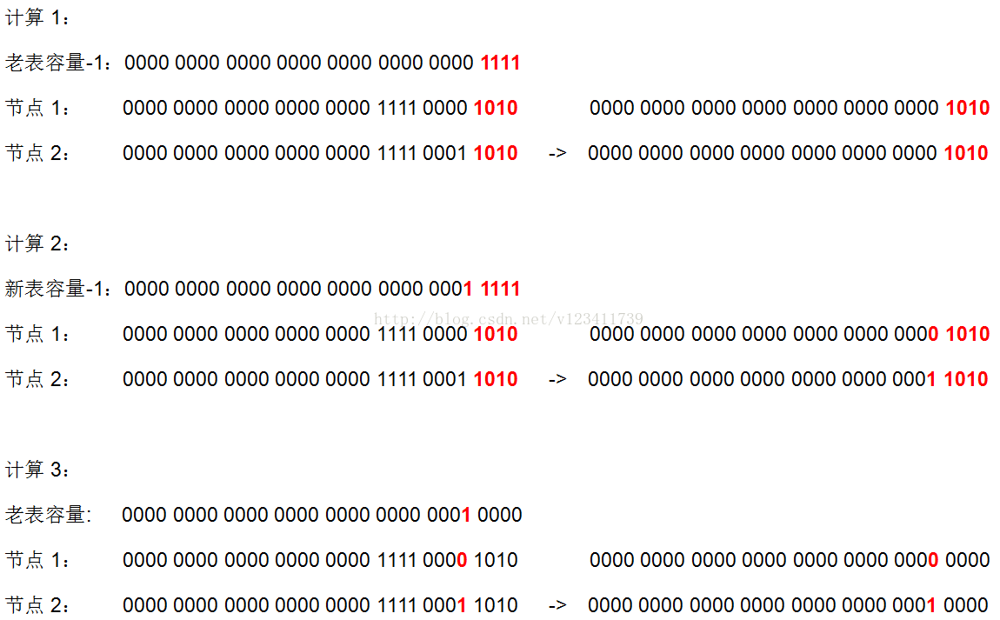

remove 方法

```
/**
 * 移除某个节点
 */
public V remove(Object key) {
    Node<K,V> e;
    return (e = removeNode(hash(key), key, null, false, true)) == null ?
        null : e.value;
}

final Node<K,V> removeNode(int hash, Object key, Object value,
                           boolean matchValue, boolean movable) {
    Node<K,V>[] tab; Node<K,V> p; int n, index;
    // 1.如果table不为空并且根据hash值计算出来的索引位置不为空, 将该位置的节点赋值给p
    if ((tab = table) != null && (n = tab.length) > 0 &&
        (p = tab[index = (n - 1) & hash]) != null) {
        Node<K,V> node = null, e; K k; V v;
        // 2.如果p的hash值和key都与入参的相同, 则p即为目标节点, 赋值给node
        if (p.hash == hash &&
            ((k = p.key) == key || (key != null && key.equals(k))))
            node = p;
        else if ((e = p.next) != null) {
            // 3.否则将p.next赋值给e，向下遍历节点
            // 3.1 如果p是TreeNode则调用红黑树的方法查找节点
            if (p instanceof TreeNode)
                node = ((TreeNode<K,V>)p).getTreeNode(hash, key);
            else {
                // 3.2 否则，进行普通链表节点的查找
                do {
                    // 当节点的hash值和key与传入的相同,则该节点即为目标节点
                    if (e.hash == hash &&
                        ((k = e.key) == key ||
                         (key != null && key.equals(k)))) {
                        node = e;	// 赋值给node, 并跳出循环
                        break;
                    }
                    p = e;  // p节点赋值为本次结束的e，在下一次循环中，e为p的next节点
                } while ((e = e.next) != null); // e指向下一个节点
            }
        }
        // 4.如果node不为空(即根据传入key和hash值查找到目标节点)，则进行移除操作
        if (node != null && (!matchValue || (v = node.value) == value ||
                             (value != null && value.equals(v)))) {
            // 4.1 如果是TreeNode则调用红黑树的移除方法
            if (node instanceof TreeNode)
                ((TreeNode<K,V>)node).removeTreeNode(this, tab, movable);
            // 4.2 如果node是该索引位置的头节点则直接将该索引位置的值赋值为node的next节点，
            // “node == p”只会出现在node是头节点的时候，如果node不是头节点，则node为p的next节点
            else if (node == p)
                tab[index] = node.next;
            // 4.3 否则将node的上一个节点的next属性设置为node的next节点,
            // 即将node节点移除, 将node的上下节点进行关联(链表的移除)
            else
                p.next = node.next;
            ++modCount;
            --size;
            afterNodeRemoval(node); // 供LinkedHashMap使用
            // 5.返回被移除的节点
            return node;
        }
    }
    return null;
}
```

**死循环问题**

在 JDK 1.8 以前，Java 语言在并发情况下使用 HashMap 造成 Race Condition，从而导致死循环。程序经常占了 100% 的 CPU，查看堆栈，你会发现程序都 Hang 在了 “HashMap.get()” 这个方法上了，重启程序后问题消失。具体分析可以查看这篇文章：疫苗：JAVA HASHMAP的死循环，有人将这个问题当成一个 bug 提给了 Sun，但是 Sun 认为这并不是个 bug，因为HashMap 本来就不保证并发的线程安全性，在并发下，要用 ConcurrentHashMap 来代替。

那么，在JDK 1.8 的时候，这个问题解决了吗？

我们知道，JDK 1.8 以前，导致死循环的主要原因是扩容后，节点的顺序会反掉，如下图：扩容前节点 A 在节点 C 前面，而扩容后节点 C 在节点 A 前面。

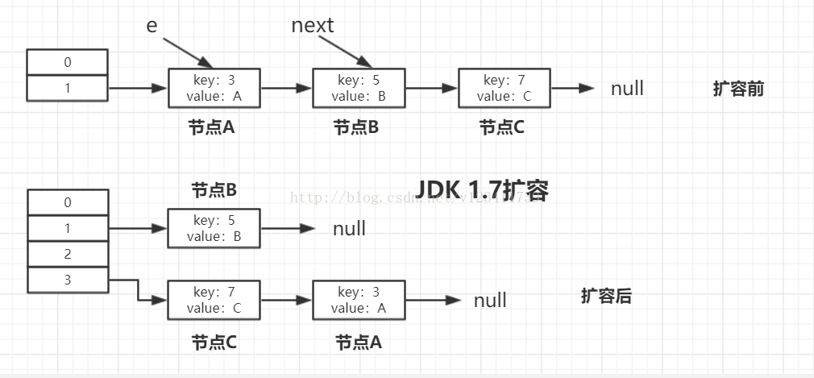

JDK1.8 具体扩容过程：

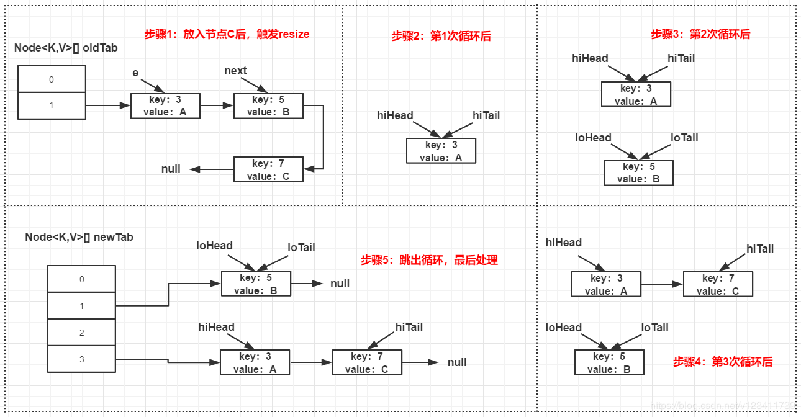

扩容后，节点 A 和节点 C 的先后顺序跟扩容前是一样的，也就是说JDK1.8解决了这个问题。

**HashMap 和 Hashtable 的区别**
```
HashMap 允许 key 和 value 为 null，Hashtable 不允许。
HashMap 的默认初始容量为 16，Hashtable 为 11。
HashMap 的扩容为原来的 2 倍，Hashtable 的扩容为原来的 2 倍加 1。
HashMap 是非线程安全的，Hashtable是线程安全的。
HashMap 的 hash 值重新计算过，Hashtable 直接使用 hashCode。
HashMap 去掉了 Hashtable 中的 contains 方法。
HashMap 继承自 AbstractMap 类，Hashtable 继承自 Dictionary 类。
```

为什么链表转红黑树的阈值是8？
> 红黑树节点大小约为链表节点的2倍，在节点太少时，红黑树的查找性能优势并不明显，付出2倍空间的代价作者觉得不值得。理想情况下，使用随机的哈希码，节点分布在 hash 桶中的频率遵循泊松分布，按照泊松分布的公式计算，链表中节点个数为8时的概率为 0.00000006（跟大乐透一等奖差不多，中大乐透？不存在的），这个概率足够低了，并且到8个节点时，红黑树的性能优势也会开始展现出来，因此8是一个较合理的数字。

那为什么转回链表节点是用的6而不是复用8？
> 如果我们设置节点多于8个转红黑树，少于8个就马上转链表，当节点个数在8徘徊时，就会频繁进行红黑树和链表的转换，造成性能的损耗。

threshold 除了用于存放扩容阈值还有其他作用吗？
> 在我们新建 HashMap 对象时， threshold 还会被用来存初始化时的容量。HashMap 直到我们第一次插入节点时，才会对 table 进行初始化，避免不必要的空间浪费。

N次方是怎么算的？
```
static final int tableSizeFor(int cap) {
    int n = cap - 1;
    n |= n >>> 1;
    n |= n >>> 2;
    n |= n >>> 4;
    n |= n >>> 8;
    n |= n >>> 16;
    return (n < 0) ? 1 : (n >= MAXIMUM_CAPACITY) ? MAXIMUM_CAPACITY : n + 1;
```
相信你应该看出来，这5个公式会通过最高位的1，拿到2个1、4个1、8个1、16个1、32个1。当然，有多少个1，取决于我们的入参有多大，但我们肯定的是经过这5个计算，得到的值是一个低位全是1的值，最后返回的时候 +1，则会得到1个比n 大的 2 的N次方。

这时再看开头的 cap - 1 就很简单了，这是为了处理 cap 本身就是 2 的N次方的情况。


HashMap 的容量必须是 2 的 N 次方，这是为什么？
> 计算索引位置的公式为：(n - 1) & hash，当 n 为 2 的 N 次方时，n - 1 为低位全是 1 的值，此时任何值跟 n - 1 进行 & 运算会等于其本身，达到了和取模同样的效果，实现了均匀分布。实际上，这个设计就是基于公式：x mod 2^n = x & (2^n - 1)，因为 & 运算比 mod 具有更高的效率。

HashMap 的插入流程是怎么样的？

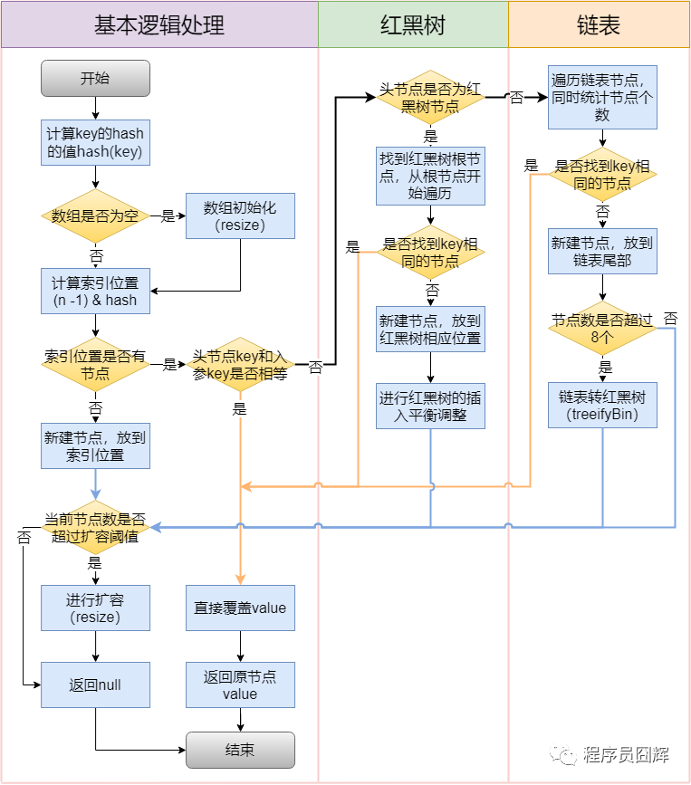

为什么要将 hashCode 的高16位参与运算？

> 主要是为了在 **table 的长度较小的时候，让高位也参与运算**，并且不会有太大的开销。
如果不加入高位运算，由于 n - 1 是 0000 0111，所以结果只取决于 hash 值的低3位，无论高位怎么变化，结果都是一样的。为了减少hash冲突，只能让高位也参与计算，这样索引计算结果就不会仅取决于低位。

扩容（resize）流程
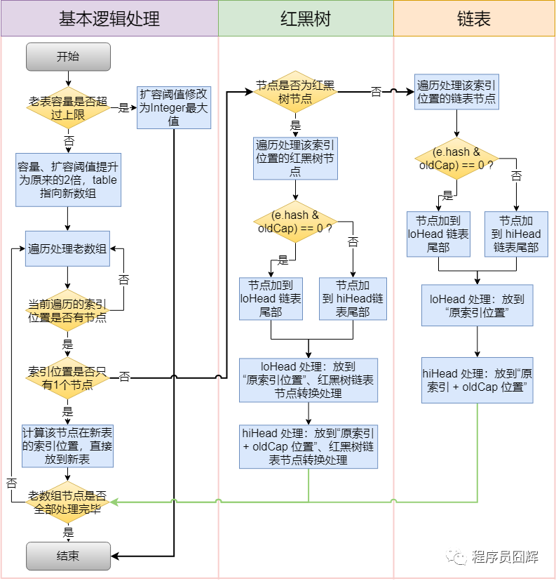


红黑树和链表都是通过 e.hash & oldCap == 0 来定位在新表的索引位置，这是为什么？

扩容前
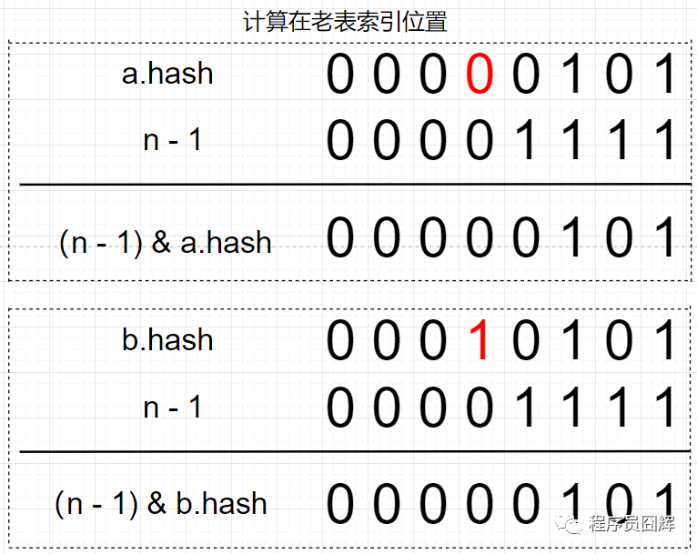

扩容后
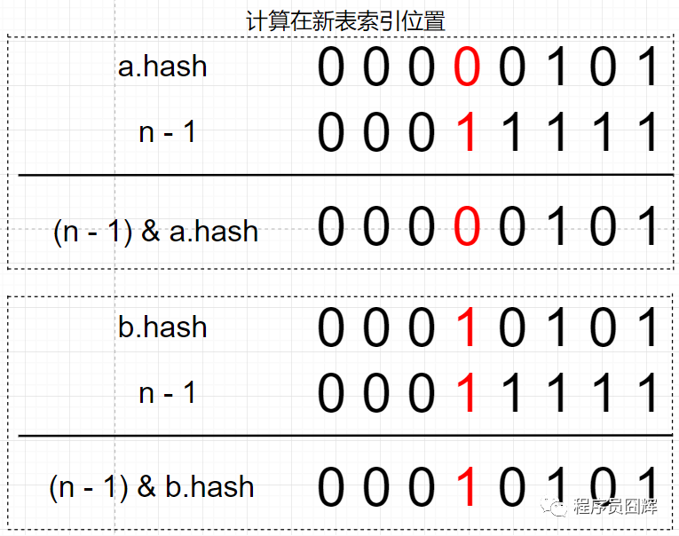

扩容前 table 的容量为16，a 节点和 b 节点在扩容前处于同一索引位置。扩容后，table 长度为32，新表的 n - 1 只比老表的 n - 1 在高位多了一个1（图中标红）。因为 2 个节点在老表是同一个索引位置，因此计算新表的索引位置时，只取决于新表在高位多出来的这一位（图中标红），而这一位的值刚好等于 oldCap。因为只取决于这一位，所以只会存在两种情况：1）  (e.hash & oldCap) == 0 ，则新表索引位置为“原索引位置” ；2）(e.hash & oldCap) != 0，则新表索引位置为“原索引 + oldCap 位置”。

死循环问题
> 导致死循环的根本原因是 JDK 1.7 扩容采用的是“头插法”，会导致同一索引位置的节点在扩容后顺序反掉。而 JDK 1.8 之后采用的是“尾插法”，扩容后节点顺序不会反掉，不存在死循环问题。

JDK 1.7 扩容采用的是“头插法”
```
void transfer(Entry[] newTable) {
    Entry[] src = table;
    int newCapacity = newTable.length;
    for (int j = 0; j < src.length; j++) {
        Entry<K,V> e = src[j];
        if (e != null) {
            src[j] = null;
            do {
                Entry<K,V> next = e.next;
                int i = indexFor(e.hash, newCapacity);
                e.next = newTable[i];
                newTable[i] = e;
                e = next;
            } while (e != null);
        }
    }
}
```

详解 ： https://coolshell.cn/articles/9606.html


JDK 1.8 主要进行了哪些优化？

1）底层数据结构从“数组+链表”改成“数组+链表+红黑树”，主要是优化了 hash 冲突较严重时，链表过长的查找性能：O(n) -> O(logn)。

 

2）计算 table 初始容量的方式发生了改变，老的方式是从1开始不断向左进行移位运算，直到找到大于等于入参容量的值；新的方式则是通过“5个移位+或等于运算”来计算。
```
// JDK 1.7.0
public HashMap(int initialCapacity, float loadFactor) {
    // 省略
    // Find a power of 2 >= initialCapacity
    int capacity = 1;
    while (capacity < initialCapacity)
        capacity <<= 1;
    // ... 省略
}
// JDK 1.8.0_191
static final int tableSizeFor(int cap) {
    int n = cap - 1;
    n |= n >>> 1;
    n |= n >>> 2;
    n |= n >>> 4;
    n |= n >>> 8;
    n |= n >>> 16;
    return (n < 0) ? 1 : (n >= MAXIMUM_CAPACITY) ? MAXIMUM_CAPACITY : n + 1;
}
```

3）优化了 hash 值的计算方式，老的通过一顿瞎JB操作，新的只是简单的让高16位参与了运算。
```
// JDK 1.7.0
static int hash(int h) {
    h ^= (h >>> 20) ^ (h >>> 12);
    return h ^ (h >>> 7) ^ (h >>> 4);
}
// JDK 1.8.0_191
static final int hash(Object key) {
    int h;
    return (key == null) ? 0 : (h = key.hashCode()) ^ (h >>> 16);
}
```

4）扩容时插入方式从“头插法”改成“尾插法”，避免了并发下的死循环。

5）扩容时计算节点在新表的索引位置方式从“h & (length-1)”改成“hash & oldCap”，性能可能提升不大，但设计更巧妙、更优雅。
