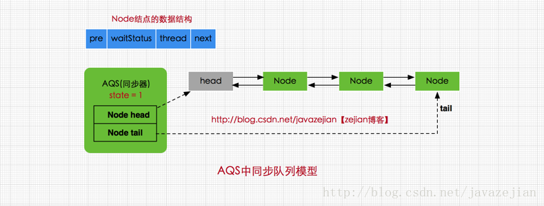
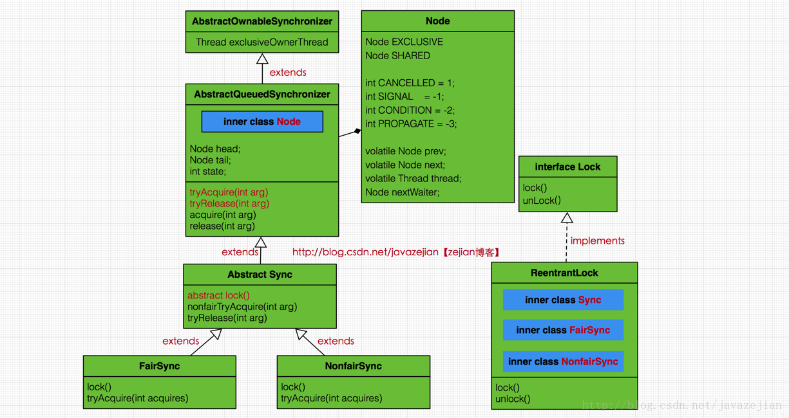
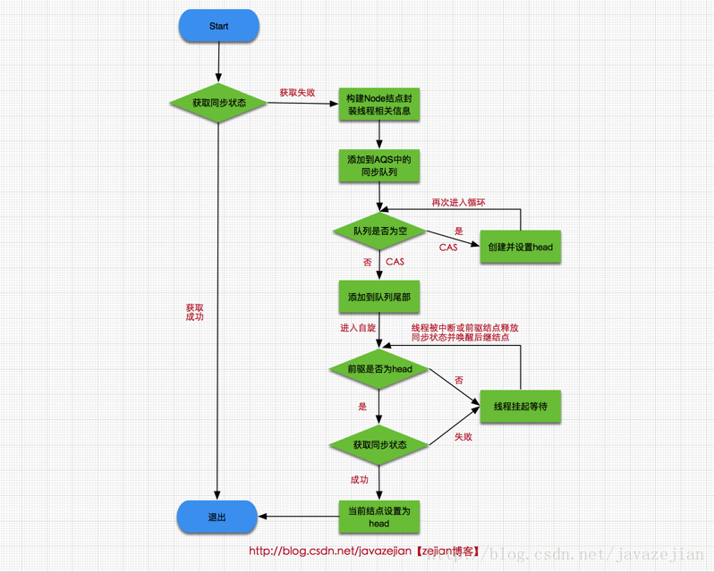

#### 基于并发AQS的(独占锁)重入锁(ReetrantLock)及其Condition实现原理

synchronized属于隐式锁，即锁的持有与释放都是隐式的，我们无需干预。

在Java 1.5中，官方在concurrent并发包中加入了Lock接口，该接口中提供了lock()方法和unLock()方法对显式加锁和显式释放锁操作进行支持
```
Lock lock = new ReentrantLock();
lock.lock();
try{
    //临界区......
}finally{
    lock.unlock();
}
```

> 注意unlock()操作必须在finally代码块中，这样可以确保即使临界区执行抛出异常，线程最终也能正常释放锁，

```
public interface Lock {
    //加锁
    void lock();

    //解锁
    void unlock();

    //可中断获取锁，与lock()不同之处在于可响应中断操作，即在获
    //取锁的过程中可中断，注意synchronized在获取锁时是不可中断的
    void lockInterruptibly() throws InterruptedException;

    //尝试非阻塞获取锁，调用该方法后立即返回结果，如果能够获取则返回true，否则返回false
    boolean tryLock();

    //根据传入的时间段获取锁，在指定时间内没有获取锁则返回false，如果在指定时间内当前线程未被中并断获取到锁则返回true
    boolean tryLock(long time, TimeUnit unit) throws InterruptedException;

    //获取等待通知组件，该组件与当前锁绑定，当前线程只有获得了锁
    //才能调用该组件的wait()方法，而调用后，当前线程将释放锁。
    Condition newCondition();
```

可见Lock对象锁还提供了synchronized所不具备的其他同步特性，如可中断锁的获取(synchronized在等待获取锁时是不可中的)，超时中断锁的获取，等待唤醒机制的多条件变量Condition等，这也使得Lock锁在使用上具有更大的灵活性

> 重入锁ReetrantLock

ReetrantLock本身也是一种支持重进入的锁，即该锁可以支持一个线程对资源重复加锁，同时也支持公平锁与非公平锁。所谓的公平与非公平指的是在请求先后顺序上，先对锁进行请求的就一定先获取到锁，那么这就是公平锁，反之，如果对于锁的获取并没有时间上的先后顺序，如后请求的线程可能先获取到锁，这就是非公平锁，一般而言非，非公平锁机制的效率往往会胜过公平锁的机制，但在某些场景下，可能更注重时间先后顺序，那么公平锁自然是很好的选择。**需要注意的是ReetrantLock支持对同一线程重加锁，但是加锁多少次，就必须解锁多少次，这样才可以成功释放锁。**

```
import java.util.concurrent.locks.ReentrantLock;

public class ReenterLock implements Runnable{
    public static ReentrantLock lock=new ReentrantLock();
    public static int i=0;
    @Override
    public void run() {
        for(int j=0;j<10000000;j++){
            lock.lock();
            //支持重入锁
            lock.lock();
            try{
                i++;
            }finally{
                //执行两次解锁
                lock.unlock();
                lock.unlock();
            }
        }
    }
    public static void main(String[] args) throws InterruptedException {
        ReenterLock tl=new ReenterLock();
        Thread t1=new Thread(tl);
        Thread t2=new Thread(tl);
        t1.start();t2.start();
        t1.join();t2.join();
        //输出结果：20000000
        System.out.println(i);
    }
}
```

内部实现
```
//查询当前线程保持此锁的次数。
int getHoldCount()

//返回目前拥有此锁的线程，如果此锁不被任何线程拥有，则返回 null。      
protected  Thread   getOwner();

//返回一个 collection，它包含可能正等待获取此锁的线程，其内部维持一个队列，这点稍后会分析。      
protected  Collection<Thread>   getQueuedThreads();

//返回正等待获取此锁的线程估计数。   
int getQueueLength();

// 返回一个 collection，它包含可能正在等待与此锁相关给定条件的那些线程。
protected  Collection<Thread>   getWaitingThreads(Condition condition);

//返回等待与此锁相关的给定条件的线程估计数。       
int getWaitQueueLength(Condition condition);

// 查询给定线程是否正在等待获取此锁。     
boolean hasQueuedThread(Thread thread);

//查询是否有些线程正在等待获取此锁。     
boolean hasQueuedThreads();

//查询是否有些线程正在等待与此锁有关的给定条件。     
boolean hasWaiters(Condition condition);

//如果此锁的公平设置为 true，则返回 true。     
boolean isFair()

//查询当前线程是否保持此锁。      
boolean isHeldByCurrentThread()

//查询此锁是否由任意线程保持。        
boolean isLocked()       
```

AQS工作原理概要
AbstractQueuedSynchronizer又称为**队列同步器**(后面简称AQS)。

它是用来构建锁或其他同步组件的基础框架，内部通过一个int类型的成员变量state来控制同步状态。

当state=0时，则说明没有任何线程占有共享资源的锁。

当state=1时，则说明有线程目前正在使用共享变量，其他线程必须加入同步队列进行等待。

**AQS内部通过内部类Node构成FIFO的同步队列来完成线程获取锁的排队工作**，同时利用内部类ConditionObject构建等待队列，当Condition调用wait()方法后，线程将会加入**等待队列**中，而当Condition调用signal()方法后，**线程将从等待队列转移动同步队列中进行锁竞争**。

注意这里涉及到两种队列，一种的同步队列，当线程请求锁而等待的后将加入同步队列等待，而另一种则是等待队列(可有多个)，通过Condition调用await()方法释放锁后，将加入等待队列。

```
/**
 * AQS抽象类
 */
public abstract class AbstractQueuedSynchronizer
    extends AbstractOwnableSynchronizer{
//指向同步队列队头
private transient volatile Node head;

//指向同步的队尾
private transient volatile Node tail;

//同步状态，0代表锁未被占用，1代表锁已被占用
private volatile int state;

//省略其他代码......
}
```




head和tail分别是AQS中的变量，其中head指向同步队列的头部，注意head为空结点，不存储信息。

而tail则是同步队列的队尾，同步队列采用的是双向链表的结构这样可方便队列进行结点增删操作。

state变量则是代表同步状态，执行当线程调用lock方法进行加锁后，如果此时state的值为0，则说明当前线程可以获取到锁(在本篇文章中，锁和同步状态代表同一个意思)，同时将state设置为1，表示获取成功。

如果state已为1，也就是当前锁已被其他线程持有，那么当前执行线程将被封装为Node结点加入同步队列等待。

其中Node结点是对每一个访问同步代码的线程的封装，从图中的Node的数据结构也可看出，其包含了需要同步的线程本身以及线程的状态，如是否被阻塞，是否等待唤醒，是否已经被取消等。**每个Node结点内部关联其前继结点prev和后继结点next，这样可以方便线程释放锁后快速唤醒下一个在等待的线程**

```
static final class Node {
    //共享模式
    static final Node SHARED = new Node();
    //独占模式
    static final Node EXCLUSIVE = null;

    //标识线程已处于结束状态
    static final int CANCELLED =  1;
    //等待被唤醒状态
    static final int SIGNAL    = -1;
    //条件状态，
    static final int CONDITION = -2;
    //在共享模式中使用表示获得的同步状态会被传播
    static final int PROPAGATE = -3;

    //等待状态,存在CANCELLED、SIGNAL、CONDITION、PROPAGATE 4种
    volatile int waitStatus;

    //同步队列中前驱结点
    volatile Node prev;

    //同步队列中后继结点
    volatile Node next;

    //请求锁的线程
    volatile Thread thread;

    //等待队列中的后继结点，这个与Condition有关，稍后会分析
    Node nextWaiter;

    //判断是否为共享模式
    final boolean isShared() {
        return nextWaiter == SHARED;
    }

    //获取前驱结点
    final Node predecessor() throws NullPointerException {
        Node p = prev;
        if (p == null)
            throw new NullPointerException();
        else
            return p;
    }

    //.....
}
```

其中SHARED和EXCLUSIVE常量分别代表共享模式和独占模式，**所谓共享模式是一个锁允许多条线程同时操作，如信号量Semaphore采用的就是基于AQS的共享模式实现的**，**而独占模式则是同一个时间段只能有一个线程对共享资源进行操作，多余的请求线程需要排队等待**，如ReentranLock。变量waitStatus则表示当前被封装成Node结点的等待状态，共有4种取值CANCELLED、SIGNAL、CONDITION、PROPAGATE。

- CANCELLED：值为1，在同步队列中等待的线程等待超时或被中断，需要从同步队列中取消该Node的结点，其结点的waitStatus为CANCELLED，即结束状态，进入该状态后的结点将不会再变化。

- SIGNAL：值为-1，被标识为该等待唤醒状态的后继结点，当其前继结点的线程释放了同步锁或被取消，将会通知该后继结点的线程执行。说白了，就是处于唤醒状态，**只要前继结点释放锁，就会通知标识为SIGNAL状态的后继结点的线程执行**。

- CONDITION：值为-2，与Condition相关，该标识的结点处于等待队列中，结点的线程等待在Condition上，当其他线程调用了Condition的signal()方法后，**CONDITION状态的结点将从等待队列转移到同步队列中，等待获取同步锁**。

- PROPAGATE：值为-3，与共享模式相关，在共享模式中，该状态标识结点的线程处于可运行状态。

- 0状态：值为0，代表初始化状态。

pre和next，分别指向当前Node结点的前驱结点和后继结点，thread变量存储的请求锁的线程。

nextWaiter，与Condition相关，代表等待队列中的后继结点。

总之呢，AQS作为基础组件，对于锁的实现存在两种不同的模式，即共享模式(如Semaphore)和独占模式(如ReetrantLock)，无论是共享模式还是独占模式的实现类，其内部都是基于AQS实现的，也都维持着一个虚拟的同步队列，当请求锁的线程超过现有模式的限制时，会将线程包装成Node结点并将线程当前必要的信息存储到node结点中，然后加入同步队列等会获取锁，而这系列操作都有AQS协助我们完成，这也是作为基础组件的原因，无论是Semaphore还是ReetrantLock，其内部绝大多数方法都是间接调用AQS完成的.




- AbstractOwnableSynchronizer：抽象类，定义了存储独占当前锁的线程和获取的方法

- AbstractQueuedSynchronizer：抽象类，AQS框架核心类，其内部以虚拟队列的方式管理线程的锁获取与锁释放，其中获取锁(tryAcquire方法)和释放锁(tryRelease方法)并没有提供默认实现，需要子类重写这两个方法实现具体逻辑，目的是使开发人员可以自由定义获取锁以及释放锁的方式。

- Node：AbstractQueuedSynchronizer 的内部类，用于构建虚拟队列(链表双向链表)，管理需要获取锁的线程。

- Sync：抽象类，是ReentrantLock的内部类，继承自AbstractQueuedSynchronizer，实现了释放锁的操作(tryRelease()方法)，并提供了lock抽象方法，由其子类实现。

- NonfairSync：是ReentrantLock的内部类，继承自Sync，非公平锁的实现类。

- FairSync：是ReentrantLock的内部类，继承自Sync，公平锁的实现类。

- ReentrantLock：实现了Lock接口的，其内部类有Sync、NonfairSync、FairSync，在创建时可以根据fair参数决定创建NonfairSync(默认非公平锁)还是FairSync。

ReentrantLock内部存在3个实现类，分别是Sync、NonfairSync、FairSync，其中Sync继承自AQS实现了解锁tryRelease()方法，而NonfairSync(非公平锁)、 FairSync(公平锁)则继承自Sync，实现了获取锁的tryAcquire()方法，ReentrantLock的所有方法调用都通过间接调用AQS和Sync类及其子类来完成的。

从上述类图可以看出AQS是一个抽象类，但请注意其源码中并没一个抽象的方法，这是因为AQS只是作为一个基础组件，并不希望直接作为直接操作类对外输出，而更倾向于作为基础组件，为真正的实现类提供基础设施，如构建同步队列，控制同步状态等。

事实上，从设计模式角度来看，AQS采用的**模板模式**的方式构建的，其内部除了提供并发操作核心方法以及同步队列操作外，还提供了一些模板方法让子类自己实现，如加锁操作以及解锁操作，为什么这么做？

这是因为AQS作为基础组件，封装的是核心并发操作，但是实现上分为两种模式，即共享模式与独占模式，而这两种模式的加锁与解锁实现方式是不一样的，但AQS只关注内部公共方法实现并不关心外部不同模式的实现，所以提供了模板方法给子类使用。

也就是说实现独占锁，如ReentrantLock需要自己实现tryAcquire()方法和tryRelease()方法，而实现共享模式的Semaphore，则需要实现tryAcquireShared()方法和tryReleaseShared()方法，这样做的好处是显而易见的，无论是共享模式还是独占模式，其基础的实现都是同一套组件(AQS)，只不过是加锁解锁的逻辑不同罢了，更重要的是如果我们需要自定义锁的话，也变得非常简单，只需要选择不同的模式实现不同的加锁和解锁的模板方法即可。

```
//AQS中提供的主要模板方法，由子类实现。
public abstract class AbstractQueuedSynchronizer
    extends AbstractOwnableSynchronizer{

    //独占模式下获取锁的方法
    protected boolean tryAcquire(int arg) {
        throw new UnsupportedOperationException();
    }

    //独占模式下解锁的方法
    protected boolean tryRelease(int arg) {
        throw new UnsupportedOperationException();
    }

    //共享模式下获取锁的方法
    protected int tryAcquireShared(int arg) {
        throw new UnsupportedOperationException();
    }

    //共享模式下解锁的方法
    protected boolean tryReleaseShared(int arg) {
        throw new UnsupportedOperationException();
    }
    //判断是否为持有独占锁
    protected boolean isHeldExclusively() {
        throw new UnsupportedOperationException();
    }

}
```

> ReetrantLock中非公平锁

```
//默认构造，创建非公平锁NonfairSync
public ReentrantLock() {
    sync = new NonfairSync();
}
//根据传入参数创建锁类型
public ReentrantLock(boolean fair) {
    sync = fair ? new FairSync() : new NonfairSync();
}

//加锁操作
public void lock() {
     sync.lock();
}

/**
 * 非公平锁实现
 */
static final class NonfairSync extends Sync {
    //加锁
    final void lock() {
        //执行CAS操作，获取同步状态
        if (compareAndSetState(0, 1))
       //成功则将独占锁线程设置为当前线程  
          setExclusiveOwnerThread(Thread.currentThread());
        else
            //否则再次请求同步状态
            acquire(1);
    }
}

public final void acquire(int arg) {
    //再次尝试获取同步状态
    if (!tryAcquire(arg) &&
        acquireQueued(addWaiter(Node.EXCLUSIVE), arg))
        selfInterrupt();
}

//NonfairSync类
static final class NonfairSync extends Sync {

    protected final boolean tryAcquire(int acquires) {
         return nonfairTryAcquire(acquires);
     }
 }

//Sync类
abstract static class Sync extends AbstractQueuedSynchronizer {

  //nonfairTryAcquire方法
  final boolean nonfairTryAcquire(int acquires) {
      final Thread current = Thread.currentThread();
      int c = getState();
      //判断同步状态是否为0，并尝试再次获取同步状态
      if (c == 0) {
          //执行CAS操作
          if (compareAndSetState(0, acquires)) {
              setExclusiveOwnerThread(current);
              return true;
          }
      }
      //如果当前线程已获取锁，属于重入锁，再次获取锁后将status值加1
      else if (current == getExclusiveOwnerThread()) {
          int nextc = c + acquires;
          if (nextc < 0) // overflow
              throw new Error("Maximum lock count exceeded");
          //设置当前同步状态，当前只有一个线程持有锁，因为不会发生线程安全问题，可以直接执行 setState(nextc);
          setState(nextc);
          return true;
      }
      return false;
  }
  //省略其他代码
}
```

这里获取锁时，首先对同步状态执行CAS操作，尝试把state的状态从0设置为1，如果返回true则代表获取同步状态成功，也就是当前线程获取锁成，可操作临界资源，如果返回false，则表示已有线程持有该同步状态(其值为1)，获取锁失败，注意这里存在并发的情景，也就是可能同时存在多个线程设置state变量，因此是CAS操作保证了state变量操作的原子性。返回false后，执行 acquire(1)方法，该方法是AQS中的方法，**它对中断不敏感，即使线程获取同步状态失败，进入同步队列，后续对该线程执行中断操作也不会从同步队列中移出。**

这里传入参数arg表示要获取同步状态后设置的值(即要设置state的值)，因为要获取锁，而status为0时是释放锁，1则是获取锁，所以这里一般传递参数为1，进入方法后首先会执行tryAcquire(arg)方法，在前面分析过该方法在AQS中并没有具体实现，而是交由子类实现，因此该方法是由ReetrantLock类内部实现的


从代码执行流程可以看出，这里做了两件事.

一是尝试再次获取同步状态，如果获取成功则将当前线程设置为OwnerThread，否则失败，

二是判断当前线程current是否为OwnerThread，如果是则属于重入锁，**state自增1**，并获取锁成功，返回true，反之失败，返回false，也就是tryAcquire(arg)执行失败，返回false。

需要注意的是nonfairTryAcquire(int acquires)内部使用的是CAS原子性操作设置state值，可以保证state的更改是线程安全的，因此只要任意一个线程调用nonfairTryAcquire(int acquires)方法并设置成功即可获取锁，不管该线程是新到来的还是已在同步队列的线程，毕竟这是非公平锁，并不保证同步队列中的线程一定比新到来线程请求(可能是head结点刚释放同步状态然后新到来的线程恰好获取到同步状态)先获取到锁，这点跟后面还会讲到的公平锁不同。

```
public final void acquire(int arg) {
    //再次尝试获取同步状态
    if (!tryAcquire(arg) &&
        acquireQueued(addWaiter(Node.EXCLUSIVE), arg))
        selfInterrupt();
}
```

如果tryAcquire(arg)返回true，acquireQueued自然不会执行，这是最理想的，因为毕竟当前线程已获取到锁，如果tryAcquire(arg)返回false，则会执行addWaiter(Node.EXCLUSIVE)进行入队操作,由于ReentrantLock属于独占锁，因此结点类型为Node.EXCLUSIVE，下面看看addWaiter方法具体实现
```
private Node addWaiter(Node mode) {
    //将请求同步状态失败的线程封装成结点
    Node node = new Node(Thread.currentThread(), mode);

    Node pred = tail;
    //如果是第一个结点加入肯定为空，跳过。
    //如果非第一个结点则直接执行CAS入队操作，尝试在尾部快速添加
    if (pred != null) {
        node.prev = pred;
        //使用CAS执行尾部结点替换，尝试在尾部快速添加
        if (compareAndSetTail(pred, node)) {
            pred.next = node;
            return node;
        }
    }
    //如果第一次加入或者CAS操作没有成功执行enq入队操作
    enq(node);
    return node;
}
```

创建了一个Node.EXCLUSIVE类型Node结点用于封装线程及其相关信息，其中tail是AQS的成员变量，指向队尾(这点前面的我们分析过AQS维持的是一个双向的链表结构同步队列)，如果是第一个结点，则为tail肯定为空，那么将执行enq(node)操作，如果非第一个结点即tail指向不为null，直接尝试执行CAS操作加入队尾，如果CAS操作失败还是会执行enq(node)，继续看enq(node)：
```
private Node enq(final Node node) {
    //死循环
    for (;;) {
         Node t = tail;
         //如果队列为null，即没有头结点
         if (t == null) { // Must initialize
             //创建并使用CAS设置头结点
             if (compareAndSetHead(new Node()))
                 tail = head;
         } else {//队尾添加新结点
             node.prev = t;
             if (compareAndSetTail(t, node)) {
                 t.next = node;
                 return t;
             }
         }
     }
    }
```
这个方法使用一个死循环进行CAS操作，可以解决多线程并发问题。

这里做了两件事，一是如果还没有初始同步队列则创建新结点并使用compareAndSetHead设置头结点，tail也指向head，二是队列已存在，则将新结点node添加到队尾。

注意这两个步骤都存在同一时间多个线程操作的可能，如果有一个线程修改head和tail成功，那么其他线程将继续循环，直到修改成功，这里使用CAS原子操作进行头结点设置和尾结点tail替换可以保证线程安全，从这里也可以看出head结点本身不存在任何数据，它只是作为一个牵头结点，而tail永远指向尾部结点(前提是队列不为null)。


添加到同步队列后，结点就会进入一个自旋过程，即每个结点都在观察时机待条件满足获取同步状态，然后从同步队列退出并结束自旋，回到之前的acquire()方法，自旋过程是在acquireQueued(addWaiter(Node.EXCLUSIVE), arg))方法中执行的，代码如下
```
final boolean acquireQueued(final Node node, int arg) {
    boolean failed = true;
    try {
        boolean interrupted = false;
        //自旋，死循环
        for (;;) {
            //获取前驱结点
            final Node p = node.predecessor();
            当且仅当p为头结点才尝试获取同步状态
            if (p == head && tryAcquire(arg)) {
                //将node设置为头结点
                setHead(node);
                //清空原来头结点的引用便于GC
                p.next = null; // help GC
                failed = false;
                return interrupted;
            }
            //如果前驱结点不是head，判断是否挂起线程
            if (shouldParkAfterFailedAcquire(p, node) &&
                parkAndCheckInterrupt())
                interrupted = true;
        }
    } finally {
        if (failed)
            //最终都没能获取同步状态，结束该线程的请求
            cancelAcquire(node);
    }
}
```
当前线程在自旋(死循环)中获取同步状态，当且仅当前驱结点为头结点才尝试获取同步状态，这符合FIFO的规则，即先进先出，其次head是当前获取同步状态的线程结点，只有当head释放同步状态唤醒后继结点，后继结点才有可能获取到同步状态，因此后继结点在其前继结点为head时，才进行尝试获取同步状态，其他时刻将被挂起。

进入if语句后调用setHead(node)方法，将当前线程结点设置为head。
```
//设置为头结点
private void setHead(Node node) {
        head = node;
        //清空结点数据
        node.thread = null;
        node.prev = null;
}
```

设置为node结点被设置为head后，其thread信息和前驱结点将被清空，因为该线程已获取到同步状态(锁)，正在执行了，也就没有必要存储相关信息了，head只有保存指向后继结点的指针即可，便于head结点释放同步状态后唤醒后继结点

当然如果前驱结点不是head
```
//如果前驱结点不是head，判断是否挂起线程
if (shouldParkAfterFailedAcquire(p, node) &&parkAndCheckInterrupt())

      interrupted = true;
}

//清除无用数据
private static boolean shouldParkAfterFailedAcquire(Node pred, Node node) {
        //获取当前结点的等待状态
        int ws = pred.waitStatus;
        //如果为等待唤醒（SIGNAL）状态则返回true
        if (ws == Node.SIGNAL)
            return true;
        //如果ws>0 则说明是结束状态，
        //遍历前驱结点直到找到没有结束状态的结点
        if (ws > 0) {
            do {
                node.prev = pred = pred.prev;
            } while (pred.waitStatus > 0);
            pred.next = node;
        } else {
            //如果ws小于0又不是SIGNAL状态，
            //则将其设置为SIGNAL状态，代表该结点的线程正在等待唤醒。
            compareAndSetWaitStatus(pred, ws, Node.SIGNAL);
        }
        return false;
    }

private final boolean parkAndCheckInterrupt() {
        //将当前线程挂起
        LockSupport.park(this);
        //获取线程中断状态,interrupted()是判断当前中断状态，
        //并非中断线程，因此可能true也可能false,并返回
        return Thread.interrupted();
}
```

shouldParkAfterFailedAcquire()方法的作用是判断当前结点的前驱结点是否为SIGNAL状态(即等待唤醒状态)，如果是则返回true。

如果结点的ws为CANCELLED状态(值为1>0),即结束状态，则说明该前驱结点已没有用应该从同步队列移除，执行while循环，直到寻找到非CANCELLED状态的结点。倘若前驱结点的ws值不为CANCELLED，也不为SIGNAL(当从Condition的条件等待队列转移到同步队列时，结点状态为CONDITION因此需要转换为SIGNAL)，那么将其转换为SIGNAL状态，等待被唤醒。

若shouldParkAfterFailedAcquire()方法返回true，即前驱结点为SIGNAL状态同时又不是head结点，那么使用parkAndCheckInterrupt()方法挂起当前线程，称为WAITING状态，需要等待一个unpark()操作来唤醒它，到此ReetrantLock内部间接通过AQS的FIFO的同步队列就完成了lock()操作




unlock()操作

```
//ReentrantLock类的unlock
public void unlock() {
    sync.release(1);
}

//AQS类的release()方法
public final boolean release(int arg) {
    //尝试释放锁
    if (tryRelease(arg)) {

        Node h = head;
        if (h != null && h.waitStatus != 0)
            //唤醒后继结点的线程
            unparkSuccessor(h);
        return true;
    }
    return false;
}

//ReentrantLock类中的内部类Sync实现的tryRelease(int releases)
protected final boolean tryRelease(int releases) {

      int c = getState() - releases;
      if (Thread.currentThread() != getExclusiveOwnerThread())
          throw new IllegalMonitorStateException();
      boolean free = false;
      //判断状态是否为0，如果是则说明已释放同步状态
      if (c == 0) {
          free = true;
          //设置Owner为null
          setExclusiveOwnerThread(null);
      }
      //设置更新同步状态
      setState(c);
      return free;
  }
```

释放同步状态的操作相对简单些，tryRelease(int releases)方法是ReentrantLock类中内部类自己实现的，因为AQS对于释放锁并没有提供具体实现，必须由子类自己实现。释放同步状态后会使用unparkSuccessor(h)唤醒后继结点的线程，这里看看unparkSuccessor(h)

```
private void unparkSuccessor(Node node) {
    //这里，node一般为当前线程所在的结点。
    int ws = node.waitStatus;
    if (ws < 0)//置零当前线程所在的结点状态，允许失败。
        compareAndSetWaitStatus(node, ws, 0);

    Node s = node.next;//找到下一个需要唤醒的结点s
    if (s == null || s.waitStatus > 0) {//如果为空或已取消
        s = null;
        for (Node t = tail; t != null && t != node; t = t.prev)
            if (t.waitStatus <= 0)//从这里可以看出，<=0的结点，都是还有效的结点。
                s = t;
    }
    if (s != null)
        LockSupport.unpark(s.thread);//唤醒
}
```

从代码执行操作来看，这里主要作用是用unpark()唤醒同步队列中最前边未放弃线程(也就是状态为CANCELLED的线程结点s)。此时，回忆前面分析进入自旋的函数acquireQueued()，s结点的线程被唤醒后，会进入acquireQueued()函数的if (p == head && tryAcquire(arg))的判断，如果p!=head也不会有影响，因为它会执行shouldParkAfterFailedAcquire()，由于s通过unparkSuccessor()操作后已是同步队列中最前边未放弃的线程结点，那么通过shouldParkAfterFailedAcquire()内部对结点状态的调整，s也必然会成为head的next结点，因此再次自旋时p==head就成立了，然后s把自己设置成head结点，表示自己已经获取到资源了，最终acquire()也返回了，这就是独占锁释放的过程。

> 在AQS同步器中维护着一个同步队列，当线程获取同步状态失败后，将会被封装成Node结点，加入到同步队列中并进行自旋操作，当当前线程结点的前驱结点为head时，将尝试获取同步状态，获取成功将自己设置为head结点。在释放同步状态时，则通过调用子类(ReetrantLock中的Sync内部类)的tryRelease(int releases)方法释放同步状态，释放成功则唤醒后继结点的线程。
