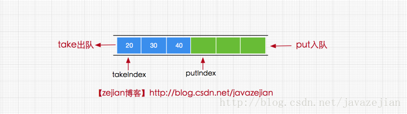
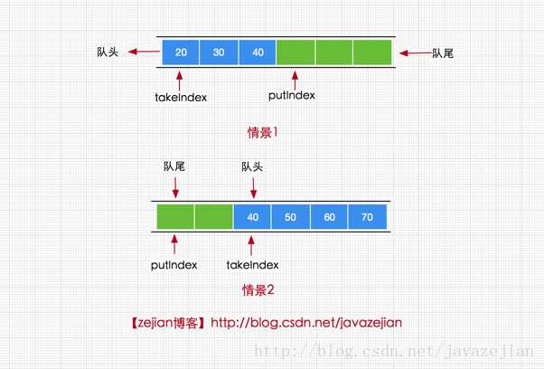
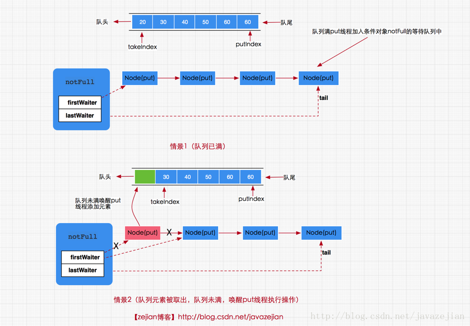

#### ArrayBlockingQueue 详解

> 阻塞队列概要

阻塞队列与我们平常接触的普通队列(LinkedList或ArrayList等)的最大不同点，在于阻塞队列支出阻塞添加和阻塞删除方法。

- 阻塞添加
所谓的阻塞添加是指当阻塞队列元素已满时，队列会阻塞加入元素的线程，直队列元素不满时才重新唤醒线程执行元素加入操作。

- 阻塞删除
阻塞删除是指在队列元素为空时，删除队列元素的线程将被阻塞，直到队列不为空再执行删除操作(一般都会返回被删除的元素)

Java中的阻塞队列接口BlockingQueue继承自Queue接口，因此先来看看阻塞队列接口为我们提供的主要方法
```
public interface BlockingQueue<E> extends Queue<E> {

	//将指定的元素插入到此队列的尾部（如果立即可行且不会超过该队列的容量）
	//在成功时返回 true，如果此队列已满，则抛IllegalStateException。
	boolean add(E e);

	//将指定的元素插入到此队列的尾部（如果立即可行且不会超过该队列的容量）
	// 将指定的元素插入此队列的尾部，如果该队列已满，
	//则在到达指定的等待时间之前等待可用的空间,该方法可中断
	boolean offer(E e, long timeout, TimeUnit unit) throws InterruptedException;

	//将指定的元素插入此队列的尾部，如果该队列已满，则一直等到（阻塞）。
	void put(E e) throws InterruptedException;

	//获取并移除此队列的头部，如果没有元素则等待（阻塞），
	//直到有元素将唤醒等待线程执行该操作
	E take() throws InterruptedException;

	//获取并移除此队列的头部，在指定的等待时间前一直等到获取元素， //超过时间方法将结束
	E poll(long timeout, TimeUnit unit) throws InterruptedException;

	//从此队列中移除指定元素的单个实例（如果存在）。
	boolean remove(Object o);
}

	//除了上述方法还有继承自Queue接口的方法
	//获取但不移除此队列的头元素,没有则跑异常NoSuchElementException
	E element();

	//获取但不移除此队列的头；如果此队列为空，则返回 null。
	E peek();

	//获取并移除此队列的头，如果此队列为空，则返回 null。
	E poll();

```

- 插入方法：
```
add(E e) : 添加成功返回true，失败抛IllegalStateException异常
offer(E e) : 成功返回 true，如果此队列已满，则返回 false。
put(E e) :将元素插入此队列的尾部，如果该队列已满，则一直阻塞
```
- 删除方法:
```
remove(Object o) :移除指定元素,成功返回true，失败返回false
poll() : 获取并移除此队列的头元素，若队列为空，则返回 null
take()：获取并移除此队列头元素，若没有元素则一直阻塞。
```
- 检查方法
```
element() ：获取但不移除此队列的头元素，没有元素则抛异常
peek() :获取但不移除此队列的头；若队列为空，则返回 null。
```

> ArrayBlockingQueue的基本使用

ArrayBlockingQueue 是一个用数组实现的有界阻塞队列，其内部按先进先出的原则对元素进行排序，其中put方法和take方法为添加和删除的阻塞方法，下面我们通过ArrayBlockingQueue队列实现一个生产者消费者的案例，通过该案例简单了解其使用方式
```
package com.zejian.concurrencys.Queue;
import java.util.concurrent.ArrayBlockingQueue;
import java.util.concurrent.TimeUnit;

/**
 * Created by wuzejian on 2017/8/13
 */
public class ArrayBlockingQueueDemo {
    private final static ArrayBlockingQueue<Apple> queue= new ArrayBlockingQueue<>(1);
    public static void main(String[] args){
        new Thread(new Producer(queue)).start();
        new Thread(new Producer(queue)).start();
        new Thread(new Consumer(queue)).start();
        new Thread(new Consumer(queue)).start();
    }
}

 class Apple {
    public Apple(){
    }
 }

/**
 * 生产者线程
 */
class Producer implements Runnable{
    private final ArrayBlockingQueue<Apple> mAbq;
    Producer(ArrayBlockingQueue<Apple> arrayBlockingQueue){
        this.mAbq = arrayBlockingQueue;
    }

    @Override
    public void run() {
        while (true) {
            Produce();
        }
    }

    private void Produce(){
        try {
            Apple apple = new Apple();
            mAbq.put(apple);
            System.out.println("生产:"+apple);
        } catch (InterruptedException e) {
            e.printStackTrace();
        }
    }
}

/**
 * 消费者线程
 */
class Consumer implements Runnable{

    private ArrayBlockingQueue<Apple> mAbq;
    Consumer(ArrayBlockingQueue<Apple> arrayBlockingQueue){
        this.mAbq = arrayBlockingQueue;
    }

    @Override
    public void run() {
        while (true){
            try {
                TimeUnit.MILLISECONDS.sleep(1000);
                comsume();
            } catch (InterruptedException e) {
                e.printStackTrace();
            }
        }
    }

    private void comsume() throws InterruptedException {
        Apple apple = mAbq.take();
        System.out.println("消费Apple="+apple);
    }
}

```
代码比较简单， Consumer 消费者和 Producer 生产者，通过ArrayBlockingQueue 队列获取和添加元素，其中消费者调用了take()方法获取元素当队列没有元素就阻塞，生产者调用put()方法添加元素，当队列满时就阻塞，通过这种方式便实现生产者消费者模式。比直接使用等待唤醒机制或者Condition条件队列来得更加简单。


有点需要注意的是ArrayBlockingQueue内部的阻塞队列是通过**重入锁ReentrantLock和Condition条件队列**实现的，所以ArrayBlockingQueue中的元素 **存在公平访问与非公平访问的区别**.对于公平访问队列，被阻塞的线程可以按照阻塞的先后顺序访问队列，即先阻塞的线程先访问队列。而非公平队列，当队列可用时，阻塞的线程将进入争夺访问资源的竞争中，也就是说谁先抢到谁就执行，没有固定的先后顺序。创建公平与非公平阻塞队列代码如下：
```
//默认非公平阻塞队列
ArrayBlockingQueue queue = new ArrayBlockingQueue(2);
//公平阻塞队列
ArrayBlockingQueue queue1 = new ArrayBlockingQueue(2,true);

//构造方法源码
public ArrayBlockingQueue(int capacity) {
     this(capacity, false);
 }

public ArrayBlockingQueue(int capacity, boolean fair) {
     if (capacity <= 0)
         throw new IllegalArgumentException();
     this.items = new Object[capacity];
     lock = new ReentrantLock(fair);
     notEmpty = lock.newCondition();
     notFull =  lock.newCondition();
 }


 //自动移除此队列中的所有元素。
 void clear()

 //如果此队列包含指定的元素，则返回 true。          
 boolean contains(Object o)

 //移除此队列中所有可用的元素，并将它们添加到给定collection中。           
 int drainTo(Collection<? super E> c)

 //最多从此队列中移除给定数量的可用元素，并将这些元素添加到给定collection 中。       
 int drainTo(Collection<? super E> c, int maxElements)

 //返回在此队列中的元素上按适当顺序进行迭代的迭代器。         
 Iterator<E> iterator()

 //返回队列还能添加元素的数量
 int remainingCapacity()

 //返回此队列中元素的数量。      
 int size()

 //返回一个按适当顺序包含此队列中所有元素的数组。
 Object[] toArray()

 //返回一个按适当顺序包含此队列中所有元素的数组；返回数组的运行时类型是指定数组的运行时类型。      
 <T> T[] toArray(T[] a)

```
> ArrayBlockingQueue的实现原理剖析

```
public class ArrayBlockingQueue<E> extends AbstractQueue<E>
        implements BlockingQueue<E>, java.io.Serializable {

    /** 存储数据的数组 */
    final Object[] items;

    /**获取数据的索引，主要用于take，poll，peek，remove方法 */
    int takeIndex;

    /**添加数据的索引，主要用于 put, offer, or add 方法*/
    int putIndex;

    /** 队列元素的个数 */
    int count;


    /** 控制并非访问的锁 */
    final ReentrantLock lock;

    /**notEmpty条件对象，用于通知take方法队列已有元素，可执行获取操作 */
    private final Condition notEmpty;

    /**notFull条件对象，用于通知put方法队列未满，可执行添加操作 */
    private final Condition notFull;

    /**
       迭代器
     */
    transient Itrs itrs = null;

}

```

ArrayBlockingQueue内部确实是通过数组对象items来存储所有的数据，值得注意的是ArrayBlockingQueue通过一个ReentrantLock来同时控制添加线程与移除线程的并非访问，这点与LinkedBlockingQueue区别很大(稍后会分析)。

而对于notEmpty条件对象则是用于存放等待或唤醒调用take方法的线程，告诉他们队列已有元素，可以执行获取操作。同理notFull条件对象是用于等待或唤醒调用put方法的线程，告诉它们，队列未满，可以执行添加元素的操作。

takeIndex代表的是下一个方法(take，poll，peek，remove)被调用时获取数组元素的索引，putIndex则代表下一个方法（put, offer, or add）被调用时元素添加到数组中的索引。图示如下



```
//add方法实现，间接调用了offer(e)
public boolean add(E e) {
        if (offer(e))
            return true;
        else
            throw new IllegalStateException("Queue full");
    }

//offer方法
public boolean offer(E e) {
     checkNotNull(e);//检查元素是否为null
     final ReentrantLock lock = this.lock;
     lock.lock();//加锁
     try {
         if (count == items.length)//判断队列是否满
             return false;
         else {
             enqueue(e);//添加元素到队列
             return true;
         }
     } finally {
         lock.unlock();
     }
 }

//入队操作
private void enqueue(E x) {
    //获取当前数组
    final Object[] items = this.items;
    //通过putIndex索引对数组进行赋值
    items[putIndex] = x;
    //索引自增，如果已是最后一个位置，重新设置 putIndex = 0;
    if (++putIndex == items.length)
        putIndex = 0;
    count++;//队列中元素数量加1
    //唤醒调用take()方法的线程，执行元素获取操作。
    notEmpty.signal();
}

```
这里的add方法和offer方法实现比较简单，其中需要注意的是enqueue(E x)方法，其方法内部通过putIndex索引直接将元素添加到数组items中，这里可能会疑惑的是当putIndex索引大小等于数组长度时，需要将putIndex重新设置为0，这是因为当前队列执行元素获取时总是从队列头部获取，而添加元素从中从队列尾部获取所以当队列索引（从0开始）与数组长度相等时，下次我们就需要从数组头部开始添加了，如下图演示



put方法，它是一个阻塞添加的方法
```
//put方法，阻塞时可中断
 public void put(E e) throws InterruptedException {
     checkNotNull(e);
      final ReentrantLock lock = this.lock;
      lock.lockInterruptibly();//该方法可中断
      try {
          //当队列元素个数与数组长度相等时，无法添加元素
          while (count == items.length)
              //将当前调用线程挂起，添加到notFull条件队列中等待唤醒
              notFull.await();
          enqueue(e);//如果队列没有满直接添加。。
      } finally {
          lock.unlock();
      }
  }

```
put方法是一个阻塞的方法，如果队列元素已满，那么当前线程将会被notFull条件对象挂起加到等待队列中，直到队列有空档才会唤醒执行添加操作。

但如果队列没有满，那么就直接调用enqueue(e)方法将元素加入到数组队列中。

到此我们对三个添加方法即put，offer，add都分析完毕，其中offer，add在正常情况下都是无阻塞的添加，而put方法是阻塞添加。

这就是阻塞队列的添加过程。说白了就是当队列满时通过条件对象Condtion来阻塞当前调用put方法的线程，直到线程又再次被唤醒执行。总得来说添加线程的执行存在以下两种情况，一是，队列已满，那么新到来的put线程将添加到notFull的条件队列中等待，二是，有移除线程执行移除操作，移除成功同时唤醒put线程，如下图所示



> ArrayBlockingQueue的(阻塞)移除实现原理

```
public E poll() {
      final ReentrantLock lock = this.lock;
       lock.lock();
       try {
           //判断队列是否为null，不为null执行dequeue()方法，否则返回null
           return (count == 0) ? null : dequeue();
       } finally {
           lock.unlock();
       }
    }
 //删除队列头元素并返回
 private E dequeue() {
     //拿到当前数组的数据
     final Object[] items = this.items;
      @SuppressWarnings("unchecked")
      //获取要删除的对象
      E x = (E) items[takeIndex];
      将数组中takeIndex索引位置设置为null
      items[takeIndex] = null;
      //takeIndex索引加1并判断是否与数组长度相等，
      //如果相等说明已到尽头，恢复为0
      if (++takeIndex == items.length)
          takeIndex = 0;
      count--;//队列个数减1
      if (itrs != null)
          itrs.elementDequeued();//同时更新迭代器中的元素数据
      //删除了元素说明队列有空位，唤醒notFull条件对象添加线程，执行添加操作
      notFull.signal();
      return x;
    }

```

> remove(Object o)方法

```
public boolean remove(Object o) {
    if (o == null) return false;
    //获取数组数据
    final Object[] items = this.items;
    final ReentrantLock lock = this.lock;
    lock.lock();//加锁
    try {
        //如果此时队列不为null，这里是为了防止并发情况
        if (count > 0) {
            //获取下一个要添加元素时的索引
            final int putIndex = this.putIndex;
            //获取当前要被删除元素的索引
            int i = takeIndex;
            //执行循环查找要删除的元素
            do {
                //找到要删除的元素
                if (o.equals(items[i])) {
                    removeAt(i);//执行删除
                    return true;//删除成功返回true
                }
                //当前删除索引执行加1后判断是否与数组长度相等
                //若为true，说明索引已到数组尽头，将i设置为0
                if (++i == items.length)
                    i = 0;
            } while (i != putIndex);//继承查找
        }
        return false;
    } finally {
        lock.unlock();
    }
}

//根据索引删除元素，实际上是把删除索引之后的元素往前移动一个位置
void removeAt(final int removeIndex) {

     final Object[] items = this.items;
      //先判断要删除的元素是否为当前队列头元素
      if (removeIndex == takeIndex) {
          //如果是直接删除
          items[takeIndex] = null;
          //当前队列头元素加1并判断是否与数组长度相等，若为true设置为0
          if (++takeIndex == items.length)
              takeIndex = 0;
          count--;//队列元素减1
          if (itrs != null)
              itrs.elementDequeued();//更新迭代器中的数据
      } else {
      //如果要删除的元素不在队列头部，
      //那么只需循环迭代把删除元素后面的所有元素往前移动一个位置
          //获取下一个要被添加的元素的索引，作为循环判断结束条件
          final int putIndex = this.putIndex;
          //执行循环
          for (int i = removeIndex;;) {
              //获取要删除节点索引的下一个索引
              int next = i + 1;
              //判断是否已为数组长度，如果是从数组头部（索引为0）开始找
              if (next == items.length)
                  next = 0;
               //如果查找的索引不等于要添加元素的索引，说明元素可以再移动
              if (next != putIndex) {
                  items[i] = items[next];//把后一个元素前移覆盖要删除的元
                  i = next;
              } else {
              //在removeIndex索引之后的元素都往前移动完毕后清空最后一个元素
                  items[i] = null;
                  this.putIndex = i;
                  break;//结束循环
              }
          }
          count--;//队列元素减1
          if (itrs != null)
              itrs.removedAt(removeIndex);//更新迭代器数据
      }
      notFull.signal();//唤醒添加线程
    }
```

remove(Object o)方法的删除过程相对复杂些，因为该方法并不是直接从队列头部删除元素。首先线程先获取锁，再一步判断队列count>0,这点是保证并发情况下删除操作安全执行。

接着获取下一个要添加源的索引putIndex以及takeIndex索引 ，作为后续循环的结束判断，因为只要putIndex与takeIndex不相等就说明队列没有结束。

然后通过while循环找到要删除的元素索引，执行removeAt(i)方法删除，在removeAt(i)方法中实际上做了两件事，一是首先判断队列头部元素是否为删除元素，如果是直接删除，并唤醒添加线程，二是如果要删除的元素并不是队列头元素，那么执行循环操作，从要删除元素的索引removeIndex之后的元素都往前移动一个位置，那么要删除的元素就被removeIndex之后的元素替换，从而也就完成了删除操作。

> take()方法

```
//从队列头部删除，队列没有元素就阻塞，可中断
 public E take() throws InterruptedException {
    final ReentrantLock lock = this.lock;
      lock.lockInterruptibly();//中断
      try {
          //如果队列没有元素
          while (count == 0)
              //执行阻塞操作
              notEmpty.await();
          return dequeue();//如果队列有元素执行删除操作
      } finally {
          lock.unlock();
      }
    }

```

> peek方法

```
public E peek() {
      final ReentrantLock lock = this.lock;
      lock.lock();
      try {
       //直接返回当前队列的头元素，但不删除
          return itemAt(takeIndex); // null when queue is empty
      } finally {
          lock.unlock();
      }
  }

final E itemAt(int i) {
      return (E) items[i];
  }

```
