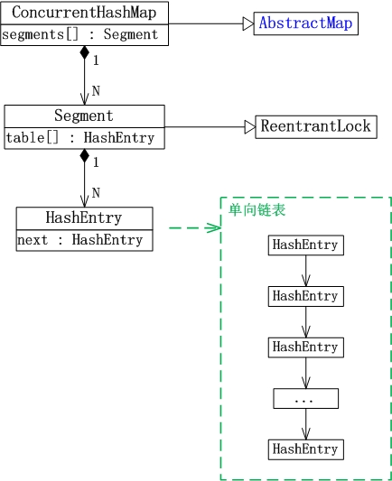

#### ConcurrentHashMap JDK1.7 详解


- HashMap是非线程安全的哈希表，常用于单线程程序中。

- Hashtable是线程安全的哈希表，它是通过synchronized来保证线程安全的；即，多线程通过同一个“对象的同步锁”来实现并发控制。Hashtable在线程竞争激烈时，效率比较低(此时建议使用ConcurrentHashMap)！因为当一个线程访问Hashtable的同步方法时，其它线程就访问Hashtable的同步方法时，可能会进入阻塞状态。

- ConcurrentHashMap是线程安全的哈希表，它是通过“锁分段”来保证线程安全的。ConcurrentHashMap将哈希表分成许多片段(Segment)，每一个片段除了保存哈希表之外，本质上也是一个“可重入的互斥锁”(ReentrantLock)。多线程对同一个片段的访问，是互斥的；但是，对于不同片段的访问，却是可以同步进行的。




```
(01) ConcurrentHashMap继承于AbstractMap抽象类。
(02) Segment是ConcurrentHashMap中的内部类，它就是ConcurrentHashMap中的“锁分段”对应的存储结构。ConcurrentHashMap与Segment是组合关系，1个ConcurrentHashMap对象包含若干个Segment对象。在代码中，这表现为ConcurrentHashMap类中存在“Segment数组”成员。
(03) Segment类继承于ReentrantLock类，所以Segment本质上是一个可重入的互斥锁。
(04) HashEntry也是ConcurrentHashMap的内部类，是单向链表节点，存储着key-value键值对。Segment与HashEntry是组合关系，Segment类中存在“HashEntry数组”成员，“HashEntry数组”中的每个HashEntry就是一个单向链表。
```

> 对于多线程访问对一个“哈希表对象”竞争资源，Hashtable是通过一把锁来控制并发；而ConcurrentHashMap则是将哈希表分成许多片段，对于每一个片段分别通过一个互斥锁来控制并发。ConcurrentHashMap对并发的控制更加细腻，它也更加适应于高并发场景！

```
// 创建一个带有默认初始容量 (16)、加载因子 (0.75) 和 concurrencyLevel (16) 的新的空映射。
ConcurrentHashMap()
// 创建一个带有指定初始容量、默认加载因子 (0.75) 和 concurrencyLevel (16) 的新的空映射。
ConcurrentHashMap(int initialCapacity)
// 创建一个带有指定初始容量、加载因子和默认 concurrencyLevel (16) 的新的空映射。
ConcurrentHashMap(int initialCapacity, float loadFactor)
// 创建一个带有指定初始容量、加载因子和并发级别的新的空映射。
ConcurrentHashMap(int initialCapacity, float loadFactor, int concurrencyLevel)
// 构造一个与给定映射具有相同映射关系的新映射。
ConcurrentHashMap(Map<? extends K,? extends V> m)

// 从该映射中移除所有映射关系
void clear()
// 一种遗留方法，测试此表中是否有一些与指定值存在映射关系的键。
boolean contains(Object value)
// 测试指定对象是否为此表中的键。
boolean containsKey(Object key)
// 如果此映射将一个或多个键映射到指定值，则返回 true。
boolean containsValue(Object value)
// 返回此表中值的枚举。
Enumeration<V> elements()
// 返回此映射所包含的映射关系的 Set 视图。
Set<Map.Entry<K,V>> entrySet()
// 返回指定键所映射到的值，如果此映射不包含该键的映射关系，则返回 null。
V get(Object key)
// 如果此映射不包含键-值映射关系，则返回 true。
boolean isEmpty()
// 返回此表中键的枚举。
Enumeration<K> keys()
// 返回此映射中包含的键的 Set 视图。
Set<K> keySet()
// 将指定键映射到此表中的指定值。
V put(K key, V value)
// 将指定映射中所有映射关系复制到此映射中。
void putAll(Map<? extends K,? extends V> m)
// 如果指定键已经不再与某个值相关联，则将它与给定值关联。
V putIfAbsent(K key, V value)
// 从此映射中移除键（及其相应的值）。
V remove(Object key)
// 只有目前将键的条目映射到给定值时，才移除该键的条目。
boolean remove(Object key, Object value)
// 只有目前将键的条目映射到某一值时，才替换该键的条目。
V replace(K key, V value)
// 只有目前将键的条目映射到给定值时，才替换该键的条目。
boolean replace(K key, V oldValue, V newValue)
// 返回此映射中的键-值映射关系数。
int size()
// 返回此映射中包含的值的 Collection 视图。
Collection<V> values()
```

ConcurrentHashMap采用了“锁分段”技术；在代码中，它通过“segments数组”对象来保存各个分段。segments的定义如下：
```
final Segment<K,V>[] segments;
```
concurrencyLevel的作用就是用来计算segments数组的容量大小。先计算出“大于或等于concurrencyLevel的最小的2的N次方值”，然后将其保存为“segments的容量大小(ssize)”。

initialCapacity是哈希表的初始容量。需要注意的是，哈希表的实际容量=“segments的容量” x “segments中数组的长度”。

loadFactor是加载因子。它是哈希表在其容量自动增加之前可以达到多满的一种尺度。
```
static final class Segment<K,V> extends ReentrantLock implements Serializable {
    ...

    transient volatile HashEntry<K,V>[] table;
    // threshold阈，是哈希表在其容量自动增加之前可以达到多满的一种尺度。
    transient int threshold;
    // loadFactor是加载因子
    final float loadFactor;

    Segment(float lf, int threshold, HashEntry<K,V>[] tab) {
        this.loadFactor = lf;
        this.threshold = threshold;
        this.table = tab;
    }

    ...
}

static final class HashEntry<K,V> {
    final int hash;    // 哈希值
    final K key;       // 键
    volatile V value;  // 值
    volatile HashEntry<K,V> next; // 下一个HashEntry节点

    HashEntry(int hash, K key, V value, HashEntry<K,V> next) {
        this.hash = hash;
        this.key = key;
        this.value = value;
        this.next = next;
    }

    ...
}
```
get
```
public V get(Object key) {
    Segment<K,V> s; // manually integrate access methods to reduce overhead
    HashEntry<K,V>[] tab;
    int h = hash(key);
    long u = (((h >>> segmentShift) & segmentMask) << SSHIFT) + SBASE;
    // 获取key对应的Segment片段。
    // 如果Segment片段不为null，则在“Segment片段的HashEntry数组中”中找到key所对应的HashEntry列表；
    // 接着遍历该HashEntry链表，找到于key-value键值对对应的HashEntry节点。
    if ((s = (Segment<K,V>)UNSAFE.getObjectVolatile(segments, u)) != null &&
        (tab = s.table) != null) {
        for (HashEntry<K,V> e = (HashEntry<K,V>) UNSAFE.getObjectVolatile
                 (tab, ((long)(((tab.length - 1) & h)) << TSHIFT) + TBASE);
             e != null; e = e.next) {
            K k;
            if ((k = e.key) == key || (e.hash == h && key.equals(k)))
                return e.value;
        }
    }
    return null;
}
private int hash(Object k) {
    int h = hashSeed;

    if ((0 != h) && (k instanceof String)) {
        return sun.misc.Hashing.stringHash32((String) k);
    }

    h ^= k.hashCode();

    // Spread bits to regularize both segment and index locations,
    // using variant of single-word Wang/Jenkins hash.
    h += (h <<  15) ^ 0xffffcd7d;
    h ^= (h >>> 10);
    h += (h <<   3);
    h ^= (h >>>  6);
    h += (h <<   2) + (h << 14);
    return h ^ (h >>> 16);
}
```
put
```
public V put(K key, V value) {
    Segment<K,V> s;
    if (value == null)
        throw new NullPointerException();
    // 获取key对应的哈希值
    int hash = hash(key);
    int j = (hash >>> segmentShift) & segmentMask;
    // 如果找不到该Segment，则新建一个。
    if ((s = (Segment<K,V>)UNSAFE.getObject          // nonvolatile; recheck
         (segments, (j << SSHIFT) + SBASE)) == null) // in ensureSegment
        s = ensureSegment(j);
    return s.put(key, hash, value, false);
}
```
