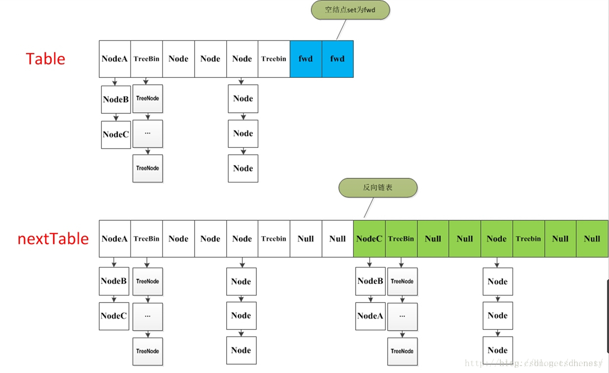

#### ConcurrentHashMap JDK1.8 详解

- ConcurrentHashMap的实现与1.7版本有很大的差别，放弃了段锁的概念，借鉴了HashMap的数据结构：数组＋链表＋红黑树。

- ConcurrentHashMap不接受nullkey和nullvalue。

并发原理：**cas乐观锁+synchronized锁**

加锁对象: **数组每个位置的头节点**

```
// 最大容量：2^30=1073741824
private static final int MAXIMUM_CAPACITY = 1 << 30;

// 默认初始值，必须是2的幕数
private static final int DEFAULT_CAPACITY = 16;

//
static final int MAX_ARRAY_SIZE = Integer.MAX_VALUE - 8;

//
private static final int DEFAULT_CONCURRENCY_LEVEL = 16;

//
private static final float LOAD_FACTOR = 0.75f;

// 链表转红黑树阀值,> 8 链表转换为红黑树
static final int TREEIFY_THRESHOLD = 8;

//树转链表阀值，小于等于6（tranfer时，lc、hc=0两个计数器分别++记录原bin、新binTreeNode数量，<=UNTREEIFY_THRESHOLD 则untreeify(lo)）
static final int UNTREEIFY_THRESHOLD = 6;

//
static final int MIN_TREEIFY_CAPACITY = 64;

//
private static final int MIN_TRANSFER_STRIDE = 16;

//
private static int RESIZE_STAMP_BITS = 16;

// 2^15-1，help resize的最大线程数
private static final int MAX_RESIZERS = (1 << (32 - RESIZE_STAMP_BITS)) - 1;

// 32-16=16，sizeCtl中记录size大小的偏移量
private static final int RESIZE_STAMP_SHIFT = 32 - RESIZE_STAMP_BITS;

// forwarding nodes的hash值
static final int MOVED     = -1;

// 树根节点的hash值
static final int TREEBIN   = -2;

// ReservationNode的hash值
static final int RESERVED  = -3;

// 可用处理器数量
static final int NCPU = Runtime.getRuntime().availableProcessors();

private transient volatile int sizeCtl;

public ConcurrentHashMap(int initialCapacity) {
        if (initialCapacity < 0)
            throw new IllegalArgumentException();
        int cap = ((initialCapacity >= (MAXIMUM_CAPACITY >>> 1)) ?
                   MAXIMUM_CAPACITY :
                   tableSizeFor(initialCapacity + (initialCapacity >>> 1) + 1));
        this.sizeCtl = cap;
    }

    /**
     * Creates a new map with the same mappings as the given map.
     *
     * @param m the map
     */
    public ConcurrentHashMap(Map<? extends K, ? extends V> m) {
        this.sizeCtl = DEFAULT_CAPACITY;
        putAll(m);
    }

static final class ForwardingNode<K,V> extends Node<K,V> {
        final Node<K,V>[] nextTable;
        ForwardingNode(Node<K,V>[] tab) {
            super(MOVED, null, null, null);
            this.nextTable = tab;
        }

        Node<K,V> find(int h, Object k) {
            // loop to avoid arbitrarily deep recursion on forwarding nodes
            outer: for (Node<K,V>[] tab = nextTable;;) {
                Node<K,V> e; int n;
                if (k == null || tab == null || (n = tab.length) == 0 ||
                    (e = tabAt(tab, (n - 1) & h)) == null)
                    return null;
                for (;;) {
                    int eh; K ek;
                    if ((eh = e.hash) == h &&
                        ((ek = e.key) == k || (ek != null && k.equals(ek))))
                        return e;
                    if (eh < 0) {
                        if (e instanceof ForwardingNode) {
                            tab = ((ForwardingNode<K,V>)e).nextTable;
                            continue outer;
                        }
                        else
                            return e.find(h, k);
                    }
                    if ((e = e.next) == null)
                        return null;
                }
            }
        }
    }

    table：用来存放Node节点数据的，默认为null，默认大小为16的数组，每次扩容时大小总是2的幂次方；
    nextTable：扩容时新生成的数据，数组为table的两倍；
    Node：节点，保存key-value的数据结构；

    ForwardingNode：一个特殊的Node节点，hash值为-1，其中存储nextTable的引用。只有table发生扩容的时候，ForwardingNode才会发挥作用，作为一个占位符放在table中表示当前节点为null或则已经被移动
    sizeCtl：控制标识符，用来控制table初始化和扩容操作的，在不同的地方有不同的用途，其值也不同，所代表的含义也不同

    负数代表正在进行初始化或扩容操作
    -1代表正在初始化
    -N 表示有N-1个线程正在进行扩容操作
    正数或0代表hash表还没有被初始化，这个数值表示初始化或下一次进行扩容的大小
```
Node节点
```
static class Node<K,V> implements Map.Entry<K,V> {
       final int hash;
       final K key;
       volatile V val;             //带有volatile，保证可见性
       volatile Node<K,V> next;    //下一个节点的指针

       Node(int hash, K key, V val, Node<K,V> next) {
           this.hash = hash;
           this.key = key;
           this.val = val;
           this.next = next;
       }

       public final K getKey()       { return key; }
       public final V getValue()     { return val; }
       public final int hashCode()   { return key.hashCode() ^ val.hashCode(); }
       public final String toString(){ return key + "=" + val; }
       /** 不允许修改value的值 */
       public final V setValue(V value) {
           throw new UnsupportedOperationException();
       }

       public final boolean equals(Object o) {
           Object k, v, u; Map.Entry<?,?> e;
           return ((o instanceof Map.Entry) &&
                   (k = (e = (Map.Entry<?,?>)o).getKey()) != null &&
                   (v = e.getValue()) != null &&
                   (k == key || k.equals(key)) &&
                   (v == (u = val) || v.equals(u)));
       }

       /**  赋值get()方法 */
       Node<K,V> find(int h, Object k) {
           Node<K,V> e = this;
           if (k != null) {
               do {
                   K ek;
                   if (e.hash == h &&
                           ((ek = e.key) == k || (ek != null && k.equals(ek))))
                       return e;
               } while ((e = e.next) != null);
           }
           return null;
       }
   }
```

在Node内部类中，其属性value、next都是带有volatile的。同时其对value的setter方法进行了特殊处理，不允许直接调用其setter方法来修改value的值。最后Node还提供了find方法来赋值map.get()。

TreeNode
```
static final class TreeNode<K,V> extends Node<K,V> {
        TreeNode<K,V> parent;  // red-black tree links
        TreeNode<K,V> left;
        TreeNode<K,V> right;
        TreeNode<K,V> prev;    // needed to unlink next upon deletion
        boolean red;

        TreeNode(int hash, K key, V val, Node<K,V> next,
                 TreeNode<K,V> parent) {
            super(hash, key, val, next);
            this.parent = parent;
        }


        Node<K,V> find(int h, Object k) {
            return findTreeNode(h, k, null);
        }

        //查找hash为h，key为k的节点
        final TreeNode<K,V> findTreeNode(int h, Object k, Class<?> kc) {
            if (k != null) {
                TreeNode<K,V> p = this;
                do  {
                    int ph, dir; K pk; TreeNode<K,V> q;
                    TreeNode<K,V> pl = p.left, pr = p.right;
                    if ((ph = p.hash) > h)
                        p = pl;
                    else if (ph < h)
                        p = pr;
                    else if ((pk = p.key) == k || (pk != null && k.equals(pk)))
                        return p;
                    else if (pl == null)
                        p = pr;
                    else if (pr == null)
                        p = pl;
                    else if ((kc != null ||
                            (kc = comparableClassFor(k)) != null) &&
                            (dir = compareComparables(kc, k, pk)) != 0)
                        p = (dir < 0) ? pl : pr;
                    else if ((q = pr.findTreeNode(h, k, kc)) != null)
                        return q;
                    else
                        p = pl;
                } while (p != null);
            }
            return null;
        }
    }
```
TreeNode继承Node，且提供了findTreeNode用来查找查找hash为h，key为k的节点。

TreeBin
```
static final class TreeBin<K,V> extends Node<K,V> {
        TreeNode<K, V> root;
        volatile TreeNode<K, V> first;
        volatile Thread waiter;
        volatile int lockState;
        static final int WRITER = 1; // set while holding write lock
        static final int WAITER = 2; // set when waiting for write lock
        static final int READER = 4; // increment value for setting read lock

        TreeBin(TreeNode<K, V> b) {
            super(TREEBIN, null, null, null);
            this.first = b;
            TreeNode<K, V> r = null;
            for (TreeNode<K, V> x = b, next; x != null; x = next) {
                next = (TreeNode<K, V>) x.next;
                x.left = x.right = null;
                if (r == null) {
                    x.parent = null;
                    x.red = false;
                    r = x;
                } else {
                    K k = x.key;
                    int h = x.hash;
                    Class<?> kc = null;
                    for (TreeNode<K, V> p = r; ; ) {
                        int dir, ph;
                        K pk = p.key;
                        if ((ph = p.hash) > h)
                            dir = -1;
                        else if (ph < h)
                            dir = 1;
                        else if ((kc == null &&
                                (kc = comparableClassFor(k)) == null) ||
                                (dir = compareComparables(kc, k, pk)) == 0)
                            dir = tieBreakOrder(k, pk);
                        TreeNode<K, V> xp = p;
                        if ((p = (dir <= 0) ? p.left : p.right) == null) {
                            x.parent = xp;
                            if (dir <= 0)
                                xp.left = x;
                            else
                                xp.right = x;
                            r = balanceInsertion(r, x);
                            break;
                        }
                    }
                }
            }
            this.root = r;
            assert checkInvariants(root);
        }

        /** 省略很多代码 */
    }
```
该类并不负责key-value的键值对包装，它用于在链表转换为红黑树时包装TreeNode节点，也就是说ConcurrentHashMap红黑树存放是TreeBin，不是TreeNode。该类封装了一系列的方法，包括putTreeVal、lookRoot、UNlookRoot、remove、balanceInsetion、balanceDeletion。由于TreeBin的代码太长我们这里只展示构造方法（构造方法就是构造红黑树的过程）

ForwardingNode
```
static final class ForwardingNode<K,V> extends Node<K,V> {
        final Node<K,V>[] nextTable;
        ForwardingNode(Node<K,V>[] tab) {
            super(MOVED, null, null, null);
            this.nextTable = tab;
        }

        Node<K,V> find(int h, Object k) {
            // loop to avoid arbitrarily deep recursion on forwarding nodes
            outer: for (Node<K,V>[] tab = nextTable;;) {
                Node<K,V> e; int n;
                if (k == null || tab == null || (n = tab.length) == 0 ||
                        (e = tabAt(tab, (n - 1) & h)) == null)
                    return null;
                for (;;) {
                    int eh; K ek;
                    if ((eh = e.hash) == h &&
                            ((ek = e.key) == k || (ek != null && k.equals(ek))))
                        return e;
                    if (eh < 0) {
                        if (e instanceof ForwardingNode) {
                            tab = ((ForwardingNode<K,V>)e).nextTable;
                            continue outer;
                        }
                        else
                            return e.find(h, k);
                    }
                    if ((e = e.next) == null)
                        return null;
                }
            }
        }
    }   
```
这是一个真正的辅助类，该类仅仅只存活在ConcurrentHashMap扩容操作时。只是一个标志节点，并且指向nextTable，它提供find方法而已。该类也是继承Node节点，其hash为-1，key、value、next均为null。

> 初始化： initTable()

ConcurrentHashMap的初始化主要由initTable()方法实现，在上面的构造函数中我们可以看到，其实ConcurrentHashMap在构造函数中并没有做什么事，仅仅只是设置了一些参数而已。其真正的初始化是发生在插入的时候，例如put、merge、compute、computeIfAbsent、computeIfPresent操作时。

```
private final Node<K,V>[] initTable() {
       Node<K,V>[] tab; int sc;
       while ((tab = table) == null || tab.length == 0) {
           //sizeCtl < 0 表示有其他线程在初始化，该线程必须挂起
           if ((sc = sizeCtl) < 0)
               Thread.yield();
           // 如果该线程获取了初始化的权利，则用CAS将sizeCtl设置为-1，表示本线程正在初始化
           else if (U.compareAndSwapInt(this, SIZECTL, sc, -1)) {
                   // 进行初始化
               try {
                   if ((tab = table) == null || tab.length == 0) {
                       int n = (sc > 0) ? sc : DEFAULT_CAPACITY;
                       @SuppressWarnings("unchecked")
                       Node<K,V>[] nt = (Node<K,V>[])new Node<?,?>[n];
                       table = tab = nt;
                       // 下次扩容的大小
                       sc = n - (n >>> 2); ///相当于0.75*n 设置一个扩容的阈值  
                   }
               } finally {
                   sizeCtl = sc;
               }
               break;
           }
       }
       return tab;
   }
```
初始化方法initTable()的关键就在于sizeCtl，该值默认为0，如果在构造函数时有参数传入该值则为2的幂次方。该值如果 < 0，表示有其他线程正在初始化，则必须暂停该线程。如果线程获得了初始化的权限则先将sizeCtl设置为-1，防止有其他线程进入，最后将sizeCtl设置0.75 * n，表示扩容的阈值。

> put方法


ConcurrentHashMap的put操作与HashMap并没有多大区别，其核心思想依然是根据hash值计算节点插入在table的位置，如果该位置为空，则直接插入，否则插入到链表或者树中。但是ConcurrentHashMap会涉及到多线程情况就会复杂很多。
```
static final int HASH_BITS = 0x7fffffff;

可以算一下 0x7FFFFFFF 是多少
每个十六进制数4bit，因此8位16进制是4个字节，刚好是一个int整型


F的二进制码为 1111
7的二进制码为 0111


这样一来，整个整数 0x7FFFFFFF 的二进制表示就是除了首位是 0，其余都是1
就是说，这是最大的整型数 int（因为第一位是符号位，0 表示他是正数）


用 INT_MAX 常量可以替代这个值。


static final int spread(int h) {
        return (h ^ (h >>> 16)) & HASH_BITS;
    }

final V putVal(K key, V value, boolean onlyIfAbsent) {
    if (key == null || value == null) throw new NullPointerException();
    //分散Hash
    int hash = spread(key.hashCode());
    int binCount = 0;
    //这里是一个死循环，可能的出口如下
    for (Node<K,V>[] tab = table;;) {
        Node<K,V> f; int n, i, fh;
        if (tab == null || (n = tab.length) == 0)
        //上面已经分析了初始化过程，初始化完成后继续执行死循环
            tab = initTable();
        //数组的第一个元素为空，则赋值
        else if ((f = tabAt(tab, i = (n - 1) & hash)) == null) {
        //这里使用了CAS，避免使用锁。如果CAS失败，说明该节点已经发生改变，
        //可能被其他线程插入了，那么继续执行死循环，在链尾插入。
            if (casTabAt(tab, i, null,
                         new Node<K,V>(hash, key, value, null)))
                //可能的出口一         
                break;                   // no lock when adding to empty bin
        }
        //如果tab正在resize，则帮忙一起执行resize
        //这里监测到的的条件是目标桶被设置成了FORWORD。如果桶没有设置为
        //FORWORD节点，即使正在扩容，该线程也无感知。
        else if ((fh = f.hash) == MOVED)
            tab = helpTransfer(tab, f);
        //执行put操作
        else {
            V oldVal = null;
            //这里请求了synchronized锁。这里要注意，不会出现
            //桶正在resize的过程中执行插入，因为桶resize的时候
            //也请求了synchronized锁。即如果该桶正在resize，这里会发生锁等待
            synchronized (f) {
                    //如果是链表的首个节点
                if (tabAt(tab, i) == f) {
                        //并且是一个用户节点，非Forwarding等节点
                    if (fh >= 0) {
                        binCount = 1;
                        for (Node<K,V> e = f;; ++binCount) {
                            K ek;
                            //找到相等的元素更新其value
                            if (e.hash == hash &&
                                ((ek = e.key) == key ||
                                 (ek != null && key.equals(ek)))) {
                                oldVal = e.val;
                                if (!onlyIfAbsent)
                                    e.val = value;
                                //可能的出口二
                                break;
                            }
                            //否则添加到链表尾部
                            Node<K,V> pred = e;
                            if ((e = e.next) == null) {
                                pred.next = new Node<K,V>(hash, key,
                                                          value, null);
                                //可能的出口三
                                break;
                            }
                        }
                    }
                    else if (f instanceof TreeBin) {
                        Node<K,V> p;
                        binCount = 2;
                        if ((p = ((TreeBin<K,V>)f).putTreeVal(hash, key,
                                                       value)) != null) {
                            oldVal = p.val;
                            if (!onlyIfAbsent)
                                p.val = value;
                        }
                    }
                }
            }
            if (binCount != 0) {
            //如果链表长度（碰撞次数）超过8，将链表转化为红黑树
                if (binCount >= TREEIFY_THRESHOLD)
                    treeifyBin(tab, i);
                if (oldVal != null)
                    return oldVal;
                break;
            }
        }
    }
    //见下面的分析
    addCount(1L, binCount);
    return null;
}
```

先根据key的hash值定位桶位置，然后cas操作获取该位置头节点，接着使用synchronized锁锁住头节点，遍历该位置的链表或者红黑树进行插入操作。
```
1.根据key的hash值定位到桶位置

2.判断if(table==null)，先初始化table。

3.判断if(table[i]==null),cas添加元素。成功则跳出循环，失败则进入下一轮for循环。

4.判断是否有其他线程在扩容table(如果检测到fh = f.hash == -1，则f是ForwardingNode节点，表示有其他线程正在进行扩容操作，)，有则帮忙扩容，扩容完成再添加元素。进入真正的put步骤

5.如果f.hash >= 0 表示是链表结构，则遍历链表，如果存在当前key节点则替换value，否则插入到链表尾部。如果f是TreeBin类型节点，则按照红黑树的方法更新或者增加节点.

6. 若链表长度 > TREEIFY_THRESHOLD(默认是8)，则将链表转换为红黑树结构

7. 调用addCount方法，ConcurrentHashMap的size + 1

并发问题：假如put操作时正好有别的线程正在对table数组(map)扩容怎么办？

答：暂停put操作，先帮助其他线程对map扩容。
```


> get操作

```
public V get(Object key) {
        Node<K,V>[] tab; Node<K,V> e, p; int n, eh; K ek;
        // 计算hash
        int h = spread(key.hashCode());
        if ((tab = table) != null && (n = tab.length) > 0 &&
                (e = tabAt(tab, (n - 1) & h)) != null) {
            // 搜索到的节点key与传入的key相同且不为null,直接返回这个节点
            if ((eh = e.hash) == h) {
                if ((ek = e.key) == key || (ek != null && key.equals(ek)))
                    return e.val;
            }
            // 树
            else if (eh < 0)
                return (p = e.find(h, key)) != null ? p.val : null;
            // 链表，遍历
            while ((e = e.next) != null) {
                if (e.hash == h &&
                        ((ek = e.key) == key || (ek != null && key.equals(ek))))
                    return e.val;
            }
        }
        return null;
    }
```

> size 操作

ConcurrentHashMap的size()方法返回的是一个不精确的值，因为在进行统计的时候有其他线程正在进行插入和删除操作。
```
public int size() {
    long n = sumCount();
    return ((n < 0L) ? 0 :
            (n > (long)Integer.MAX_VALUE) ? Integer.MAX_VALUE :
            (int)n);
}
final long sumCount() {
   CounterCell[] as = counterCells; CounterCell a;
   long sum = baseCount;
   if (as != null) {
       for (int i = 0; i < as.length; ++i) {
           //遍历，所有counter求和
           if ((a = as[i]) != null)
               sum += a.value;     
       }
   }
   return sum;
}

@sun.misc.Contended static final class CounterCell {
    volatile long value;
    CounterCell(long x) { value = x; }
}

//ConcurrentHashMap中元素个数,但返回的不一定是当前Map的真实元素个数。基于CAS无锁更新
private transient volatile long baseCount;

private transient volatile CounterCell[] counterCells;
```
其实在1.8中，它不推荐size()方法，而是推崇mappingCount()方法，该方法的定义和size()方法基本一致：
```
public long mappingCount() {
   long n = sumCount();
   return (n < 0L) ? 0L : n; // ignore transient negative values
}
```

> 扩容操作

当ConcurrentHashMap中table元素个数达到了容量阈值（sizeCtl）时，则需要进行扩容操作。在put操作时最后一个会调用addCount(long x, int check)，该方法主要做两个工作：1.更新baseCount；2.检测是否需要扩容操作。
```
private final void addCount(long x, int check) {
        CounterCell[] as; long b, s;
        // 更新baseCount

        //check >= 0 :则需要进行扩容操作
        if (check >= 0) {
            Node<K,V>[] tab, nt; int n, sc;
            while (s >= (long)(sc = sizeCtl) && (tab = table) != null &&
                    (n = tab.length) < MAXIMUM_CAPACITY) {
                int rs = resizeStamp(n);
                if (sc < 0) {
                    if ((sc >>> RESIZE_STAMP_SHIFT) != rs || sc == rs + 1 ||
                            sc == rs + MAX_RESIZERS || (nt = nextTable) == null ||
                            transferIndex <= 0)
                        break;
                    if (U.compareAndSwapInt(this, SIZECTL, sc, sc + 1))
                        transfer(tab, nt);
                }

                //当前线程是唯一的或是第一个发起扩容的线程  此时nextTable=null
                else if (U.compareAndSwapInt(this, SIZECTL, sc,
                        (rs << RESIZE_STAMP_SHIFT) + 2))
                    transfer(tab, null);
                s = sumCount();
            }
        }
    }
```

transfer()方法为ConcurrentHashMap扩容操作的核心方法。由于ConcurrentHashMap支持多线程扩容，而且也没有进行加锁，所以实现会变得有点儿复杂。整个扩容操作分为两步：

- 构建一个nextTable，其大小为原来大小的两倍，这个步骤是在单线程环境下完成的

- 将原来table里面的内容复制到nextTable中，这个步骤是允许多线程操作的，所以性能得到提升，减少了扩容的时间消耗

```
从单线程角度来看：
为每个内核分任务，并保证其不小于16
检查nextTable是否为null，如果是，则初始化nextTable，使其容量为table的两倍
死循环遍历节点，知道finished：节点从table复制到nextTable中，支持并发，请思路如下：
如果节点 f 为null，则插入ForwardingNode（采用Unsafe.compareAndSwapObjectf方法实现），这个是触发并发扩容的关键
如果f为链表的头节点（fh >= 0）,则先构造一个反序链表，然后把他们分别放在nextTable的i和i + n位置，并将ForwardingNode 插入原节点位置，代表已经处理过了
如果f为TreeBin节点，同样也是构造一个反序 ，同时需要判断是否需要进行unTreeify()操作，并把处理的结果分别插入到nextTable的i 和i+nw位置，并插入ForwardingNode 节点
所有节点复制完成后，则将table指向nextTable，同时更新sizeCtl = nextTable的0.75倍，完成扩容过程   


在多线程环境下，ConcurrentHashMap用两点来保证正确性：ForwardingNode和synchronized。
当一个线程遍历到的节点如果是ForwardingNode，则继续往后遍历，如果不是，则将该节点加锁，防止其他线程进入，完成后设置ForwardingNode节点，以便要其他线程可以看到该节点已经处理过了，如此交叉进行，高效而又安全
```



> 转换红黑树

```
private final void treeifyBin(Node<K,V>[] tab, int index) {
        Node<K,V> b; int n, sc;
        if (tab != null) {
            if ((n = tab.length) < MIN_TREEIFY_CAPACITY)//如果table.length<64 就扩大一倍 返回
                tryPresize(n << 1);
            else if ((b = tabAt(tab, index)) != null && b.hash >= 0) {
                synchronized (b) {
                    if (tabAt(tab, index) == b) {
                        TreeNode<K,V> hd = null, tl = null;
                        //构造了一个TreeBin对象 把所有Node节点包装成TreeNode放进去
                        for (Node<K,V> e = b; e != null; e = e.next) {
                            TreeNode<K,V> p =
                                new TreeNode<K,V>(e.hash, e.key, e.val,
                                                  null, null);//这里只是利用了TreeNode封装 而没有利用TreeNode的next域和parent域
                            if ((p.prev = tl) == null)
                                hd = p;
                            else
                                tl.next = p;
                            tl = p;
                        }
                        //在原来index的位置 用TreeBin替换掉原来的Node对象
                        setTabAt(tab, index, new TreeBin<K,V>(hd));
                    }
                }
            }
        }
    }
```

对于tab[i]这个Node链表，它做了最终效果等于：遍历所有节点， 都做了一次 p.hash & tab.length这样的计算， 为的是将这个链表的各个节点去做重新的放置，以满足put和get方法中tabAt(hash & (n – 1))这样的取余算法能一直兼容。

当runBit == 1时，说明最高位匹配得上，这个节点得往高位走（即是nextTable[i + n]这个位置）；当runBit == 0时，说明最高位匹配不上，这个节点得往低位走（即还留在nextTable[i]这个位置）；
同时，由于是正向遍历，重新构造出来会是跟原来反向的链表；
