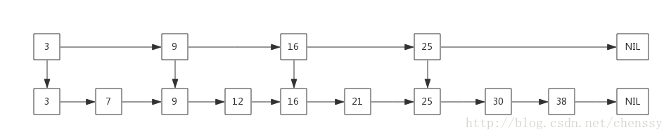
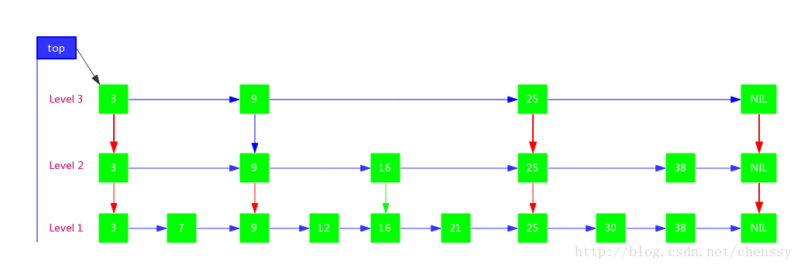
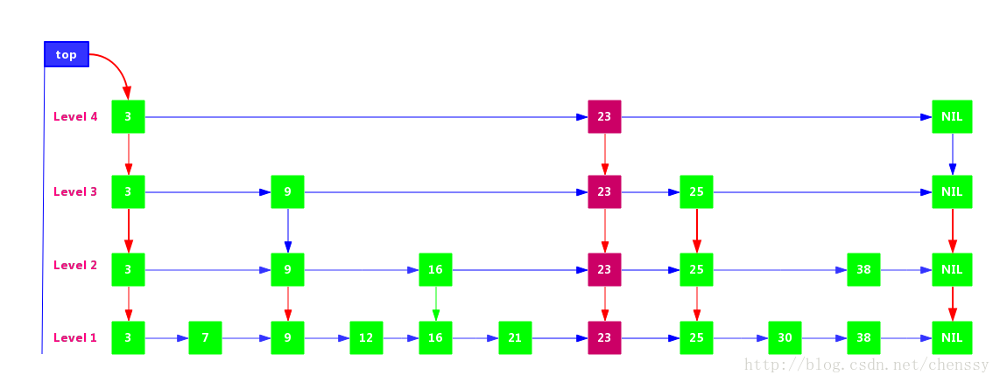
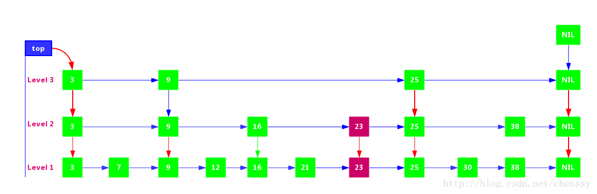
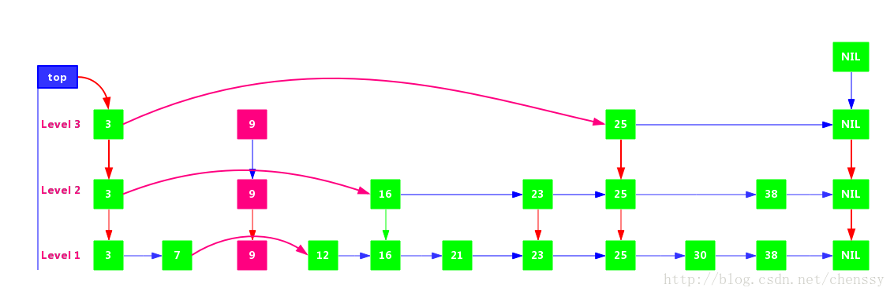

#### ConcurrentSkipListMap

> SkipList

什么是SkipList？

Skip List ，称之为跳表，它是一种可以替代平衡树的数据结构，其数据元素默认按照key值升序，天然有序。

Skip list让已排序的数据分布在多层链表中，以0-1随机数决定一个数据的向上攀升与否，通过**“空间来换取时间”** 的一个算法，在每个节点中增加了向前的指针，在插入、删除、查找时可以忽略一些不可能涉及到的结点，从而提高了效率。 我们先看一个简单的链表，如下：



SkipList具备如下特性：
```
由很多层结构组成，level是通过一定的概率随机产生的
每一层都是一个有序的链表，默认是升序，也可以根据创建映射时所提供的Comparator进行排序，具体取决于使用的构造方法
最底层(Level 1)的链表包含所有元素
如果一个元素出现在Level i 的链表中，则它在Level i 之下的链表也都会出现
每个节点包含两个指针，一个指向同一链表中的下一个元素，一个指向下面一层的元素
```


> SkipListd的查找算法较为简单，对于上面我们我们要查找元素21，其过程如下：

```
比较3，大于，往后找（9），
比9大，继续往后找（25），但是比25小，则从9的下一层开始找（16）
16的后面节点依然为25，则继续从16的下一层找
找到21
```


> SkipList的插入

```
查找合适的位置。这里需要明确一点就是在确认新节点要占据的层次K时，采用丢硬币的方式，完全随机。如果占据的层次K大于链表的层次，则重新申请新的层，否则插入指定层次
申请新的节点
调整指针
```

假定我们要插入的元素为23，经过查找可以确认她是位于25后，9、16、21前。当然需要考虑申请的层次K。 如果层次K > 3 需要申请新层次（Level 4）



如果层次 K = 2 直接在Level 2 层插入即可



**在K层插入元素后，需要确保所有小于K层的层次都应该出现新节点。**

> SkipList的删除

删除节点和插入节点思路基本一致：找到节点，删除节点，调整指针。 比如删除节点9，如下：




> ConcurrentSkipListMap

SkipList采用**空间换时间**的算法，其插入和查找的效率O(logn)，其效率不低于红黑树，但是其原理和实现的复杂度要比红黑树简单多了。

 ConcurrentSkipListMap其内部采用SkipLis数据结构实现。

 为了实现SkipList，ConcurrentSkipListMap提供了三个内部类来构建这样的链表结构：Node、Index、HeadIndex。

 - Node表示最底层的单链表有序节点
 - Index表示为基于Node的索引层
 - HeadIndex用来维护索引层次。


 可以这样说,ConcurrentSkipListMap是通过HeadIndex维护索引层次，通过Index从最上层开始往下层查找，一步一步缩小查询范围，最后到达最底层Node时，就只需要比较很小一部分数据了。
 ```
     * Head nodes          Index nodes
     * +-+    right        +-+                      +-+
     * |2|---------------->| |--------------------->| |->null
     * +-+                 +-+                      +-+
     *  | down              |                        |
     *  v                   v                        v
     * +-+            +-+  +-+       +-+            +-+       +-+
     * |1|----------->| |->| |------>| |----------->| |------>| |->null
     * +-+            +-+  +-+       +-+            +-+       +-+
     *  v              |    |         |              |         |
     * Nodes  next     v    v         v              v         v
     * +-+  +-+  +-+  +-+  +-+  +-+  +-+  +-+  +-+  +-+  +-+  +-+
     * | |->|A|->|B|->|C|->|D|->|E|->|F|->|G|->|H|->|I|->|J|->|K|->null
     * +-+  +-+  +-+  +-+  +-+  +-+  +-+  +-+  +-+  +-+  +-+  +-+
 ```
Node

Node的结构和一般的单链表毫无区别，key-value和一个指向下一个节点的next。
```
    static final class Node<K,V> {
        final K key;
        volatile Object value;
        volatile ConcurrentSkipListMap.Node<K, V> next;

        /** 省略些许代码 */
    }
```
Index

Index提供了一个基于Node节点的索引Node，一个指向下一个Index的right，一个指向下层的down节点。
```
static class Index<K,V> {
    final ConcurrentSkipListMap.Node<K,V> node;
    final ConcurrentSkipListMap.Index<K,V> down;
    volatile ConcurrentSkipListMap.Index<K,V> right;

    /** 省略些许代码 */
}
```
HeadIndex

HeadIndex内部就一个level来定义层级。
```
static final class HeadIndex<K,V> extends Index<K,V> {
    final int level;  //索引层，从1开始，Node单链表层为0
    HeadIndex(Node<K,V> node, Index<K,V> down, Index<K,V> right, int level) {
        super(node, down, right);
        this.level = level;
    }
}
```

> put操作

findPredecessor()方法其实就是确认key要插入的位置。
```
private Node<K,V> findPredecessor(Object key, Comparator<? super K> cmp) {
    if (key == null)
        throw new NullPointerException(); // don't postpone errors
    for (;;) {
        // 从head节点开始，head是level最高级别的headIndex
        for (Index<K,V> q = head, r = q.right, d;;) {

            // r != null，表示该节点右边还有节点，需要比较
            if (r != null) {
                Node<K,V> n = r.node;
                K k = n.key;
                // value == null，表示该节点已经被删除了
                // 通过unlink()方法过滤掉该节点
                if (n.value == null) {
                    //删掉r节点
                    if (!q.unlink(r))
                        break;           // restart
                    r = q.right;         // reread r
                    continue;
                }

                // value != null，节点存在
                // 如果key 大于r节点的key 则往前进一步
                if (cpr(cmp, key, k) > 0) {
                    q = r;
                    r = r.right;
                    continue;
                }
            }

            // 到达最右边，如果dowm == null，表示指针已经达到最下层了，直接返回该节点
            if ((d = q.down) == null)
                return q.node;
            q = d;
            r = d.right;
        }
    }
}
```
从最高层的headIndex开始向右一步一步比较，直到right为null或者右边节点的Node的key大于当前key为止，然后再向下寻找，依次重复该过程，直到down为null为止，即找到了前辈，看返回的结果注意是Node，不是Item，所以插入的位置应该是最底层的Node链表。

 在这个过程中ConcurrentSkipListMap赋予了该方法一个其他的功能，就是通过判断节点的value是否为null，如果为null，表示该节点已经被删除了，通过调用unlink()方法删除该节点。

 删除节点过程非常简单，更改下right指针即可。
 ```
 for (Node<K,V> b = findPredecessor(key, cmp), n = b.next;;) {
        // 前辈节点的next != null
        if (n != null) {
            Object v; int c;
            Node<K,V> f = n.next;

            // 不一致读，主要原因是并发，有节点捷足先登
            if (n != b.next)               // inconsistent read
                break;

            // n.value == null，该节点已经被删除了
            if ((v = n.value) == null) {   // n is deleted
                n.helpDelete(b, f);
                break;
            }

            // 前辈节点b已经被删除
            if (b.value == null || v == n) // b is deleted
                break;

            // 节点大于，往前移
            if ((c = cpr(cmp, key, n.key)) > 0) {
                b = n;
                n = f;
                continue;
            }

            // c == 0 表示，找到一个key相等的节点，根据onlyIfAbsent参数来做判断
            // onlyIfAbsent ==false，则通过casValue，替换value
            // onlyIfAbsent == true，返回该value
            if (c == 0) {
                if (onlyIfAbsent || n.casValue(v, value)) {
                    @SuppressWarnings("unchecked") V vv = (V)v;
                    return vv;
                }
                break; // restart if lost race to replace value
            }
            // else c < 0; fall through
        }

        // 将key-value包装成一个node，插入
        z = new Node<K,V>(key, value, n);
        if (!b.casNext(n, z))
            break;         // restart if lost race to append to b
        break outer;
    }
 ```

 插入节点的过程比较简单，就是将key-value包装成一个Node，然后通过casNext()方法加入到链表当中。当然是插入之前需要进行一系列的校验工作。

 在最下层插入节点后，下一步工作是什么？

 新建索引。

 在插入节点的时候，会根据采用抛硬币的方式来决定新节点所插入的层次，**由于存在并发的可能，ConcurrentSkipListMap采用ThreadLocalRandom来生成随机数。**
 ```
 int rnd = ThreadLocalRandom.nextSecondarySeed();
 ```
 抛硬币决定层次的思想很简单，就是通过抛硬币如果硬币为正面则层次level + 1 ，否则停止，如下：
```
// 抛硬币决定层次
while (((rnd >>>= 1) & 1) != 0)
    ++level;
```
决定的层次level会分为两种情况进行处理，一是如果层次level大于最大的层次话则需要新增一层，否则就在相应层次以及小于该level的层次进行节点新增处理。

level <= headIndex.level
```
// 如果决定的层次level比最高层次head.level小，直接生成最高层次的index
// 由于需要确认每一层次的down，所以需要从最下层依次往上生成
if (level <= (max = h.level)) {
  for (int i = 1; i <= level; ++i)
      idx = new ConcurrentSkipListMap.Index<K,V>(z, idx, null);
}
```
level > headIndex.level
```
// leve > head.level 则新增一层
else { // try to grow by one level
    // 新增一层
    level = max + 1;

    // 初始化 level个item节点
    @SuppressWarnings("unchecked")
    ConcurrentSkipListMap.Index<K,V>[] idxs =
            (ConcurrentSkipListMap.Index<K,V>[])new ConcurrentSkipListMap.Index<?,?>[level+1];
    for (int i = 1; i <= level; ++i)
        idxs[i] = idx = new ConcurrentSkipListMap.Index<K,V>(z, idx, null);

    //
    for (;;) {
        h = head;
        int oldLevel = h.level;
        // 层次扩大了，需要重新开始（有新线程节点加入）
        if (level <= oldLevel) // lost race to add level
            break;
        // 新的头结点HeadIndex
        ConcurrentSkipListMap.HeadIndex<K,V> newh = h;
        ConcurrentSkipListMap.Node<K,V> oldbase = h.node;
        // 生成新的HeadIndex节点，该HeadIndex指向新增层次
        for (int j = oldLevel+1; j <= level; ++j)
            newh = new ConcurrentSkipListMap.HeadIndex<K,V>(oldbase, newh, idxs[j], j);

        // HeadIndex CAS替换
        if (casHead(h, newh)) {
            h = newh;
            idx = idxs[level = oldLevel];
            break;
        }
    }
```
当抛硬币决定的level大于最大层次level时，需要新增一层进行处理。处理逻辑如下：
```
初始化一个对应的index数组，大小为level + 1，然后为每个单位都创建一个index，个中参数为：Node为新增的Z，down为下一层index，right为null。

通过for循环来进行扩容操作。

从最高层进行处理，新增一个HeadIndex，个中参数：节点Node，down都为最高层的Node和HeadIndex，right为刚刚创建的对应层次的index，level为相对应的层次level。

最后通过CAS把当前的head与新加入层的head进行替换。

通过上面步骤我们发现，尽管已经找到了前辈节点，也将node插入了，也确定确定了层次并生成了相应的Index，但是并没有将这些Index插入到相应的层次当中，所以下面的代码就是将index插入到相对应的层当中。

// 从插入的层次level开始
    splice: for (int insertionLevel = level;;) {
        int j = h.level;
        //  从headIndex开始
        for (ConcurrentSkipListMap.Index<K,V> q = h, r = q.right, t = idx;;) {
            if (q == null || t == null)
                break splice;

            // r != null；这里是找到相应层次的插入节点位置，注意这里只横向找
            if (r != null) {
                ConcurrentSkipListMap.Node<K,V> n = r.node;

                int c = cpr(cmp, key, n.key);

                // n.value == null ，解除关系，r右移
                if (n.value == null) {
                    if (!q.unlink(r))
                        break;
                    r = q.right;
                    continue;
                }

                // key > n.key 右移
                if (c > 0) {
                    q = r;
                    r = r.right;
                    continue;
                }
            }

            // 上面找到节点要插入的位置，这里就插入
            // 当前层是最顶层
            if (j == insertionLevel) {
                // 建立联系
                if (!q.link(r, t))
                    break; // restart
                if (t.node.value == null) {
                    findNode(key);
                    break splice;
                }
                // 标志的插入层 -- ，如果== 0 ，表示已经到底了，插入完毕，退出循环
                if (--insertionLevel == 0)
                    break splice;
            }

            // 上面节点已经插入完毕了，插入下一个节点
            if (--j >= insertionLevel && j < level)
                t = t.down;
            q = q.down;
            r = q.right;
        }
    }
```

> get操作

```
private V doGet(Object key) {
    if (key == null)
        throw new NullPointerException();
    Comparator<? super K> cmp = comparator;
    outer: for (;;) {
        for (ConcurrentSkipListMap.Node<K,V> b = findPredecessor(key, cmp), n = b.next;;) {
            Object v; int c;
            if (n == null)
                break outer;
            ConcurrentSkipListMap.Node<K,V> f = n.next;
            if (n != b.next)                // inconsistent read
                break;
            if ((v = n.value) == null) {    // n is deleted
                n.helpDelete(b, f);
                break;
            }
            if (b.value == null || v == n)  // b is deleted
                break;
            if ((c = cpr(cmp, key, n.key)) == 0) {
                @SuppressWarnings("unchecked") V vv = (V)v;
                return vv;
            }
            if (c < 0)
                break outer;
            b = n;
            n = f;
        }
    }
    return null;
  }
```
> remove操作

```
public V remove(Object key) {
      return doRemove(key, null);
  }

final V doRemove(Object key, Object value) {
    if (key == null)
        throw new NullPointerException();
    Comparator<? super K> cmp = comparator;
    outer: for (;;) {
        for (ConcurrentSkipListMap.Node<K,V> b = findPredecessor(key, cmp), n = b.next;;) {
            Object v; int c;
            if (n == null)
                break outer;
            ConcurrentSkipListMap.Node<K,V> f = n.next;

            // 不一致读，重新开始
            if (n != b.next)                    // inconsistent read
                break;

            // n节点已删除
            if ((v = n.value) == null) {        // n is deleted
                n.helpDelete(b, f);
                break;
            }

            // b节点已删除
            if (b.value == null || v == n)      // b is deleted
                break;

            if ((c = cpr(cmp, key, n.key)) < 0)
                break outer;

            // 右移
            if (c > 0) {
                b = n;
                n = f;
                continue;
            }

            /*
             * 找到节点
             */

            // value != null 表示需要同时校验key-value值
            if (value != null && !value.equals(v))
                break outer;

            // CAS替换value
            if (!n.casValue(v, null))
                break;
            if (!n.appendMarker(f) || !b.casNext(n, f))
                findNode(key);                  // retry via findNode
            else {
                // 清理节点
                findPredecessor(key, cmp);      // clean index

                // head.right == null表示该层已经没有节点，删掉该层
                if (head.right == null)
                    tryReduceLevel();
            }
            @SuppressWarnings("unchecked") V vv = (V)v;
            return vv;
        }
    }
    return null;
}
```
调用findPredecessor()方法找到前辈节点，然后通过右移，然后比较，找到后利用CAS把value替换为null，然后判断该节点是不是这层唯一的index，如果是的话，调用tryReduceLevel()方法把这层干掉，完成删除。 其实从这里可以看出，remove方法仅仅是把Node的value设置null，并没有真正删除该节点Node，其实从上面的put操作、get操作我们可以看出，他们在寻找节点的时候都会判断节点的value是否为null，如果为null，则调用unLink()方法取消关联关系，如下：
```
if (n.value == null) {
    if (!q.unlink(r))
        break;           // restart
    r = q.right;         // reread r
    continue;
}
```
> size操作

ConcurrentSkipListMap的size()操作和ConcurrentHashMap不同，它并没有维护一个全局变量来统计元素的个数，所以每次调用该方法的时候都需要去遍历。
```
public int size() {
        long count = 0;
        for (Node<K,V> n = findFirst(); n != null; n = n.next) {
            if (n.getValidValue() != null)
                ++count;
        }
        return (count >= Integer.MAX_VALUE) ? Integer.MAX_VALUE : (int) count;
    }
```

调用findFirst()方法找到第一个Node，然后利用node的next去统计。最后返回统计数据，最多能返回Integer.MAX_VALUE。注意这里在线程并发下是安全的，**但结果是不准确的。**
