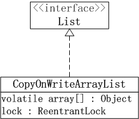

#### CopyOnWriteArrayList

```
1. 它最适合于具有以下特征的应用程序：List 大小通常保持很小，只读操作远多于可变操作，需要在遍历期间防止线程间的冲突。
2. 它是线程安全的。
3. 因为通常需要复制整个基础数组，所以可变操作（add()、set() 和 remove() 等等）的开销很大。
4. 迭代器支持hasNext(), next()等不可变操作，但不支持可变 remove()等操作。
5. 使用迭代器进行遍历的速度很快，并且不会与其他线程发生冲突。在构造迭代器时，迭代器依赖于不变的数组快照。
```



1. CopyOnWriteArrayList的“动态数组”机制 -- 它内部有个“volatile数组”(array)来保持数据。在“添加/修改/删除”数据时，都会新建一个数组，并将更新后的数据拷贝到新建的数组中，最后再将该数组赋值给“volatile数组”。这就是它叫做CopyOnWriteArrayList的原因！CopyOnWriteArrayList就是通过这种方式实现的动态数组；不过正由于**它在“添加/修改/删除”数据时，都会新建数组**，所以涉及到修改数据的操作，CopyOnWriteArrayList效率很
低；但是单单只是进行遍历查找的话，效率比较高。

2. CopyOnWriteArrayList的“线程安全”机制 -- 是通过volatile和互斥锁来实现的。(01) CopyOnWriteArrayList是通过“volatile数组”来保存数据的。一个线程读取volatile数组时，总能看到其它线程对该volatile变量最后的写入；就这样，通过volatile提供了“读取到的数据总是最新的”这个机制的
保证。(02) CopyOnWriteArrayList通过互斥锁来保护数据。**在“添加/修改/删除”数据时，会先“获取互斥锁”，再修改完毕之后，先将数据更新到“volatile数组”中，然后再“释放互斥锁”**；这样，就达到了保护数据的目的。

```
// 创建一个空列表。
CopyOnWriteArrayList()
// 创建一个按 collection 的迭代器返回元素的顺序包含指定 collection 元素的列表。
CopyOnWriteArrayList(Collection<? extends E> c)
// CopyOnWriteArrayList(E[] toCopyIn)
创建一个保存给定数组的副本的列表。

// 将指定元素添加到此列表的尾部。
boolean add(E e)
// 在此列表的指定位置上插入指定元素。
void add(int index, E element)
// 按照指定 collection 的迭代器返回元素的顺序，将指定 collection 中的所有元素添加此列表的尾部。
boolean addAll(Collection<? extends E> c)
// 从指定位置开始，将指定 collection 的所有元素插入此列表。
boolean addAll(int index, Collection<? extends E> c)
// 按照指定 collection 的迭代器返回元素的顺序，将指定 collection 中尚未包含在此列表中的所有元素添加列表的尾部。
int addAllAbsent(Collection<? extends E> c)
// 添加元素（如果不存在）。
boolean addIfAbsent(E e)
// 从此列表移除所有元素。
void clear()
// 返回此列表的浅表副本。
Object clone()
// 如果此列表包含指定的元素，则返回 true。
boolean contains(Object o)
// 如果此列表包含指定 collection 的所有元素，则返回 true。
boolean containsAll(Collection<?> c)
// 比较指定对象与此列表的相等性。
boolean equals(Object o)
// 返回列表中指定位置的元素。
E get(int index)
// 返回此列表的哈希码值。
int hashCode()
// 返回第一次出现的指定元素在此列表中的索引，从 index 开始向前搜索，如果没有找到该元素，则返回 -1。
int indexOf(E e, int index)
// 返回此列表中第一次出现的指定元素的索引；如果此列表不包含该元素，则返回 -1。
int indexOf(Object o)
// 如果此列表不包含任何元素，则返回 true。
boolean isEmpty()
// 返回以恰当顺序在此列表元素上进行迭代的迭代器。
Iterator<E> iterator()
// 返回最后一次出现的指定元素在此列表中的索引，从 index 开始向后搜索，如果没有找到该元素，则返回 -1。
int lastIndexOf(E e, int index)
// 返回此列表中最后出现的指定元素的索引；如果列表不包含此元素，则返回 -1。
int lastIndexOf(Object o)
// 返回此列表元素的列表迭代器（按适当顺序）。
ListIterator<E> listIterator()
// 返回列表中元素的列表迭代器（按适当顺序），从列表的指定位置开始。
ListIterator<E> listIterator(int index)
// 移除此列表指定位置上的元素。
E remove(int index)
// 从此列表移除第一次出现的指定元素（如果存在）。
boolean remove(Object o)
// 从此列表移除所有包含在指定 collection 中的元素。
boolean removeAll(Collection<?> c)
// 只保留此列表中包含在指定 collection 中的元素。
boolean retainAll(Collection<?> c)
// 用指定的元素替代此列表指定位置上的元素。
E set(int index, E element)
// 返回此列表中的元素数。
int size()
// 返回此列表中 fromIndex（包括）和 toIndex（不包括）之间部分的视图。
List<E> subList(int fromIndex, int toIndex)
// 返回一个按恰当顺序（从第一个元素到最后一个元素）包含此列表中所有元素的数组。
Object[] toArray()
// 返回以恰当顺序（从第一个元素到最后一个元素）包含列表所有元素的数组；返回数组的运行时类型是指定数组的运行时类型。
<T> T[] toArray(T[] a)
// 返回此列表的字符串表示形式。
String toString()
```

add
```
public boolean add(E e) {
    final ReentrantLock lock = this.lock;
    // 获取“锁”
    lock.lock();
    try {
        // 获取原始”volatile数组“中的数据和数据长度。
        Object[] elements = getArray();
        int len = elements.length;
        // 新建一个数组newElements，并将原始数据拷贝到newElements中；
        // newElements数组的长度=“原始数组的长度”+1
        Object[] newElements = Arrays.copyOf(elements, len + 1);
        // 将“新增加的元素”保存到newElements中。
        newElements[len] = e;
        // 将newElements赋值给”volatile数组“。
        setArray(newElements);
        return true;
    } finally {
        // 释放“锁”
        lock.unlock();
    }
}
```
get
```
public E get(int index) {
    return get(getArray(), index);
}

private E get(Object[] a, int index) {
    return (E) a[index];
}
```
remove
```
public E remove(int index) {
    final ReentrantLock lock = this.lock;
    // 获取“锁”
    lock.lock();
    try {
        // 获取原始”volatile数组“中的数据和数据长度。
        Object[] elements = getArray();
        int len = elements.length;
        // 获取elements数组中的第index个数据。
        E oldValue = get(elements, index);
        int numMoved = len - index - 1;
        // 如果被删除的是最后一个元素，则直接通过Arrays.copyOf()进行处理，而不需要新建数组。
        // 否则，新建数组，然后将”volatile数组中被删除元素之外的其它元素“拷贝到新数组中；最后，将新数组赋值给”volatile数组“。
        if (numMoved == 0)
            setArray(Arrays.copyOf(elements, len - 1));
        else {
            Object[] newElements = new Object[len - 1];
            System.arraycopy(elements, 0, newElements, 0, index);
            System.arraycopy(elements, index + 1, newElements, index,
                             numMoved);
            setArray(newElements);
        }
        return oldValue;
    } finally {
        // 释放“锁”
        lock.unlock();
    }
}
```

遍历

COWIterator不支持修改元素的操作。例如，对于remove(),set(),add()等操作，COWIterator都会抛出异常！
另外，需要提到的一点是，CopyOnWriteArrayList返回迭代器不会抛出ConcurrentModificationException异常，即它不是fail-fast机制的！
```
private static class COWIterator<E> implements ListIterator<E> {
    private final Object[] snapshot;
    private int cursor;

    private COWIterator(Object[] elements, int initialCursor) {
        cursor = initialCursor;
        snapshot = elements;
    }

    public boolean hasNext() {
        return cursor < snapshot.length;
    }

    public boolean hasPrevious() {
        return cursor > 0;
    }

    // 获取下一个元素
    @SuppressWarnings("unchecked")
    public E next() {
        if (! hasNext())
            throw new NoSuchElementException();
        return (E) snapshot[cursor++];
    }

    // 获取上一个元素
    @SuppressWarnings("unchecked")
    public E previous() {
        if (! hasPrevious())
            throw new NoSuchElementException();
        return (E) snapshot[--cursor];
    }

    public int nextIndex() {
        return cursor;
    }

    public int previousIndex() {
        return cursor-1;
    }

    public void remove() {
        throw new UnsupportedOperationException();
    }

    public void set(E e) {
        throw new UnsupportedOperationException();
    }

    public void add(E e) {
        throw new UnsupportedOperationException();
    }
}
```
