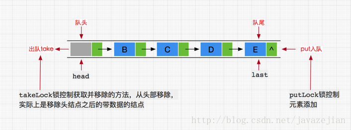

#### LinkedBlockingQueue的基本概要

LinkedBlockingQueue是一个基于链表的阻塞队列，其内部维持一个基于链表的数据队列，实际上我们对LinkedBlockingQueue的API操作都是间接操作该数据队列.
```
public class LinkedBlockingQueue<E> extends AbstractQueue<E>
        implements BlockingQueue<E>, java.io.Serializable {

    /**
     * 节点类，用于存储数据
     */
    static class Node<E> {
        E item;

        /**
         * One of:
         * - the real successor Node
         * - this Node, meaning the successor is head.next
         * - null, meaning there is no successor (this is the last node)
         */
        Node<E> next;

        Node(E x) { item = x; }
    }

    /** 阻塞队列的大小，默认为Integer.MAX_VALUE */
    private final int capacity;

    /** 当前阻塞队列中的元素个数 */
    private final AtomicInteger count = new AtomicInteger();

    /**
     * 阻塞队列的头结点
     */
    transient Node<E> head;

    /**
     * 阻塞队列的尾节点
     */
    private transient Node<E> last;

    /** 获取并移除元素时使用的锁，如take, poll, etc */
    private final ReentrantLock takeLock = new ReentrantLock();

    /** notEmpty条件对象，当队列没有数据时用于挂起执行删除的线程 */
    private final Condition notEmpty = takeLock.newCondition();

    /** 添加元素时使用的锁如 put, offer, etc */
    private final ReentrantLock putLock = new ReentrantLock();

    /** notFull条件对象，当队列数据已满时用于挂起执行添加的线程 */
    private final Condition notFull = putLock.newCondition();

}

```
LinkedBlockingQueue 内部分别使用了takeLock 和 putLock 对并发进行控制，也就是说，添加和删除操作并不是互斥操作，可以同时进行，这样也就可以大大提高吞吐量。




> 添加方法

```
public boolean add(E e) {
     if (offer(e))
         return true;
     else
         throw new IllegalStateException("Queue full");
}
public boolean offer(E e) {
     //添加元素为null直接抛出异常
     if (e == null) throw new NullPointerException();
      //获取队列的个数
      final AtomicInteger count = this.count;
      //判断队列是否已满
      if (count.get() == capacity)
          return false;
      int c = -1;
      //构建节点
      Node<E> node = new Node<E>(e);
      final ReentrantLock putLock = this.putLock;
      putLock.lock();
      try {
          //再次判断队列是否已满，考虑并发情况
          if (count.get() < capacity) {
              enqueue(node);//添加元素
              c = count.getAndIncrement();//拿到当前未添加新元素时的队列长度
              //如果容量还没满
              if (c + 1 < capacity)
                  notFull.signal();//唤醒下一个添加线程，执行添加操作
          }
      } finally {
          putLock.unlock();
      }
      // 由于存在添加锁和消费锁，而消费锁和添加锁都会持续唤醒等到线程，因此count肯定会变化。
      //这里的if条件表示如果队列中还有1条数据
      if (c == 0)
        signalNotEmpty();//如果还存在数据那么就唤醒消费锁
    return c >= 0; // 添加成功返回true，否则返回false
  }

//入队操作
private void enqueue(Node<E> node) {
     //队列尾节点指向新的node节点
     last = last.next = node;
}

//signalNotEmpty方法
private void signalNotEmpty() {
      final ReentrantLock takeLock = this.takeLock;
      takeLock.lock();
          //唤醒获取并删除元素的线程
          notEmpty.signal();
      } finally {
          takeLock.unlock();
      }
  }

```

唤醒添加线程的原因：

在添加新元素完成后，会判断队列是否已满，不满就继续唤醒在条件对象notFull上的添加线程，这点与前面分析的ArrayBlockingQueue很不相同。

在ArrayBlockingQueue内部完成添加操作后，会直接唤醒消费线程对元素进行获取，这是因为ArrayBlockingQueue只用了一个ReenterLock同时对添加线程和消费线程进行控制，这样如果在添加完成后再次唤醒添加线程的话，消费线程可能永远无法执行。

而对于LinkedBlockingQueue来说就不一样了，其内部对添加线程和消费线程分别使用了各自的ReenterLock锁对并发进行控制，**也就是说添加线程和消费线程是不会互斥的**，所以添加锁只要管好自己的添加线程即可，添加线程自己直接唤醒自己的其他添加线程，如果没有等待的添加线程，直接结束了。**如果有就直到队列元素已满才结束挂起**，当然offer方法并不会挂起，而是直接结束，只有put方法才会当队列满时才执行挂起操作。注意消费线程的执行过程也是如此。

**这也是为什么LinkedBlockingQueue的吞吐量要相对大些的原因。**

为什么要判断if (c == 0)时才去唤醒消费线程呢？

这是因为消费线程一旦被唤醒是一直在消费的（前提是有数据），所以c值是一直在变化的，c值是添加完元素前队列的大小，此时c只可能是0或c>0。

**如果是c=0，那么说明之前消费线程已停止，条件对象上可能存在等待的消费线程**，添加完数据后应该是c+1，那么有数据就直接唤醒等待消费线程，如果没有就结束啦，等待下一次的消费操作。

如果c>0那么消费线程就不会被唤醒，只能等待下一个消费操作（poll、take、remove）的调用，那为什么不是条件c>0才去唤醒呢？

我们要明白的是消费线程一旦被唤醒会和添加线程一样，一直不断唤醒其他消费线程，如果添加前c>0，那么很可能上一次调用的消费线程后，数据并没有被消费完，条件队列上也就不存在等待的消费线程了，所以c>0唤醒消费线程得意义不是很大，当然如果添加线程一直添加元素，那么一直c>0，消费线程执行的换就要等待下一次调用消费操作了（poll、take、remove）。

> 移除方法的实现原理

```
public boolean remove(Object o) {
   if (o == null) return false;
     fullyLock();//同时对putLock和takeLock加锁
     try {
         //循环查找要删除的元素
         for (Node<E> trail = head, p = trail.next;
              p != null;
              trail = p, p = p.next) {
             if (o.equals(p.item)) {//找到要删除的节点
                 unlink(p, trail);//直接删除
                 return true;
             }
         }
         return false;
     } finally {
         fullyUnlock();//解锁
     }
    }

//两个同时加锁
void fullyLock() {
       putLock.lock();
       takeLock.lock();
   }

void fullyUnlock() {
      takeLock.unlock();
      putLock.unlock();
  }


  public E poll() {
           //获取当前队列的大小
          final AtomicInteger count = this.count;
          if (count.get() == 0)//如果没有元素直接返回null
              return null;
          E x = null;
          int c = -1;
          final ReentrantLock takeLock = this.takeLock;
          takeLock.lock();
          try {
              //判断队列是否有数据
              if (count.get() > 0) {
                  //如果有，直接删除并获取该元素值
                  x = dequeue();
                  //当前队列大小减一
                  c = count.getAndDecrement();
                  //如果队列未空，继续唤醒等待在条件对象notEmpty上的消费线程
                  if (c > 1)
                      notEmpty.signal();
              }
          } finally {
              takeLock.unlock();
          }
          //判断c是否等于capacity，这是因为如果满说明NotFull条件对象上
          //可能存在等待的添加线程
          if (c == capacity)
              signalNotFull();
          return x;
      }

    private E dequeue() {
          Node<E> h = head;//获取头结点
          Node<E> first = h.next; 获取头结的下一个节点（要删除的节点）
          h.next = h; // help GC//自己next指向自己，即被删除
          head = first;//更新头结点
          E x = first.item;//获取删除节点的值
          first.item = null;//清空数据，因为first变成头结点是不能带数据的，这样也就删除队列的带数据的第一个节点
          return x;
      }

      public E take() throws InterruptedException {
              E x;
              int c = -1;
              //获取当前队列大小
              final AtomicInteger count = this.count;
              final ReentrantLock takeLock = this.takeLock;
              takeLock.lockInterruptibly();//可中断
              try {
                  //如果队列没有数据，挂机当前线程到条件对象的等待队列中
                  while (count.get() == 0) {
                      notEmpty.await();
                  }
                  //如果存在数据直接删除并返回该数据
                  x = dequeue();
                  c = count.getAndDecrement();//队列大小减1
                  if (c > 1)
                      notEmpty.signal();//还有数据就唤醒后续的消费线程
              } finally {
                  takeLock.unlock();
              }
              //满足条件，唤醒条件对象上等待队列中的添加线程
              if (c == capacity)
                  signalNotFull();
              return x;
          }

```

> 检查方法

```
//构造方法，head 节点不存放数据
 public LinkedBlockingQueue(int capacity) {
       if (capacity <= 0) throw new IllegalArgumentException();
       this.capacity = capacity;
       last = head = new Node<E>(null);
   }

 public E element() {
        E x = peek();//直接调用peek
        if (x != null)
            return x;
        else
            throw new NoSuchElementException();//没数据抛异常
    }

 public E peek() {
        if (count.get() == 0)
            return null;
        final ReentrantLock takeLock = this.takeLock;
        takeLock.lock();
        try {
            //获取头结节点的下一个节点
            Node<E> first = head.next;
            if (first == null)
                return null;//为null就返回null
            else
                return first.item;//返回值
        } finally {
            takeLock.unlock();
        }
    }

```

> 最后来看两个根据时间阻塞的方法，比较有意思，利用的Conditin来实现的。

```
//在指定时间内阻塞添加的方法，超时就结束
 public boolean offer(E e, long timeout, TimeUnit unit)
        throws InterruptedException {

        if (e == null) throw new NullPointerException();
        //将时间转换成纳秒
        long nanos = unit.toNanos(timeout);
        int c = -1;
        //获取锁
        final ReentrantLock putLock = this.putLock;
        //获取当前队列大小
        final AtomicInteger count = this.count;
        //锁中断(如果需要)
        putLock.lockInterruptibly();
        try {
            //判断队列是否满
            while (count.get() == capacity) {
                if (nanos <= 0)
                    return false;
                //如果队列满根据阻塞的等待
                nanos = notFull.awaitNanos(nanos);
            }
            //队列没满直接入队
            enqueue(new Node<E>(e));
            c = count.getAndIncrement();
            //唤醒条件对象上等待的线程
            if (c + 1 < capacity)
                notFull.signal();
        } finally {
            putLock.unlock();
        }
        //唤醒消费线程
        if (c == 0)
            signalNotEmpty();
        return true;
    }


offer():
    //判断队列是否满
     while (count.get() == capacity) {
            if (nanos <= 0)
                return false;
            //如果队列满根据阻塞的等待
            nanos = notFull.awaitNanos(nanos);
        }

    //CoditionObject（Codition的实现类）中的awaitNanos方法
     public final long awaitNanos(long nanosTimeout)
                    throws InterruptedException {
                if (Thread.interrupted())
                    throw new InterruptedException();
                //这里是将当前添加线程封装成NODE节点加入Condition的等待队列中
                //注意这里的NODE是AQS的内部类Node
                Node node = addConditionWaiter();
                //加入等待，那么就释放当前线程持有的锁
                int savedState = fullyRelease(node);
                //计算过期时间
                final long deadline = System.nanoTime() + nanosTimeout;
                int interruptMode = 0;

                while (!isOnSyncQueue(node)) {
                    if (nanosTimeout <= 0L) {
                        transferAfterCancelledWait(node);
                        break;
                    }
                    //主要看这里！！由于是while 循环，这里会不断判断等待时间
                    //nanosTimeout 是否超时
                    //static final long spinForTimeoutThreshold = 1000L;
                    if (nanosTimeout >= spinForTimeoutThreshold)
                        LockSupport.parkNanos(this, nanosTimeout);//挂起线程
                    if ((interruptMode = checkInterruptWhileWaiting(node)) != 0)
                        break;
                    //重新计算剩余等待时间，while循环中继续判断下列公式
                    //nanosTimeout >= spinForTimeoutThreshold
                    nanosTimeout = deadline - System.nanoTime();
                }
                if (acquireQueued(node, savedState) && interruptMode != THROW_IE)
                    interruptMode = REINTERRUPT;
                if (node.nextWaiter != null)
                    unlinkCancelledWaiters();
                if (interruptMode != 0)
                    reportInterruptAfterWait(interruptMode);
                return deadline - System.nanoTime();
            }
```

> LinkedBlockingQueue和ArrayBlockingQueue

1. 队列大小有所不同，ArrayBlockingQueue是有界的初始化必须指定大小，而LinkedBlockingQueue可以是有界的也可以是无界的(Integer.MAX_VALUE)，对于后者而言，当添加速度大于移除速度时，在无界的情况下，可能会造成内存溢出等问题。

2. 数据存储容器不同，ArrayBlockingQueue采用的是数组作为数据存储容器，而LinkedBlockingQueue采用的则是以Node节点作为连接对象的链表。

3. 由于ArrayBlockingQueue采用的是数组的存储容器，因此在插入或删除元素时不会产生或销毁任何额外的对象实例，而LinkedBlockingQueue则会生成一个额外的Node对象。这可能在长时间内需要高效并发地处理大批量数据的时，对于GC可能存在较大影响。

4. 两者的实现队列添加或移除的锁不一样，ArrayBlockingQueue实现的队列中的锁是没有分离的，即添加操作和移除操作采用的同一个ReenterLock锁，而LinkedBlockingQueue实现的队列中的锁是分离的，其添加采用的是putLock，移除采用的则是takeLock，这样能大大提高队列的吞吐量，也意味着在高并发的情况下生产者和消费者可以并行地操作队列中的数据，以此来提高整个队列的并发性能。


原文链接：https://blog.csdn.net/javazejian/article/details/77410889
