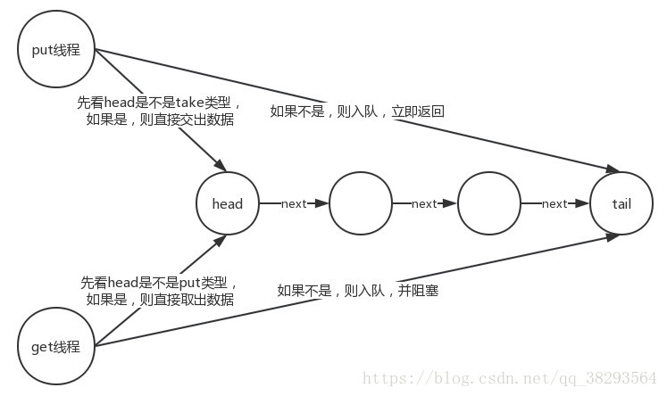

#### LinkedTransferQueue

前面提到的各种BlockingQueue对读或者写都是锁上整个队列，在并发量大的时候，各种锁是比较耗资源和耗时间的，而前面的SynchronousQueue虽然不会锁住整个队列，但它是一个没有容量的“队列”。

那么有没有这样一种队列，它即可以像其他的BlockingQueue一样有容量又可以像SynchronousQueue一样不会锁住整个队列呢？

有！答案就是LinkedTransferQueue。

LinkedTransferQueue是基于链表的FIFO无界阻塞队列，它出现在JDK7中。Doug Lea 大神说LinkedTransferQueue是一个聪明的队列。

它是ConcurrentLinkedQueue、SynchronousQueue (公平模式下)、无界的LinkedBlockingQueues等的超集。

LinkedTransferQueue采用一种预占模式。

什么意思呢？

有就直接拿走，没有就占着这个位置直到拿到或者超时或者中断。

**即消费者线程到队列中取元素时，如果发现队列为空，则会生成一个null节点，然后park住等待生产者。后面如果生产者线程入队时发现有一个null元素节点，这时生产者就不会入列了，直接将元素填充到该节点上，唤醒该节点的线程，被唤醒的消费者线程拿东西走人。**

和SynchronousQueue相比，LinkedTransferQueue多了一个可以存储的队列，与LinkedBlockingQueue相比，LinkedTransferQueue多了直接传递元素，少了用锁来同步。
