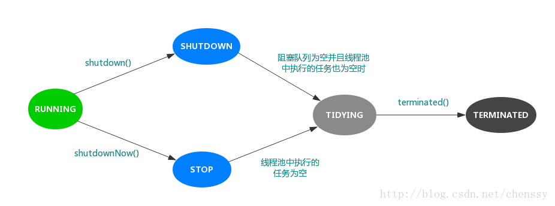

#### ThreadPoolExecutor

在《阿里巴巴java开发手册》中指出了线程资源必须通过线程池提供，不允许在应用中自行显示的创建线程，这样一方面是线程的创建更加规范，可以合理控制开辟线程的数量；另一方面线程的细节管理交给线程池处理，优化了资源的开销。

而线程池不允许使用Executors去创建，而要通过ThreadPoolExecutor方式，这一方面是由于jdk中Executor框架虽然提供了如newFixedThreadPool()、newSingleThreadExecutor()、newCachedThreadPool()等创建线程池的方法，但都有其局限性，不够灵活；另外由于前面几种方法内部也是通过ThreadPoolExecutor方式实现，使用ThreadPoolExecutor有助于大家明确线程池的运行规则，创建符合自己的业务场景需要的线程池，避免资源耗尽的风险。


ThreadPoolExecutor扩展主要是围绕beforeExecute()、afterExecute()和terminated()三个接口实现的，
```
1、beforeExecute：线程池中任务运行前执行

2、afterExecute：线程池中任务运行完毕后执行

3、terminated：线程池退出后执行

public class ThreadPool {
    private static ExecutorService pool;
    public static void main( String[] args ) throws InterruptedException
    {
        //实现自定义接口
        pool = new ThreadPoolExecutor(2, 4, 1000, TimeUnit.MILLISECONDS, new ArrayBlockingQueue<Runnable>(5),
                new ThreadFactory() {
            public Thread newThread(Runnable r) {
                System.out.println("线程"+r.hashCode()+"创建");
                //线程命名
                Thread th = new Thread(r,"threadPool"+r.hashCode());
                return th;
            }
        }, new ThreadPoolExecutor.CallerRunsPolicy()) {

            protected void beforeExecute(Thread t,Runnable r) {
                System.out.println("准备执行："+ ((ThreadTask)r).getTaskName());
            }

            protected void afterExecute(Runnable r,Throwable t) {
                System.out.println("执行完毕："+((ThreadTask)r).getTaskName());
            }

            protected void terminated() {
                System.out.println("线程池退出");
            }
        };

        for(int i=0;i<10;i++) {
            pool.execute(new ThreadTask("Task"+i));
        }    
        pool.shutdown();
    }
}
```

线程有6种状态
```
public enum State {
       /**
        * Thread state for a thread which has not yet started.
        */
       NEW,

       /**
        * Thread state for a runnable thread.  A thread in the runnable
        * state is executing in the Java virtual machine but it may
        * be waiting for other resources from the operating system
        * such as processor.
        */
       RUNNABLE,

       /**
        * Thread state for a thread blocked waiting for a monitor lock.
        * A thread in the blocked state is waiting for a monitor lock
        * to enter a synchronized block/method or
        * reenter a synchronized block/method after calling
        * {@link Object#wait() Object.wait}.
        */
       BLOCKED,

       /**
        * Thread state for a waiting thread.
        * A thread is in the waiting state due to calling one of the
        * following methods:
        * <ul>
        *   <li>{@link Object#wait() Object.wait} with no timeout</li>
        *   <li>{@link #join() Thread.join} with no timeout</li>
        *   <li>{@link LockSupport#park() LockSupport.park}</li>
        * </ul>
        *
        * <p>A thread in the waiting state is waiting for another thread to
        * perform a particular action.
        *
        * For example, a thread that has called <tt>Object.wait()</tt>
        * on an object is waiting for another thread to call
        * <tt>Object.notify()</tt> or <tt>Object.notifyAll()</tt> on
        * that object. A thread that has called <tt>Thread.join()</tt>
        * is waiting for a specified thread to terminate.
        */
       WAITING,

       /**
        * Thread state for a waiting thread with a specified waiting time.
        * A thread is in the timed waiting state due to calling one of
        * the following methods with a specified positive waiting time:
        * <ul>
        *   <li>{@link #sleep Thread.sleep}</li>
        *   <li>{@link Object#wait(long) Object.wait} with timeout</li>
        *   <li>{@link #join(long) Thread.join} with timeout</li>
        *   <li>{@link LockSupport#parkNanos LockSupport.parkNanos}</li>
        *   <li>{@link LockSupport#parkUntil LockSupport.parkUntil}</li>
        * </ul>
        */
       TIMED_WAITING,

       /**
        * Thread state for a terminated thread.
        * The thread has completed execution.
        */
       TERMINATED;
   }

```

线程池同样有五种状态：Running, SHUTDOWN, STOP, TIDYING, TERMINATED。

```
    private final AtomicInteger ctl = new AtomicInteger(ctlOf(RUNNING, 0));
    private static final int COUNT_BITS = Integer.SIZE - 3;
    private static final int CAPACITY   = (1 << COUNT_BITS) - 1;

    // runState is stored in the high-order bits
    private static final int RUNNING    = -1 << COUNT_BITS;
    private static final int SHUTDOWN   =  0 << COUNT_BITS;
    private static final int STOP       =  1 << COUNT_BITS;
    private static final int TIDYING    =  2 << COUNT_BITS;
    private static final int TERMINATED =  3 << COUNT_BITS;

    // Packing and unpacking ctl
    private static int runStateOf(int c)     { return c & ~CAPACITY; }
    private static int workerCountOf(int c)  { return c & CAPACITY; }
    private static int ctlOf(int rs, int wc) { return rs | wc; }
```
变量ctl定义为AtomicInteger ，其功能非常强大，记录了“线程池中的任务数量”和“线程池的状态”两个信息。共32位，其中高3位表示"线程池状态"，低29位表示"线程池中的任务数量"。

```
RUNNING            -- 对应的高3位值是111。
SHUTDOWN           -- 对应的高3位值是000。
STOP               -- 对应的高3位值是001。
TIDYING            -- 对应的高3位值是010。
TERMINATED         -- 对应的高3位值是011。

RUNNING：处于RUNNING状态的线程池能够接受新任务，以及对新添加的任务进行处理。

SHUTDOWN：处于SHUTDOWN状态的线程池不可以接受新任务，但是可以对已添加的任务进行处理。

STOP：处于STOP状态的线程池不接收新任务，不处理已添加的任务，并且会中断正在处理的任务。

TIDYING：当所有的任务已终止，ctl记录的"任务数量"为0，线程池会变为TIDYING状态。当线程池变为TIDYING状态时，会执行钩子函数terminated()。terminated()在ThreadPoolExecutor类中是空的，若用户想在线程池变为TIDYING时，进行相应的处理；可以通过重载terminated()函数来实现。

TERMINATED：线程池彻底终止的状态。
```



> 创建线程池

```
public ThreadPoolExecutor(int corePoolSize,
                           int maximumPoolSize,
                           long keepAliveTime,
                           TimeUnit unit,
                           BlockingQueue<Runnable> workQueue,
                           ThreadFactory threadFactory,
                           RejectedExecutionHandler handler) {
     if (corePoolSize < 0 ||
         maximumPoolSize <= 0 ||
         maximumPoolSize < corePoolSize ||
         keepAliveTime < 0)
         throw new IllegalArgumentException();
     if (workQueue == null || threadFactory == null || handler == null)
         throw new NullPointerException();
     this.corePoolSize = corePoolSize;
     this.maximumPoolSize = maximumPoolSize;
     this.workQueue = workQueue;
     this.keepAliveTime = unit.toNanos(keepAliveTime);
     this.threadFactory = threadFactory;
     this.handler = handler;
 }
```

**corePoolSize**

线程池中核心线程的数量。

当提交一个任务时，线程池会新建一个线程来执行任务，直到当前线程数等于corePoolSize，如果超过了则放入阻塞队列。

如果调用了线程池的prestartAllCoreThreads()方法，线程池会提前创建并启动所有基本线程。

**maximumPoolSize**

线程池中允许的最大线程数。

线程池的阻塞队列满了之后，如果还有任务提交，如果当前的线程数小于maximumPoolSize，则会新建线程来执行任务。

注意，如果使用的是无界队列，该参数也就没有什么效果了。

**keepAliveTime**

线程空闲的时间。线程的创建和销毁是需要代价的。线程执行完任务后不会立即销毁，而是继续存活一段时间：keepAliveTime。

默认情况下，该参数只有在线程数大于corePoolSize时才会生效。

**unit**

keepAliveTime的单位。TimeUnit

**workQueue**

用来保存等待执行的任务的阻塞队列，等待的任务必须实现Runnable接口。我们可以选择如下几种：

```
ArrayBlockingQueue：基于数组结构的有界阻塞队列，FIFO。
LinkedBlockingQueue：基于链表结构的有界阻塞队列，FIFO。
SynchronousQueue：不存储元素的阻塞队列，每个插入操作都必须等待一个移出操作，反之亦然。
PriorityBlockingQueue：具有优先界别的阻塞队列。
```

**threadFactory**

用于设置创建线程的工厂。该对象可以通过Executors.defaultThreadFactory()，如下：
```
    public static ThreadFactory defaultThreadFactory() {
        return new DefaultThreadFactory();
    }
    返回的是DefaultThreadFactory对象，源码如下：

    static class DefaultThreadFactory implements ThreadFactory {
        private static final AtomicInteger poolNumber = new AtomicInteger(1);
        private final ThreadGroup group;
        private final AtomicInteger threadNumber = new AtomicInteger(1);
        private final String namePrefix;

        DefaultThreadFactory() {
            SecurityManager s = System.getSecurityManager();
            group = (s != null) ? s.getThreadGroup() :
                                  Thread.currentThread().getThreadGroup();
            namePrefix = "pool-" +
                          poolNumber.getAndIncrement() +
                         "-thread-";
        }

        public Thread newThread(Runnable r) {
            Thread t = new Thread(group, r,
                                  namePrefix + threadNumber.getAndIncrement(),
                                  0);
            if (t.isDaemon())
                t.setDaemon(false);
            if (t.getPriority() != Thread.NORM_PRIORITY)
                t.setPriority(Thread.NORM_PRIORITY);
            return t;
        }
    }
```

**ThreadFactory**

提供创建线程的功能的线程工厂。

他是通过newThread()方法提供创建线程的功能，newThread()方法创建的线程都是“非守护线程”而且“线程优先级都是Thread.NORM_PRIORITY”。

**handler**

RejectedExecutionHandler，线程池的拒绝策略。所谓拒绝策略，是指将任务添加到线程池中时，线程池拒绝该任务所采取的相应策略。当向线程池中提交任务时，如果此时线程池中的线程已经饱和了，而且阻塞队列也已经满了，则线程池会选择一种拒绝策略来处理该任务。

线程池提供了四种拒绝策略：
```
AbortPolicy：直接抛出异常，默认策略；
CallerRunsPolicy：用调用者所在的线程来执行任务；
DiscardOldestPolicy：丢弃阻塞队列中靠最前的任务，并执行当前任务；
DiscardPolicy：直接丢弃任务；
当然我们也可以实现自己的拒绝策略，例如记录日志等等，实现RejectedExecutionHandler接口即可。
```

> 线程池

Executor框架提供了三种线程池，他们都可以通过工具类Executors来创建。

**FixedThreadPool**

FixedThreadPool，可重用固定线程数的线程池，其定义如下：
```
    public static ExecutorService newFixedThreadPool(int nThreads) {
        return new ThreadPoolExecutor(nThreads, nThreads,
                                      0L, TimeUnit.MILLISECONDS,
                                      new LinkedBlockingQueue<Runnable>());
    }
```
corePoolSize 和 maximumPoolSize都设置为创建FixedThreadPool时指定的参数nThreads，意味着当线程池满时且阻塞队列也已经满时，如果继续提交任务，则会直接走拒绝策略，该线程池不会再新建线程来执行任务，而是直接走拒绝策略。FixedThreadPool使用的是默认的拒绝策略，即AbortPolicy，则直接抛出异常。

keepAliveTime设置为0L，表示空闲的线程会立刻终止。

workQueue则是使用LinkedBlockingQueue，但是没有设置范围，那么则是最大值（Integer.MAX_VALUE），这基本就相当于一个无界队列了。

使用该“无界队列”则会带来哪些影响呢？

当线程池中的线程数量等于corePoolSize 时，如果继续提交任务，该任务会被添加到阻塞队列workQueue中，当阻塞队列也满了之后，则线程池会新建线程执行任务直到maximumPoolSize。

由于FixedThreadPool使用的是“无界队列”LinkedBlockingQueue，那么maximumPoolSize参数无效，同时指定的拒绝策略AbortPolicy也将无效。而且该线程池也不会拒绝提交的任务，如果客户端提交任务的速度快于任务的执行，那么keepAliveTime也是一个无效参数。

**SingleThreadExecutor**

SingleThreadExecutor是使用单个worker线程的Executor，定义如下：
```
    public static ExecutorService newSingleThreadExecutor() {
        return new FinalizableDelegatedExecutorService
            (new ThreadPoolExecutor(1, 1,
                                    0L, TimeUnit.MILLISECONDS,
                                    new LinkedBlockingQueue<Runnable>()));
    }
```
作为单一worker线程的线程池，SingleThreadExecutor把corePool和maximumPoolSize均被设置为1，和FixedThreadPool一样使用的是无界队列LinkedBlockingQueue,所以带来的影响和FixedThreadPool一样。

CachedThreadPool

CachedThreadPool是一个会根据需要创建新线程的线程池 ，他定义如下：

    public static ExecutorService newCachedThreadPool() {
        return new ThreadPoolExecutor(0, Integer.MAX_VALUE,
                                      60L, TimeUnit.SECONDS,
                                      new SynchronousQueue<Runnable>());
    }
CachedThreadPool的corePool为0，maximumPoolSize为Integer.MAX_VALUE，这就意味着所有的任务一提交就会加入到阻塞队列中。

keepAliveTime这是为60L，unit设置为TimeUnit.SECONDS，意味着空闲线程等待新任务的最长时间为60秒，空闲线程超过60秒后将会被终止。

阻塞队列采用的SynchronousQueue，SynchronousQueue是一个没有元素的阻塞队列，加上corePool = 0 ，maximumPoolSize = Integer.MAX_VALUE，这样就会存在一个问题，如果主线程提交任务的速度远远大于CachedThreadPool的处理速度，则CachedThreadPool会不断地创建新线程来执行任务，这样有可能会导致系统耗尽CPU和内存资源，所以在使用该线程池是，一定要注意控制并发的任务数，否则创建大量的线程可能导致严重的性能问题。

**newScheduledThreadPool**

创建一个线程池，它可安排在给定延迟后运行命令或者定期地执行。

```
public class Scheduled {
	private static int pool = 2;
	public static void main(String[] args){
		ScheduledExecutorService ex = Executors.newScheduledThreadPool(pool);
		runnable rn = new runnable();
		//参数1：目标对象   参数2：隔多长时间开始执行线程，    参数3：执行周期       参数4：时间单位
    ex.scheduleAtFixedRate(rn, 3, 1, TimeUnit.MILLISECONDS);
	}
}
class runnable implements Runnable{
	public void run(){
		System.out.println(Thread.currentThread().getName());
	}
-------
package com.th.threadPool;

import java.util.concurrent.Executors;
import java.util.concurrent.ScheduledExecutorService;
import java.util.concurrent.TimeUnit;

/**
 * Created by Administrator on 2018/6/6.
 * newScheduledThreadPool 创建一个固定长度线程池，支持定时及周期性任务执行。
 */
public class NewScheduledThreadPool {
    public static void main(String[] args) {
        ScheduledExecutorService scheduledExecutorService = Executors.newScheduledThreadPool(5);

        //testSchedule(scheduledExecutorService);

        //testScheduleAtFixedRate(scheduledExecutorService);

        testScheduleWithFixedDelay(scheduledExecutorService);

        // 终止线程池
        //scheduledExecutorService.shutdown();
    }

    /**
     *
     * 跟 testScheduleAtFixedRate 非常类似，就是延迟的时间有点区别
     * 创建并执行一个在给定初始延迟后首次启用的定期操作，后续操作具有给定的周期；
     * 也就是将在 initialDelay 后开始执行，然后在 initialDelay+period 后执行，
     * 接着在 initialDelay + 2 * period 后执行，依此类推。
     *
     * 如果任务里面执行的时间大于 period 的时间，下一次的任务会推迟执行。
     * 推迟的时间 ： 等到上次的任务执行完之后再延迟period 的时间后执行。
     * @param scheduledExecutorService
     */
    private static void testScheduleWithFixedDelay(ScheduledExecutorService scheduledExecutorService) {
        scheduledExecutorService.scheduleWithFixedDelay(new Runnable() {
            @Override
            public void run() {
                try {
                    System.out.println("延迟2秒，再3秒执行一次");
                    //如果任务里面执行的时间大于 period 的时间，下一次的任务会推迟执行。
                    //本次任务执行完后下次的任务还需要延迟period时间后再执行
                    Thread.sleep(6*1000);
                } catch (InterruptedException e) {
                    e.printStackTrace();
                }
            }
        },2,3,TimeUnit.SECONDS);
    }

    /**
     * 创建并执行一个在给定初始延迟后首次启用的定期操作，后续操作具有给定的周期；
     * 也就是将在 initialDelay 后开始执行，然后在 initialDelay+period 后执行，
     * 接着在 initialDelay + 2 * period 后执行，依此类推。
     *
     * 如果任务里面执行的时间大于 period 的时间，下一次的任务会推迟执行。
     * 推迟的时间 ： 等到上次的任务执行完就立马执行。
     * @param scheduledExecutorService
     */
    private static void testScheduleAtFixedRate(ScheduledExecutorService scheduledExecutorService) {
        scheduledExecutorService.scheduleAtFixedRate(new Runnable() {
            @Override
            public void run() {
                try {
                    System.out.println("延迟2秒，再3秒执行一次");
                    //如果任务里面执行的时间大于 period 的时间，下一次的任务会推迟执行。
                    //如果任务里面执行的时间大于 period 的时间，本次任务执行完后，下次任务立马执行。
                    Thread.sleep(6*1000);
                } catch (InterruptedException e) {
                    e.printStackTrace();
                }

            }
        },2,3,TimeUnit.SECONDS);
    }

    /**
     * 创建并执行在给定延迟后启用的一次性操作
     * @param scheduledExecutorService
     */
    private static void testSchedule(ScheduledExecutorService scheduledExecutorService) {
        scheduledExecutorService.schedule(new Runnable() {
            @Override
            public void run() {
                System.out.println("delay 3 seconds");
            }
        }, 3, TimeUnit.SECONDS);
    }
}
```

> 任务提交

线程池根据业务不同的需求提供了两种方式提交任务：Executor.execute()、ExecutorService.submit()。其中ExecutorService.submit()可以获取该任务执行的Future。
```
public void execute(Runnable command) {
    if (command == null)
        throw new NullPointerException();
    int c = ctl.get();
    if (workerCountOf(c) < corePoolSize) {
        if (addWorker(command, true))
            return;
        c = ctl.get();
    }
    if (isRunning(c) && workQueue.offer(command)) {
        int recheck = ctl.get();
        if (! isRunning(recheck) && remove(command))
            reject(command);
        else if (workerCountOf(recheck) == 0)
            addWorker(null, false);
    }
    else if (!addWorker(command, false))
        reject(command);
}
private boolean addWorker(Runnable firstTask, boolean core) {
        retry:
        for (;;) {
            int c = ctl.get();

            // 获取当前线程状态
            int rs = runStateOf(c);

            if (rs >= SHUTDOWN &&
                    ! (rs == SHUTDOWN &&
                            firstTask == null &&
                            ! workQueue.isEmpty()))
                return false;

            // 内层循环，worker + 1
            for (;;) {
                // 线程数量
                int wc = workerCountOf(c);
                // 如果当前线程数大于线程最大上限CAPACITY  return false
                // 若core == true，则与corePoolSize 比较，否则与maximumPoolSize ，大于 return false
                if (wc >= CAPACITY ||
                        wc >= (core ? corePoolSize : maximumPoolSize))
                    return false;
                // worker + 1,成功跳出retry循环
                if (compareAndIncrementWorkerCount(c))
                    break retry;

                // CAS add worker 失败，再次读取ctl
                c = ctl.get();

                // 如果状态不等于之前获取的state，跳出内层循环，继续去外层循环判断
                if (runStateOf(c) != rs)
                    continue retry;
            }
        }

        boolean workerStarted = false;
        boolean workerAdded = false;
        Worker w = null;
        try {

            // 新建线程：Worker
            w = new Worker(firstTask);
            // 当前线程
            final Thread t = w.thread;
            if (t != null) {
                // 获取主锁：mainLock
                final ReentrantLock mainLock = this.mainLock;
                mainLock.lock();
                try {

                    // 线程状态
                    int rs = runStateOf(ctl.get());

                    // rs < SHUTDOWN ==> 线程处于RUNNING状态
                    // 或者线程处于SHUTDOWN状态，且firstTask == null（可能是workQueue中仍有未执行完成的任务，创建没有初始任务的worker线程执行）
                    if (rs < SHUTDOWN ||
                            (rs == SHUTDOWN && firstTask == null)) {

                        // 当前线程已经启动，抛出异常
                        if (t.isAlive()) // precheck that t is startable
                            throw new IllegalThreadStateException();

                        // workers是一个HashSet<Worker>
                        workers.add(w);

                        // 设置最大的池大小largestPoolSize，workerAdded设置为true
                        int s = workers.size();
                        if (s > largestPoolSize)
                            largestPoolSize = s;
                        workerAdded = true;
                    }
                } finally {
                    // 释放锁
                    mainLock.unlock();
                }
                // 启动线程
                if (workerAdded) {
                    t.start();
                    workerStarted = true;
                }
            }
        } finally {

            // 线程启动失败
            if (! workerStarted)
                addWorkerFailed(w);
        }
        return workerStarted;
    }
```

> 线程终止

线程池ThreadPoolExecutor提供了shutdown()和shutDownNow()用于关闭线程池。

shutdown()：按过去执行已提交任务的顺序发起一个有序的关闭，但是不接受新任务。

shutdownNow() :尝试停止所有的活动执行任务、暂停等待任务的处理，**清空任务列表，并返回等待执行的任务列表。**
