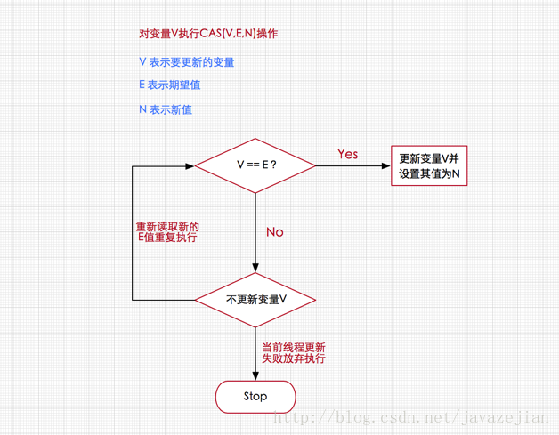
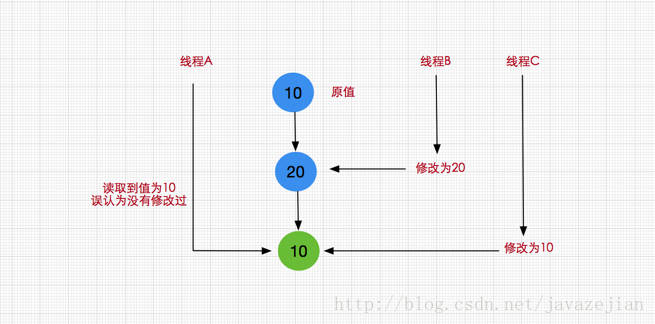

#### CAS

synchronized关键字，通过该关键字可以控制并发执行过程中有且只有一个线程可以访问共享资源，其原理是通过当前线程持有当前对象锁，从而拥有访问权限，而其他没有持有当前对象锁的线程无法拥有访问权限，也就保证了线程安全。但在本篇中，我们将会详聊另外一种**反向而行的并发策略，即无锁并发，即不加锁也能保证并发执行的安全性**。

无锁的概念
在谈论无锁概念时，总会关联起乐观派与悲观派，对于乐观派而言，他们认为事情总会往好的方向发展，总是认为坏的情况发生的概率特别小，可以无所顾忌地做事，但对于悲观派而已，他们总会认为发展事态如果不及时控制，以后就无法挽回了，即使无法挽回的局面几乎不可能发生。

**这两种派系映射到并发编程中就如同加锁与无锁的策略，即加锁是一种悲观策略，无锁是一种乐观策略**，因为对于加锁的并发程序来说，它们总是认为每次访问共享资源时总会发生冲突，因此必须对每一次数据操作实施加锁策略。而无锁则总是假设对共享资源的访问没有冲突，线程可以不停执行，无需加锁，无需等待，**一旦发现冲突，无锁策略则采用一种称为CAS的技术来保证线程执行的安全性**，这项CAS技术就是无锁策略实现的关键。

CAS的全称是**Compare And Swap** 即比较交换，其算法核心思想如下：
```
CAS(V,E,N)

V表示要更新的变量

E表示预期值

N表示新值
```

如果V值等于E值，则将V的值设为N。若V值和E值不同，则说明已经有其他线程做了更新，则当前线程什么都不做。通俗的理解就是CAS操作需要我们提供一个期望值，当期望值与当前线程的变量值相同时，说明还没线程修改该值，当前线程可以进行修改，也就是执行CAS操作，**但如果期望值与当前线程不符，则说明该值已被其他线程修改，此时不执行更新操作，但可以选择重新读取该变量再尝试再次修改该变量**，也可以放弃操作，原理图如下



由于CAS操作属于乐观派，它总认为自己可以成功完成操作，当多个线程同时使用CAS操作一个变量时，**只有一个会胜出，并成功更新，其余均会失败**，但失败的线程并不会被挂起，仅是被告知失败，并且允许再次尝试，当然也允许失败的线程放弃操作，这点从图中也可以看出来。基于这样的原理，CAS操作即使没有锁，同样知道其他线程对共享资源操作影响，并执行相应的处理措施。同时从这点也可以看出，**由于无锁操作中没有锁的存在，因此不可能出现死锁的情况，也就是说无锁操作天生免疫死锁。**

CPU指令对CAS的支持

或许我们可能会有这样的疑问，假设存在多个线程执行CAS操作并且CAS的步骤很多，有没有可能在判断V和E相同后，正要赋值时，切换了线程，更改了值。造成了数据不一致呢？

答案是否定的，**因为CAS是一种系统原语，原语属于操作系统用语范畴，是由若干条指令组成的，用于完成某个功能的一个过程，并且原语的执行必须是连续的，在执行过程中不允许被中断，也就是说CAS是一条CPU的原子指令，不会造成所谓的数据不一致问题**。

> Unsafe类

Unsafe类存在于sun.misc包中，其内部方法操作可以像C的指针一样直接操作内存，单从名称看来就可以知道该类是非安全的，毕竟Unsafe拥有着类似于C的指针操作，因此总是不应该首先使用Unsafe类，Java官方也不建议直接使用的Unsafe类，据说Oracle正在计划从Java 9中去掉Unsafe类，但我们还是很有必要了解该类，因为Java中CAS操作的执行依赖于Unsafe类的方法，**注意Unsafe类中的所有方法都是native修饰的，也就是说Unsafe类中的方法都直接调用操作系统底层资源执行相应任务**。

```
//分配内存指定大小的内存
public native long allocateMemory(long bytes);
//根据给定的内存地址address设置重新分配指定大小的内存
public native long reallocateMemory(long address, long bytes);
//用于释放allocateMemory和reallocateMemory申请的内存
public native void freeMemory(long address);
//将指定对象的给定offset偏移量内存块中的所有字节设置为固定值
public native void setMemory(Object o, long offset, long bytes, byte value);
//设置给定内存地址的值
public native void putAddress(long address, long x);
//获取指定内存地址的值
public native long getAddress(long address);

//设置给定内存地址的long值
public native void putLong(long address, long x);
//获取指定内存地址的long值
public native long getLong(long address);
//设置或获取指定内存的byte值
public native byte  getByte(long address);
public native void  putByte(long address, byte x);
//其他基本数据类型(long,char,float,double,short等)的操作与putByte及getByte相同

//操作系统的内存页大小
public native int pageSize();
```

样例：
```
public class UnSafeDemo {

    public  static  void main(String[] args) throws NoSuchFieldException, IllegalAccessException, InstantiationException {
        // 通过反射得到theUnsafe对应的Field对象
        Field field = Unsafe.class.getDeclaredField("theUnsafe");
        // 设置该Field为可访问
        field.setAccessible(true);
        // 通过Field得到该Field对应的具体对象，传入null是因为该Field为static的
        Unsafe unsafe = (Unsafe) field.get(null);
        System.out.println(unsafe);

        //通过allocateInstance直接创建对象
        User user = (User) unsafe.allocateInstance(User.class);

        Class userClass = user.getClass();
        Field name = userClass.getDeclaredField("name");
        Field age = userClass.getDeclaredField("age");
        Field id = userClass.getDeclaredField("id");

        //获取实例变量name和age在对象内存中的偏移量并设置值
        unsafe.putInt(user,unsafe.objectFieldOffset(age),18);
        unsafe.putObject(user,unsafe.objectFieldOffset(name),"android TV");

        // 这里返回 User.class，
        Object staticBase = unsafe.staticFieldBase(id);
        System.out.println("staticBase:"+staticBase);

        //获取静态变量id的偏移量staticOffset
        long staticOffset = unsafe.staticFieldOffset(userClass.getDeclaredField("id"));
        //获取静态变量的值
        System.out.println("设置前的ID:"+unsafe.getObject(staticBase,staticOffset));
        //设置值
        unsafe.putObject(staticBase,staticOffset,"SSSSSSSS");
        //获取静态变量的值
        System.out.println("设置前的ID:"+unsafe.getObject(staticBase,staticOffset));
        //输出USER
        System.out.println("输出USER:"+user.toString());

        long data = 1000;
        byte size = 1;//单位字节

        //调用allocateMemory分配内存,并获取内存地址memoryAddress
        long memoryAddress = unsafe.allocateMemory(size);
        //直接往内存写入数据
        unsafe.putAddress(memoryAddress, data);
        //获取指定内存地址的数据
        long addrData=unsafe.getAddress(memoryAddress);
        System.out.println("addrData:"+addrData);

        /**
         * 输出结果:
         sun.misc.Unsafe@6f94fa3e
         staticBase:class geym.conc.ch4.atomic.User
         设置前的ID:USER_ID
         设置前的ID:SSSSSSSS
         输出USER:User{name='android TV', age=18', id=SSSSSSSS'}
         addrData:1000
         */

    }
}

class User{
    public User(){
        System.out.println("user 构造方法被调用");
    }
    private String name;
    private int age;
    private static String id="USER_ID";

    @Override
    public String toString() {
        return "User{" +
                "name='" + name + '\'' +
                ", age=" + age +'\'' +
                ", id=" + id +'\'' +
                '}';
    }
}
```

虽然在Unsafe类中存在getUnsafe()方法，但该方法只提供给高级的Bootstrap类加载器使用，普通用户调用将抛出异常，所以我们在Demo中使用了反射技术获取了Unsafe实例对象并进行相关操作。

```
public static Unsafe getUnsafe() {
      Class cc = sun.reflect.Reflection.getCallerClass(2);
      if (cc.getClassLoader() != null)
          throw new SecurityException("Unsafe");
      return theUnsafe;
  }
```

CAS是一些CPU直接支持的指令，也就是我们前面分析的无锁操作，在Java中无锁操作CAS基于以下3个方法实现，在稍后讲解Atomic系列内部方法是基于下述方法的实现的。
```
//第一个参数o为给定对象，offset为对象内存的偏移量，通过这个偏移量迅速定位字段并设置或获取该字段的值，
//expected表示期望值，x表示要设置的值，下面3个方法都通过CAS原子指令执行操作。
public final native boolean compareAndSwapObject(Object o, long offset,Object expected, Object x);

public final native boolean compareAndSwapInt(Object o, long offset,int expected,int x);

public final native boolean compareAndSwapLong(Object o, long offset,long expected,long x);
```

> 挂起与恢复

将一个线程进行挂起是通过park方法实现的，调用 park后，线程将一直阻塞直到超时或者中断等条件出现。unpark可以终止一个挂起的线程，使其恢复正常。Java对线程的挂起操作被封装在 LockSupport类中，LockSupport类中有各种版本pack方法，其底层实现最终还是使用Unsafe.park()方法和Unsafe.unpark()方法
```
//线程调用该方法，线程将一直阻塞直到超时，或者是中断条件出现。
public native void park(boolean isAbsolute, long time);

//终止挂起的线程，恢复正常.java.util.concurrent包中挂起操作都是在LockSupport类实现的，其底层正是使用这两个方法，
public native void unpark(Object thread);
```

> 内存屏障

这里主要包括了loadFence、storeFence、fullFence等方法，这些方法是在Java 8新引入的，用于定义内存屏障，避免代码重排序
```
//在该方法之前的所有读操作，一定在load屏障之前执行完成
public native void loadFence();
//在该方法之前的所有写操作，一定在store屏障之前执行完成
public native void storeFence();
//在该方法之前的所有读写操作，一定在full屏障之前执行完成，这个内存屏障相当于上面两个的合体功能
public native void fullFence();
```

> 其他

```
//获取持有锁，已不建议使用
@Deprecated
public native void monitorEnter(Object var1);
//释放锁，已不建议使用
@Deprecated
public native void monitorExit(Object var1);
//尝试获取锁，已不建议使用
@Deprecated
public native boolean tryMonitorEnter(Object var1);

//获取本机内存的页数，这个值永远都是2的幂次方
public native int pageSize();

//告诉虚拟机定义了一个没有安全检查的类，默认情况下这个类加载器和保护域来着调用者类
public native Class defineClass(String name, byte[] b, int off, int len, ClassLoader loader, ProtectionDomain protectionDomain);

//加载一个匿名类
public native Class defineAnonymousClass(Class hostClass, byte[] data, Object[] cpPatches);
//判断是否需要加载一个类
public native boolean shouldBeInitialized(Class<?> c);
//确保类一定被加载
public native  void ensureClassInitialized(Class<?> c)
```

> 原子更新基本类型

从JDK 1.5开始提供了java.util.concurrent.atomic包，在该包中提供了许多基于CAS实现的原子操作类，用法方便，性能高效。

3种原子更新基本类型
```
AtomicBoolean：原子更新布尔类型
AtomicInteger：原子更新整型
AtomicLong：原子更新长整型
```
原子更新引用类型
```
AtomicReference
```

>原子更新数组

```
原子更新数组指的是通过原子的方式更新数组里的某个元素，主要有以下3个类

AtomicIntegerArray：原子更新整数数组里的元素
AtomicLongArray：原子更新长整数数组里的元素
AtomicReferenceArray：原子更新引用类型数组里的元素

public class AtomicIntegerArrayDemo {
    static AtomicIntegerArray arr = new AtomicIntegerArray(10);

    public static class AddThread implements Runnable{
        public void run(){
           for(int k=0;k<10000;k++)
               //执行数组中元素自增操作,参数为index,即数组下标
               arr.getAndIncrement(k%arr.length());
        }
    }
    public static void main(String[] args) throws InterruptedException {

        Thread[] ts=new Thread[10];
        //创建10条线程
        for(int k=0;k<10;k++){
            ts[k]=new Thread(new AddThread());
        }
        //启动10条线程
        for(int k=0;k<10;k++){ts[k].start();}
        for(int k=0;k<10;k++){ts[k].join();}
        //执行结果
        //[10000, 10000, 10000, 10000, 10000, 10000, 10000, 10000, 10000, 10000]
        System.out.println(arr);
    }
}
```

> 原子更新属性

如果我们只需要某个类里的某个字段，也就是说让普通的变量也享受原子操作，可以使用原子更新字段类，如在某些时候由于项目前期考虑不周全，项目需求又发生变化，使得某个类中的变量需要执行多线程操作，由于该变量多处使用，改动起来比较麻烦，而且原来使用的地方无需使用线程安全，只要求新场景需要使用时，可以借助原子更新器处理这种场景，Atomic并发包提供了以下三个类：
```
AtomicIntegerFieldUpdater：原子更新整型的字段的更新器。
AtomicLongFieldUpdater：原子更新长整型字段的更新器。
AtomicReferenceFieldUpdater：原子更新引用类型里的字段。

请注意原子更新器的使用存在比较苛刻的条件如下

操作的字段不能是static类型。

操作的字段不能是final类型的，因为final根本没法修改。

字段必须是volatile修饰的，也就是数据本身是读一致的。

属性必须对当前的Updater所在的区域是可见的，如果不是当前类内部进行原子更新器操作不能使用private，protected子类操作父类时修饰符必须是protect权限及以上，如果在同一个package下则必须是default权限及以上，也就是说无论何时都应该保证操作类与被操作类间的可见性。

public class AtomicIntegerFieldUpdaterDemo {
    public static class Candidate{
        int id;
        volatile int score;
    }

    public static class Game{
        int id;
        volatile String name;

        public Game(int id, String name) {
            this.id = id;
            this.name = name;
        }

        @Override
        public String toString() {
            return "Game{" +
                    "id=" + id +
                    ", name='" + name + '\'' +
                    '}';
        }
    }

    static AtomicIntegerFieldUpdater<Candidate> atIntegerUpdater
        = AtomicIntegerFieldUpdater.newUpdater(Candidate.class, "score");

    static AtomicReferenceFieldUpdater<Game,String> atRefUpdate =
            AtomicReferenceFieldUpdater.newUpdater(Game.class,String.class,"name");


    //用于验证分数是否正确
    public static AtomicInteger allScore=new AtomicInteger(0);


    public static void main(String[] args) throws InterruptedException {
        final Candidate stu=new Candidate();
        Thread[] t=new Thread[10000];
        //开启10000个线程
        for(int i = 0 ; i < 10000 ; i++) {
            t[i]=new Thread() {
                public void run() {
                    if(Math.random()>0.4){
                        atIntegerUpdater.incrementAndGet(stu);
                        allScore.incrementAndGet();
                    }
                }
            };
            t[i].start();
        }

        for(int i = 0 ; i < 10000 ; i++) {  t[i].join();}
        System.out.println("最终分数score="+stu.score);
        System.out.println("校验分数allScore="+allScore);

        //AtomicReferenceFieldUpdater 简单的使用
        Game game = new Game(2,"zh");
        atRefUpdate.compareAndSet(game,game.name,"JAVA-HHH");
        System.out.println(game.toString());

        /**
         * 输出结果:
         * 最终分数score=5976
           校验分数allScore=5976
           Game{id=2, name='JAVA-HHH'}
         */
    }
}
```


> CAS的ABA问题及其解决方案

假设这样一种场景，当第一个线程执行CAS(V,E,U)操作，在获取到当前变量V，准备修改为新值U前，另外两个线程已连续修改了两次变量V的值，使得该值又恢复为旧值，这样的话，我们就无法正确判断这个变量是否已被修改过，如下图




在Java中解决ABA问题，我们可以使用以下两个原子类

> AtomicStampedReference

```
AtomicStampedReference原子类是一个带有时间戳的对象引用，在每次修改后，AtomicStampedReference不仅会设置新值而且还会记录更改的时间。当AtomicStampedReference设置对象值时，对象值以及时间戳都必须满足期望值才能写入成功，这也就解决了反复读写时，无法预知值是否已被修改的窘境

/**
 * Created by zejian on 2017/7/2.
 * Blog : http://blog.csdn.net/javazejian [原文地址,请尊重原创]
 */
public class ABADemo {

    static AtomicInteger atIn = new AtomicInteger(100);

    //初始化时需要传入一个初始值和初始时间
    static AtomicStampedReference<Integer> atomicStampedR =
            new AtomicStampedReference<Integer>(200,0);


    static Thread t1 = new Thread(new Runnable() {
        @Override
        public void run() {
            //更新为200
            atIn.compareAndSet(100, 200);
            //更新为100
            atIn.compareAndSet(200, 100);
        }
    });


    static Thread t2 = new Thread(new Runnable() {
        @Override
        public void run() {
            try {
                TimeUnit.SECONDS.sleep(1);
            } catch (InterruptedException e) {
                e.printStackTrace();
            }
            boolean flag=atIn.compareAndSet(100,500);
            System.out.println("flag:"+flag+",newValue:"+atIn);
        }
    });


    static Thread t3 = new Thread(new Runnable() {
        @Override
        public void run() {
            int time=atomicStampedR.getStamp();
            //更新为200
            atomicStampedR.compareAndSet(100, 200,time,time+1);
            //更新为100
            int time2=atomicStampedR.getStamp();
            atomicStampedR.compareAndSet(200, 100,time2,time2+1);
        }
    });


    static Thread t4 = new Thread(new Runnable() {
        @Override
        public void run() {
            int time = atomicStampedR.getStamp();
            System.out.println("sleep 前 t4 time:"+time);
            try {
                TimeUnit.SECONDS.sleep(1);
            } catch (InterruptedException e) {
                e.printStackTrace();
            }
            boolean flag=atomicStampedR.compareAndSet(100,500,time,time+1);
            System.out.println("flag:"+flag+",newValue:"+atomicStampedR.getReference());
        }
    });

    public static  void  main(String[] args) throws InterruptedException {
        t1.start();
        t2.start();
        t1.join();
        t2.join();

        t3.start();
        t4.start();
        /**
         * 输出结果:
         flag:true,newValue:500
         sleep 前 t4 time:0
         flag:false,newValue:200
         */
    }
}
```

到这我们就很清晰AtomicStampedReference的内部实现思想了，通过一个键值对Pair存储数据和时间戳，在更新时对数据和时间戳进行比较，只有两者都符合预期才会调用Unsafe的compareAndSwapObject方法执行数值和时间戳替换，也就避免了ABA的问题。

> AtomicMarkableReference类
```
AtomicMarkableReference与AtomicStampedReference不同的是，AtomicMarkableReference维护的是一个boolean值的标识，也就是说至于true和false两种切换状态，经过博主测试，这种方式并不能完全防止ABA问题的发生，只能减少ABA问题发生的概率。

public class ABADemo {
    static AtomicMarkableReference<Integer> atMarkRef =
              new AtomicMarkableReference<Integer>(100,false);

 static Thread t5 = new Thread(new Runnable() {
        @Override
        public void run() {
            boolean mark=atMarkRef.isMarked();
            System.out.println("mark:"+mark);
            //更新为200
            System.out.println("t5 result:"+atMarkRef.compareAndSet(atMarkRef.getReference(), 200,mark,!mark));
        }
    });

    static Thread t6 = new Thread(new Runnable() {
        @Override
        public void run() {
            boolean mark2=atMarkRef.isMarked();
            System.out.println("mark2:"+mark2);
            System.out.println("t6 result:"+atMarkRef.compareAndSet(atMarkRef.getReference(), 100,mark2,!mark2));
        }
    });

    static Thread t7 = new Thread(new Runnable() {
        @Override
        public void run() {
            boolean mark=atMarkRef.isMarked();
            System.out.println("sleep 前 t7 mark:"+mark);
            try {
                TimeUnit.SECONDS.sleep(1);
            } catch (InterruptedException e) {
                e.printStackTrace();
            }
            boolean flag=atMarkRef.compareAndSet(100,500,mark,!mark);
            System.out.println("flag:"+flag+",newValue:"+atMarkRef.getReference());
        }
    });

    public static  void  main(String[] args) throws InterruptedException {        
        t5.start();t5.join();
        t6.start();t6.join();
        t7.start();

        /**
         * 输出结果:
         mark:false
         t5 result:true
         mark2:true
         t6 result:true
         sleep 前 t5 mark:false
         flag:true,newValue:500 ---->成功了.....说明还是发生ABA问题
         */
    }
}
```
