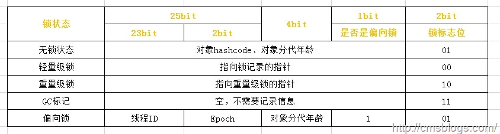

###### synchronized 底层原理详解

造成线程安全问题的主要诱因有两点，一是存在共享数据(也称临界资源)，二是存在多条线程共同操作共享数据。

因此为了解决这个问题，我们可能需要这样一个方案，当存在多个线程操作共享数据时，需要保证同一时刻有且只有一个线程在操作共享数据，其他线程必须等到该线程处理完数据后再进行，这种方式有个高尚的名称叫互斥锁，即能达到互斥访问目的的锁，也就是说当一个共享数据被当前正在访问的线程加上互斥锁后，在同一个时刻，其他线程只能处于等待的状态，直到当前线程处理完毕释放该锁。

**在 Java 中，关键字 synchronized可以保证在同一个时刻，只有一个线程可以执行某个方法或者某个代码块**。

同时我们还应该注意到synchronized另外一个重要的作用，**synchronized可保证一个线程的变化(主要是共享数据的变化)被其他线程所看到（保证可见性，完全可以替代Volatile功能），这点确实也是很重要的。**

在java中，每一个对象有且仅有一个同步锁。这也意味着，同步锁是依赖于对象而存在。

当我们调用某对象的synchronized方法时，就获取了该对象的同步锁。例如，**synchronized(obj)就获取了“obj这个对象”的同步锁。**

不同线程对同步锁的访问是互斥的。也就是说，某时间点，对象的同步锁只能被一个线程获取到！通过同步锁，我们就能在多线程中，实现对“对象/方法”的互斥访问。

> 当一个线程访问“某对象”的“synchronized方法”或者“synchronized代码块”时，其他线程对“该对象”的其他的“synchronized方法”或者“synchronized代码块”的访问将被阻塞。


关于“实例锁”和“全局锁”有一个很形象的例子：
```
pulbic class Something {
    public synchronized void isSyncA(){}
    public synchronized void isSyncB(){}
    public static synchronized void cSyncA(){}
    public static synchronized void cSyncB(){}
}
```
假设，Something有两个实例x和y。分析下面4组表达式获取的锁的情况。
```
(01) x.isSyncA()与x.isSyncB()
(02) x.isSyncA()与y.isSyncA()
(03) x.cSyncA()与y.cSyncB()
(04) x.isSyncA()与Something.cSyncA()
```

(01) 不能被同时访问。因为isSyncA()和isSyncB()都是访问同一个对象(对象x)的同步锁！

(02) 可以同时被访问。因为访问的不是同一个对象的同步锁，x.isSyncA()访问的是x的同步锁，而y.isSyncA()访问的是y的同步锁。

(03) 不能被同时访问。因为cSyncA()和cSyncB()都是static类型，x.cSyncA()相当于Something.isSyncA()，y.cSyncB()相当于Something.isSyncB()，因此它们共用一个同步锁，不能被同时反问。

(04) 可以被同时访问。因为isSyncA()是实例方法，x.isSyncA()使用的是对象x的锁；而cSyncA()是静态方法，Something.cSyncA()可以理解对使用的是“类的锁”。因此，它们是可以被同时访问的。


当一个线程访问同步代码块时，它首先是需要得到锁才能执行同步代码，**当退出或者抛出异常时必须要释放锁**，那么它是如何来实现这个机制的呢？

可以利用javap工具查看生成的class文件信息来分析Synchronize的实现(同步代码块)


从上面可以看出，**同步代码块是使用monitorenter和monitorexit指令实现的**，**同步方法（在这看不出来需要看JVM底层实现）依靠的是方法修饰符上的ACC_SYNCHRONIZED实现**。

同步代码块：monitorenter指令插入到同步代码块的开始位置，monitorexit指令插入到同步代码块的结束位置，JVM需要保证每一个monitorenter都有一个monitorexit与之相对应。任何对象都有一个monitor与之相关联，当且一个monitor被持有之后，他将处于锁定状态。线程执行到monitorenter指令时，将会尝试获取对象所对应的monitor所有权，即尝试获取对象的锁；

同步方法：**synchronized方法则会被翻译成普通的方法调用和返回指令**，如:invokevirtual、areturn指令，**在JVM字节码层面并没有任何特别的指令来实现被synchronized修饰的方法**，而是在**Class文件的方法表** 中将该方法的access_flags字段中的synchronized标志位置1，表示该方法是同步方法并使用调用该方法的对象或该方法所属的Class在JVM的内部对象表示class做为锁对象。

**Java对象头和monitor是实现synchronized的基础**

**synchronized用的锁是存在Java对象头里的**，那么什么是Java对象头呢？

Hotspot虚拟机的对象头主要包括两部分数据：**Mark Word（标记字段）、Klass Pointer（类型指针）**。

其中Klass Point是是对象指向它的类元数据的指针，虚拟机通过这个指针来确定这个对象是哪个类的实例，Mark Word用于存储对象自身的运行时数据，它是实现轻量级锁和偏向锁的关键。

Mark Word用于存储对象自身的运行时数据，如哈希码（HashCode）、GC分代年龄、锁状态标志、线程持有的锁、偏向线程 ID、偏向时间戳等等。

Java对象头一般占有两个机器码（在32位虚拟机中，1个机器码等于4字节，也就是32bit），但是如果对象是数组类型，则需要三个机器码，因为JVM虚拟机可以通过Java对象的元数据信息确定Java对象的大小，但是无法从数组的元数据来确认数组的大小，所以用一块来记录数组长度。下图是Java对象头的存储结构（32位虚拟机）：


对象头信息是与对象自身定义的数据无关的额外存储成本，但是考虑到虚拟机的空间效率，Mark Word被设计成一个非固定的数据结构以便在极小的空间内存存储尽量多的数据，它会根据对象的状态复用自己的存储空间，也就是说，Mark Word会随着程序的运行发生变化，变化状态如下（32位虚拟机）：



其中轻量级锁和偏向锁是Java 6 对 synchronized 锁进行优化后新增加的，稍后我们会简要分析。

这里我们主要分析一下重量级锁也就是通常说synchronized的对象锁，锁标识位为10，其中指针指向的是monitor对象（也称为管程或监视器锁）的起始地址。

**每个对象都存在着一个 monitor 与之关联**，对象与其 monitor 之间的关系有存在多种实现方式，如monitor可以与对象一起创建销毁或当线程试图获取对象锁时自动生成，但当一个 monitor 被某个线程持有后，它便处于锁定状态。在Java虚拟机(HotSpot)中，monitor是由ObjectMonitor实现的，其主要数据结构如下（位于HotSpot虚拟机源码ObjectMonitor.hpp文件，C++实现的）
```
ObjectMonitor() {
    _header       = NULL;
    _count        = 0; //记录个数
    _waiters      = 0,
    _recursions   = 0;
    _object       = NULL;
    _owner        = NULL;
    _WaitSet      = NULL; //处于wait状态的线程，会被加入到_WaitSet
    _WaitSetLock  = 0 ;
    _Responsible  = NULL ;
    _succ         = NULL ;
    _cxq          = NULL ;
    FreeNext      = NULL ;
    _EntryList    = NULL ; //处于等待锁block状态的线程，会被加入到该列表
    _SpinFreq     = 0 ;
    _SpinClock    = 0 ;
    OwnerIsThread = 0 ;
  }
```

ObjectMonitor中有两个队列，**_WaitSet 和 _EntryList**，用来保存ObjectWaiter对象列表( 每个等待锁的线程都会被封装成ObjectWaiter对象)，**_owner指向持有ObjectMonitor对象的线程**，当多个线程同时访问一段同步代码时，**首先会进入 _EntryList 集合**，当线程获取到对象的monitor 后进入 **_Owner 区域** 并把monitor中的**owner变量设置为当前线程**,同时monitor中的计数器count加1，**若线程调用 wait() 方法，将释放当前持有的monitor，owner变量恢复为null，count自减1，同时该线程进入 WaitSe t集合中等待被唤醒。**若当前线程执行完毕也将释放monitor(锁)并复位变量的值，以便其他线程进入获取monitor(锁)。

monitor对象存在于每个Java对象的对象头中(**存储的指针的指向**)，synchronized锁便是通过这种方式获取锁的，也是为什么Java中任意对象可以作为锁的原因，同时也是notify/notifyAll/wait等方法存在于顶级对象Object中的原因。


javap反编译同步带码块
```
public class SyncCodeBlock {

   public int i;

   public void syncTask(){
       //同步代码库
       synchronized (this){
           i++;
       }
   }
}

Classfile /Users/zejian/Downloads/Java8_Action/src/main/java/com/zejian/concurrencys/SyncCodeBlock.class
  Last modified 2017-6-2; size 426 bytes
  MD5 checksum c80bc322c87b312de760942820b4fed5
  Compiled from "SyncCodeBlock.java"
public class com.zejian.concurrencys.SyncCodeBlock
  minor version: 0
  major version: 52
  flags: ACC_PUBLIC, ACC_SUPER
Constant pool:
  //........省略常量池中数据
  //构造函数
  public com.zejian.concurrencys.SyncCodeBlock();
    descriptor: ()V
    flags: ACC_PUBLIC
    Code:
      stack=1, locals=1, args_size=1
         0: aload_0
         1: invokespecial #1                  // Method java/lang/Object."<init>":()V
         4: return
      LineNumberTable:
        line 7: 0
  //===========主要看看syncTask方法实现================
  public void syncTask();
    descriptor: ()V
    flags: ACC_PUBLIC
    Code:
      stack=3, locals=3, args_size=1
         0: aload_0
         1: dup
         2: astore_1
         3: monitorenter  //注意此处，进入同步方法
         4: aload_0
         5: dup
         6: getfield      #2             // Field i:I
         9: iconst_1
        10: iadd
        11: putfield      #2            // Field i:I
        14: aload_1
        15: monitorexit   //注意此处，退出同步方法
        16: goto          24
        19: astore_2
        20: aload_1
        21: monitorexit //注意此处，退出同步方法
        22: aload_2
        23: athrow
        24: return
      Exception table:
      //省略其他字节码.......
}
SourceFile: "SyncCodeBlock.java"
```

从字节码中可知同步语句块的实现使用的是monitorenter 和 monitorexit 指令，其中monitorenter指令指向同步代码块的开始位置，monitorexit指令则指明同步代码块的结束位置，当执行monitorenter指令时，当前线程将试图获取 objectref(即对象锁) 所对应的 monitor 的持有权，当 objectref 的 monitor 的进入计数器为 0，那线程可以成功取得 monitor，并将计数器值设置为 1，取锁成功。

如果当前线程已经拥有 objectref 的 monitor 的持有权，**那它可以重入这个 monitor** (关于重入性稍后会分析)，重入时计数器的值也会加 1。

倘若其他线程已经拥有 objectref 的 monitor 的所有权，那当前线程将被阻塞，直到正在执行线程执行完毕，即monitorexit指令被执行，执行线程将释放 monitor(锁)并设置计数器值为0 ，其他线程将有机会持有 monitor 。

**值得注意的是编译器将会确保无论方法通过何种方式完成，方法中调用过的每条 monitorenter 指令都有执行其对应 monitorexit 指令，而无论这个方法是正常结束还是异常结束**。

为了保证在方法异常完成时 monitorenter 和 monitorexit 指令依然可以正确配对执行，编译器会自动产生一个异常处理器，**这个异常处理器声明可处理所有的异常，它的目的就是用来执行 monitorexit 指令**。从字节码中也可以看出多了一个monitorexit指令，它就是异常结束时被执行的释放monitor 的指令。

**synchronized方法底层原理**

方法级的同步是隐式的，即无需通过字节码指令来控制的，它实现在方法调用和返回操作之中。JVM可以从方法常量池中的方法表结构(method_info Structure) 中的 ACC_SYNCHRONIZED 访问标志区分一个方法是否同步方法。

当方法调用时，**调用指令将会 检查方法的 ACC_SYNCHRONIZED 访问标志是否被设置**，如果设置了，执行线程将先持有monitor（虚拟机规范中用的是管程一词）， 然后再执行方法，最后再方法完成(无论是正常完成还是非正常完成)时释放monitor。在方法执行期间，执行线程持有了monitor，其他任何线程都无法再获得同一个monitor。如果一个同步方法执行期间抛 出了异常，并且在方法内部无法处理此异常，那这个同步方法所持有的monitor将在异常抛到同步方法之外时自动释放。

```
public class SyncMethod {

   public int i;

   public synchronized void syncTask(){
           i++;
   }
}
Classfile /Users/zejian/Downloads/Java8_Action/src/main/java/com/zejian/concurrencys/SyncMethod.class
  Last modified 2017-6-2; size 308 bytes
  MD5 checksum f34075a8c059ea65e4cc2fa610e0cd94
  Compiled from "SyncMethod.java"
public class com.zejian.concurrencys.SyncMethod
  minor version: 0
  major version: 52
  flags: ACC_PUBLIC, ACC_SUPER
Constant pool;

   //省略没必要的字节码
  //==================syncTask方法======================
  public synchronized void syncTask();
    descriptor: ()V
    //方法标识ACC_PUBLIC代表public修饰，ACC_SYNCHRONIZED指明该方法为同步方法
    flags: ACC_PUBLIC, ACC_SYNCHRONIZED
    Code:
      stack=3, locals=1, args_size=1
         0: aload_0
         1: dup
         2: getfield      #2                  // Field i:I
         5: iconst_1
         6: iadd
         7: putfield      #2                  // Field i:I
        10: return
      LineNumberTable:
        line 12: 0
        line 13: 10
}
SourceFile: "SyncMethod.java"
```

在Java早期版本中，synchronized属于重量级锁，效率低下，因为监视器锁（monitor）是依赖于底层的操作系统的Mutex Lock来实现的，**而操作系统实现线程之间的切换时需要从用户态转换到核心态**，这个状态之间的转换需要相对比较长的时间，时间成本相对较高，这也是为什么早期的synchronized效率低的原因。庆幸的是在Java 6之后Java官方对从JVM层面对synchronized较大优化，所以现在的synchronized锁效率也优化得很不错了，Java 6之后，**为了减少获得锁和释放锁所带来的性能消耗，引入了轻量级锁和偏向锁。**

锁的状态总共有四种，无锁状态、偏向锁、轻量级锁和重量级锁。随着锁的竞争，锁可以从偏向锁升级到轻量级锁，再升级的重量级锁，但是锁的升级是单向的，也就是说只能从低到高升级，不会出现锁的降级。

> 偏向锁

偏向锁是Java 6之后加入的新锁，**它是一种针对加锁操作的优化手段**，经过研究发现，**在大多数情况下，锁不仅不存在多线程竞争，而且总是由同一线程多次获得**，因此为了减少同一线程获取锁(会涉及到一些CAS操作,耗时)的代价而引入偏向锁。

偏向锁的核心思想是，**如果一个线程获得了锁，那么锁就进入偏向模式，此时Mark Word 的结构也变为偏向锁结构，当这个线程再次请求锁时，无需再做任何同步操作，即获取锁的过程，这样就省去了大量有关锁申请的操作**，从而也就提供程序的性能。

所以，对于没有锁竞争的场合，偏向锁有很好的优化效果，毕竟极有可能连续多次是同一个线程申请相同的锁。但是对于锁竞争比较激烈的场合，偏向锁就失效了，因为这样场合极有可能每次申请锁的线程都是不相同的，因此这种场合下不应该使用偏向锁，否则会得不偿失，需要注意的是，偏向锁失败后，并不会立即膨胀为重量级锁，而是先升级为轻量级锁。

> 轻量级锁

倘若偏向锁失败，虚拟机并不会立即升级为重量级锁，它还会尝试使用一种称为轻量级锁的优化手段(1.6之后加入的)，此时Mark Word 的结构也变为轻量级锁的结构。轻量级锁能够提升程序性能的依据是“对绝大部分的锁，在整个同步周期内都不存在竞争”，注意这是经验数据。需要了解的是，轻量级锁所适应的场景是线程交替执行同步块的场合，如果存在同一时间访问同一锁的场合，就会导致轻量级锁膨胀为重量级锁。

如果没有竞争，轻量级锁使用CAS操作避免了使用互斥量的开销，但如果存在锁竞争，除了互斥量的开销外，还额外发生了CAS操作，因此在有竞争的情况下，轻量级锁比传统的重量级锁更慢。

**轻量级锁的加锁过程**

- 在代码进入同步块的时候，如果同步对象锁状态为无锁状态（锁标志位为“01”状态，是否为偏向锁为“0”），虚拟机首先将在当前线程的栈帧中建立一个名为锁记录（Lock Record）的空间，用于存储锁对象目前的Mark Word的拷贝，官方称之为 Displaced Mark Word。

- 拷贝对象头中的Mark Word复制到锁记录（Lock Record）中；

- 拷贝成功后，虚拟机将使用CAS操作尝试将锁对象的Mark Word更新为指向Lock Record的指针，并将线程栈帧中的Lock Record里的owner指针指向Object的 Mark Word。

- 如果这个更新动作成功了，那么这个线程就拥有了该对象的锁，并且对象Mark Word的锁标志位设置为“00”，即表示此对象处于轻量级锁定状态

- 如果这个更新操作失败了，虚拟机首先会检查对象的Mark Word是否指向当前线程的栈帧，如果是就说明当前线程已经拥有了这个对象的锁，那就可以直接进入同步块继续执行。否则说明多个线程竞争锁，轻量级锁就要膨胀为重量级锁，锁标志的状态值变为“10”，Mark Word中存储的就是指向重量级锁（互斥量）的指针，后面等待锁的线程也要进入阻塞状态。


> 自旋锁与自适应自旋

Java的线程是映射到操作系统的原生线程之上的，如果要阻塞或唤醒一个线程，都需要操作系统来帮忙完成，这就需要从用户态转换到核心态中，因此状态转换需要耗费很多的处理器时间，对于代码简单的同步块（如被synchronized修饰的getter()和setter()方法），状态转换消耗的时间有可能比用户代码执行的时间还要长。

虚拟机的开发团队注意到在许多应用上，共享数据的锁定状态只会持续很短的一段时间，为了这段时间去挂起和恢复线程并不值得。**如果物理机器有一个以上的处理器，能让两个或以上的线程同时并行执行**，我们就可以让后面请求锁的那个线程“稍等一下“，但不放弃处理器的执行时间，看看持有锁的线程是否很快就会释放锁。为了让线程等待，我们只需让线程执行一个忙循环（自旋），这项技术就是所谓的自旋锁。

自旋锁在JDK1.4.2中引入，使用-XX:+UseSpinning来开启。JDK1.6中已经变为默认开。自旋等待不能代替阻塞。自旋等待本身虽然避免了线程切换的开销，但它是要占用处理器时间的，因此，如果锁被占用的时间很短，自旋等待的效果就会非常好，反之，如果锁被占用的时间很长，那么自旋的线程只会浪费处理器资源。因此，**自旋等待的时间必须要有一定的限度，如果自旋超过了限定次数（默认是10次，可以使用-XX:PreBlockSpin来更改）没有成功获得锁，就应当使用传统的方式去挂起线程了**。

JDK1.6中引入自适应的自旋锁，自适应意味着自旋的时间不在固定。而是有虚拟机对程序锁的监控与预测来设置自旋的次数。

所谓自适应就意味着自旋的次数不再是固定的，它是由前一次在同一个锁上的自旋时间及锁的拥有者的状态来决定。

它怎么做呢？

线程如果自旋成功了，那么下次自旋的次数会更加多，因为虚拟机认为既然上次成功了，那么此次自旋也很有可能会再次成功，那么它就会允许自旋等待持续的次数更多。反之，如果对于某个锁，很少有自旋能够成功的，那么在以后要或者这个锁的时候自旋的次数会减少甚至省略掉自旋过程，以免浪费处理器资源。 有了自适应自旋锁，随着程序运行和性能监控信息的不断完善，虚拟机对程序锁的状况预测会越来越准确，虚拟机会变得越来越聪明。

> 锁粗化

我们知道在使用同步锁的时候，需要让同步块的作用范围尽可能小—仅在共享数据的实际作用域中才进行同步，这样做的目的是为了使需要同步的操作数量尽可能缩小，如果存在锁竞争，那么等待锁的线程也能尽快拿到锁。 在大多数的情况下，上述观点是正确的，LZ也一直坚持着这个观点。但是如果一系列的连续加锁解锁操作，可能会导致不必要的性能损耗，所以引入锁粗话的概念。 锁粗话概念比较好理解，**就是将多个连续的加锁、解锁操作连接在一起，扩展成一个范围更大的锁**。如上面实例：vector每次add的时候都需要加锁操作，JVM检测到对同一个对象（vector）连续加锁、解锁操作，会合并一个更大范围的加锁、解锁操作，**即加锁解锁操作会移到for循环之外**。

> 锁消除

消除锁是虚拟机另外一种锁的优化，这种优化更彻底，Java虚拟机在JIT编译时(可以简单理解为当某段代码即将第一次被执行时进行编译，又称即时编译)，通过对运行上下文的扫描，去除不可能存在共享资源竞争的锁，通过这种方式消除没有必要的锁，可以节省毫无意义的请求锁时间，如下StringBuffer的append是一个同步方法，但是在add方法中的StringBuffer属于一个局部变量，并且不会被其他线程所使用，因此StringBuffer不可能存在共享资源竞争的情景，JVM会自动将其锁消除。

```
/**
 * Created by zejian on 2017/6/4.
 * Blog : http://blog.csdn.net/javazejian [原文地址,请尊重原创]
 * 消除StringBuffer同步锁
 */
public class StringBufferRemoveSync {

    public void add(String str1, String str2) {
        //StringBuffer是线程安全,由于sb只会在append方法中使用,不可能被其他线程引用
        //因此sb属于不可能共享的资源,JVM会自动消除内部的锁
        StringBuffer sb = new StringBuffer();
        sb.append(str1).append(str2);
    }

    public static void main(String[] args) {
        StringBufferRemoveSync rmsync = new StringBufferRemoveSync();
        for (int i = 0; i < 10000000; i++) {
            rmsync.add("abc", "123");
        }
    }

}
```


> 偏向所锁，轻量级锁及重量级锁

偏向所锁，轻量级锁都是乐观锁，重量级锁是悲观锁。

一个对象刚开始实例化的时候，没有任何线程来访问它的时候。它是可偏向的，意味着，它现在认为只可能有一个线程来访问它，所以当第一个
线程来访问它的时候，它会偏向这个线程，此时，对象持有偏向锁。偏向第一个线程，这个线程在修改对象头成为偏向锁的时候使用CAS操作，并将
对象头中的ThreadID改成自己的ID，之后再次访问这个对象时，只需要对比ID，不需要再使用CAS在进行操作。

一旦有第二个线程访问这个对象，因为偏向锁不会主动释放，所以第二个线程可以看到对象时偏向状态，这时表明在这个对象上已经存在竞争了，检查原来持有该对象锁的线程是否依然存活，如果挂了，则可以将对象变为无锁状态，然后重新偏向新的线程，如果原来的线程依然存活，则马上执行那个线程的操作栈，检查该对象的使用情况，如果仍然需要持有偏向锁，则偏向锁升级为轻量级锁，（偏向锁就是这个时候升级为轻量级锁的）。如果不存在使用了，则可以将对象回复成无锁状态，然后重新偏向。

轻量级锁认为竞争存在，但是竞争的程度很轻，一般两个线程对于同一个锁的操作都会错开，或者说稍微等待一下（自旋），另一个线程就会释放锁。 但是当自旋超过一定的次数，或者一个线程在持有锁，一个在自旋，又有第三个来访时，轻量级锁膨胀为重量级锁，重量级锁使除了拥有锁的线程以外的线程都阻塞，防止CPU空转。

> synchronized的可重入性

从互斥锁的设计上来说，当一个线程试图操作一个由其他线程持有的对象锁的临界资源时，将会处于阻塞状态，但当一个线程再次请求自己持有对象锁的临界资源时，这种情况属于重入锁，请求将会成功，在java中synchronized是基于原子性的内部锁机制，**是可重入的**，因此在一个线程调用synchronized方法的同时在其方法体内部调用该对象另一个synchronized方法，也就是说一个线程得到一个对象锁后再次请求该对象锁，是允许的，这就是synchronized的可重入性。

**需要特别注意另外一种情况，当子类继承父类时，子类也是可以通过可重入锁调用父类的同步方法。**

> 线程中断

在Java中，提供了以下3个有关线程中断的方法
```
//中断线程（实例方法）
public void Thread.interrupt();

//判断线程是否被中断（实例方法）
public boolean Thread.isInterrupted();

//判断是否被中断并清除当前中断状态（静态方法）
public static boolean Thread.interrupted();
```
当一个线程处于被阻塞状态或者试图执行一个阻塞操作时，使用Thread.interrupt()方式中断该线程，注意此时将会抛出一个InterruptedException的异常，同时中断状态将会被复位(由中断状态改为非中断状态)，如下代码将演示该过程：
```
public class InterruputSleepThread3 {
    public static void main(String[] args) throws InterruptedException {
        Thread t1 = new Thread() {
            @Override
            public void run() {
                //while在try中，通过异常中断就可以退出run循环
                try {
                    while (true) {
                        //当前线程处于阻塞状态，异常必须捕捉处理，无法往外抛出
                        TimeUnit.SECONDS.sleep(2);
                    }
                } catch (InterruptedException e) {
                    System.out.println("Interruted When Sleep");
                    boolean interrupt = this.isInterrupted();
                    //中断状态被复位
                    System.out.println("interrupt:"+interrupt);
                }
            }
        };
        t1.start();
        TimeUnit.SECONDS.sleep(2);
        //中断处于阻塞状态的线程
        t1.interrupt();

        /**
         * 输出结果:
           Interruted When Sleep
           interrupt:false
         */
    }
}
```
当一个线程处于被阻塞状态或者试图执行一个阻塞操作时，使用Thread.interrupt()方式中断该线程，注意此时将会抛出一个InterruptedException的异常，同时中断状态将会被复位(由中断状态改为非中断状态)，如下代码将演示该过程：
```
public class InterruputSleepThread3 {
    public static void main(String[] args) throws InterruptedException {
        Thread t1 = new Thread() {
            @Override
            public void run() {
                //while在try中，通过异常中断就可以退出run循环
                try {
                    while (true) {
                        //当前线程处于阻塞状态，异常必须捕捉处理，无法往外抛出
                        TimeUnit.SECONDS.sleep(2);
                    }
                } catch (InterruptedException e) {
                    System.out.println("Interruted When Sleep");
                    boolean interrupt = this.isInterrupted();
                    //中断状态被复位
                    System.out.println("interrupt:"+interrupt);
                }
            }
        };
        t1.start();
        TimeUnit.SECONDS.sleep(2);
        //中断处于阻塞状态的线程
        t1.interrupt();

        /**
         * 输出结果:
           Interruted When Sleep
           interrupt:false
         */
    }
}
```
处于运行期且非阻塞的状态的线程，这种情况下，直接调用Thread.interrupt()中断线程是不会得到任响应的，如下代码，将无法中断非阻塞状态下的线程：
```
public class InterruputThread {
    public static void main(String[] args) throws InterruptedException {
        Thread t1=new Thread(){
            @Override
            public void run(){
                while(true){
                    System.out.println("未被中断");
                }
            }
        };
        t1.start();
        TimeUnit.SECONDS.sleep(2);
        t1.interrupt();

        /**
         * 输出结果(无限执行):
             未被中断
             未被中断
             未被中断
             ......
         */
    }
}
```
虽然我们调用了interrupt方法，但线程t1并未被中断，因为处于非阻塞状态的线程需要我们手动进行中断检测并结束程序，改进后代码如下：
```
public class InterruputThread {
    public static void main(String[] args) throws InterruptedException {
        Thread t1=new Thread(){
            @Override
            public void run(){
                while(true){
                    //判断当前线程是否被中断
                    if (this.isInterrupted()){
                        System.out.println("线程中断");
                        break;
                    }
                }

                System.out.println("已跳出循环,线程中断!");
            }
        };
        t1.start();
        TimeUnit.SECONDS.sleep(2);
        t1.interrupt();

        /**
         * 输出结果:
            线程中断
            已跳出循环,线程中断!
         */
    }
}
```

我们在代码中使用了实例方法isInterrupted判断线程是否已被中断，如果被中断将跳出循环以此结束线程,注意非阻塞状态调用interrupt()并不会导致中断状态重置。综合所述，可以简单总结一下中断两种情况:

一种是当线程处于阻塞状态或者试图执行一个阻塞操作时，我们可以使用实例方法interrupt()进行线程中断，执行中断操作后将会抛出interruptException异常(该异常必须捕捉无法向外抛出)并将中断状态复位。

另外一种是当线程处于运行状态时，我们也可调用实例方法interrupt()进行线程中断（**只改变中断状态**），但同时必须手动判断中断状态，并编写中断线程的代码(其实就是结束run方法体的代码)。有时我们在编码时可能需要兼顾以上两种情况，那么就可以如下编写：
```
public void run(){
    try {
    //判断当前线程是否已中断,注意interrupted方法是静态的,执行后会对中断状态进行复位
    while (!Thread.interrupted()) {
        TimeUnit.SECONDS.sleep(2);
    }
    } catch (InterruptedException e) {

    }
}
```

> 中断与synchronized

事实上线程的中断操作对于正在等待获取的锁对象的synchronized方法或者代码块并不起作用，也就是对于synchronized来说，如果一个线程在等待锁，那么结果只有两种，要么它获得这把锁继续执行，要么它就保存等待，即使调用中断线程的方法，也不会生效。演示代码如下

```
/**
 * Created by zejian on 2017/6/2.
 * Blog : http://blog.csdn.net/javazejian [原文地址,请尊重原创]
 */
public class SynchronizedBlocked implements Runnable{

    public synchronized void f() {
        System.out.println("Trying to call f()");
        while(true) // Never releases lock
            Thread.yield();
    }

    /**
     * 在构造器中创建新线程并启动获取对象锁
     */
    public SynchronizedBlocked() {
        //该线程已持有当前实例锁
        new Thread() {
            public void run() {
                f(); // Lock acquired by this thread
            }
        }.start();
    }
    public void run() {
        //中断判断
        while (true) {
            if (Thread.interrupted()) {
                System.out.println("中断线程!!");
                break;
            } else {
                f();
            }
        }
    }


    public static void main(String[] args) throws InterruptedException {
        SynchronizedBlocked sync = new SynchronizedBlocked();
        Thread t = new Thread(sync);
        //启动后调用f()方法,无法获取当前实例锁处于等待状态
        t.start();
        TimeUnit.SECONDS.sleep(1);
        //中断线程,无法生效
        t.interrupt();
    }
}
```

> 等待唤醒机制与synchronized

所谓等待唤醒机制本篇主要指的是notify/notifyAll和wait方法，在使用这3个方法时，必须处于synchronized代码块或者synchronized方法中，否则就会抛出IllegalMonitorStateException异常，这是因为调用这几个方法前必须拿到当前对象的监视器monitor对象，也就是说notify/notifyAll和wait方法依赖于monitor对象，在前面的分析中，我们知道monitor 存在于对象头的Mark Word 中(存储monitor引用指针)，而synchronized关键字可以获取 monitor ，这也就是为什么notify/notifyAll和wait方法必须在synchronized代码块或者synchronized方法调用的原因。
```
synchronized (obj) {
       obj.wait();
       obj.notify();
       obj.notifyAll();         
 }
```
**同时notify/notifyAll方法调用后，并不会马上释放监视器锁，而是在相应的synchronized(){}/synchronized方法执行结束后才自动释放锁。**
