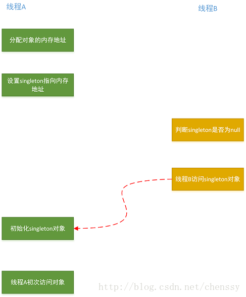

#### 双检锁

单例模式里面的懒汉式：
```
public class Singleton {
   private static Singleton singleton;

   private Singleton(){}

   public static Singleton getInstance(){
       if(singleton == null){
           singleton = new Singleton();
       }

       return singleton;
   }
}
```
这种写法是错误的，因为它无法保证线程的安全性。优化如下：
```
public class Singleton {
   private static Singleton singleton;

   private Singleton(){}

   public static synchronized Singleton getInstance(){
       if(singleton == null){
           singleton = new Singleton();
       }

       return singleton;
   }
}
```
优化非常简单，就是在getInstance方法上面做了同步，但是synchronized就会导致这个方法比较低效，导致程序性能下降，那么怎么解决呢？聪明的人们想到了双重检查 DCL：
```
public class Singleton {
   private static Singleton singleton;

   private Singleton(){}

   public static Singleton getInstance(){
       if(singleton == null){                              // 1
           synchronized (Singleton.class){                 // 2
               if(singleton == null){                      // 3
                   singleton = new Singleton();            // 4
               }
           }
       }
       return singleton;
   }
}
```
DCL看起确实是非常完美，但是可以明确地告诉你，这个错误的。

上面的逻辑确实是没有问题，分析也对，但是就是有问题，那么问题出在哪里呢？

在回答这个问题之前，我们先来复习一下创建对象过程，实例化一个对象要分为三个步骤：
```
1 分配内存空间
2 初始化对象
3 将内存空间的地址赋值给对应的引用
```
但是由于重排序的缘故，步骤2、3可能会发生重排序，其过程如下：
```
分配内存空间
将内存空间的地址赋值给对应的引用
初始化对象
```
如果2、3发生了重排序就会导致第二个判断会出错，singleton != null，但是它其实仅仅只是一个地址而已，此时对象还没有被初始化，所以return的singleton对象是一个没有被初始化的对象，这个时候使用这个对象就会报空指针异常，如下：



知道问题根源所在，那么怎么解决呢？有两个解决办法：
```
不允许初始化阶段步骤2 、3发生重排序。
允许初始化阶段步骤2 、3发生重排序，但是不允许其他线程“看到”这个重排序。
```

基于volatile解决方案
```
public class Singleton {
   //通过volatile关键字来确保安全
   private volatile static Singleton singleton;

   private Singleton(){}

   public static Singleton getInstance(){
       if(singleton == null){
           synchronized (Singleton.class){
               if(singleton == null){
                   singleton = new Singleton();
               }
           }
       }
       return singleton;
   }
}
```
基于类初始化的解决方案
```
public class Singleton {
   private static class SingletonHolder{
       public static Singleton singleton = new Singleton();
   }

   public static Singleton getInstance(){
       return SingletonHolder.singleton;
   }
}
```
这种解决方案的实质是：运行步骤2和步骤3重排序，但是不允许其他线程看见。

> Java语言规定，对于每一个类或者接口C,都有一个唯一的初始化锁LC与之相对应。从C到LC的映射，由JVM的具体实现去自由实现。JVM在类初始化阶段期间会获取这个初始化锁，并且每一个线程至少获取一次锁来确保这个类已经被初始化过了。


