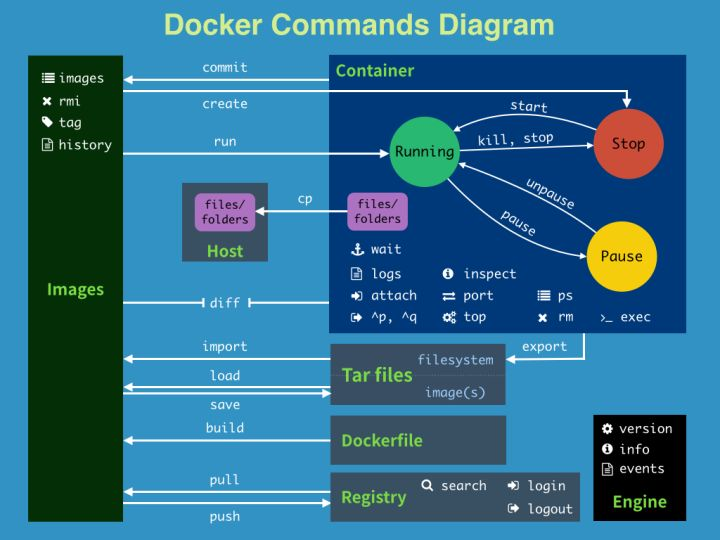
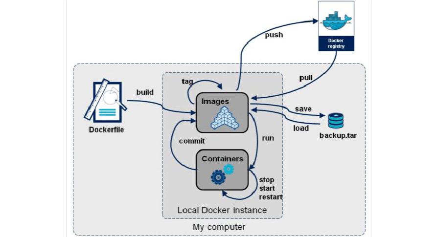

#### Docker 概述

> 打包环境，隔离应用，解决冲突，方便简化部署

docker 是一种容器技术，或者说是一种虚拟化技术

传统虚拟技术： 相当笨重，几乎复刻了一整套系统，资源占用多，冗余步骤多，启动慢

docker: 使用镜像，只包含最核心必须的环境，小巧迅捷，不是一个完整的系统，没有内核，它运行在系统上，使用系统内核，每个容器互相隔离，互不影响

docker是基于go语言开发。

> 关键词

镜像（image）：模板，可以创建多个容器服务，跟容器的关系就像类和实例的关系。

容器（container）：独立运行一个或一组应用，通过镜像创建，就像是一个模拟出来的linux系统

仓库（repository）：仓库就是存放镜像的地方，分为共有仓库和私有仓库，默认是Docker hub

