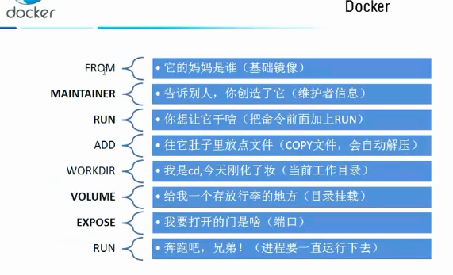

#### DockerFile

DockerFile是用来构建docker镜像的文件，就是一个命令参数脚本。

步骤：

1. 编写dockerfile脚本

2. docker build命令构建一个镜像
3. docker run 运行镜像
4. docker push 发布镜像（docker hub或者阿里云镜像仓库）

很多官方镜像都是基础包，很多需要的应用是没有的，比如centos，需要我们自定义搭建自己需要的镜像。命令全是大写，#为注释，每个指令都会创建一个新的镜像层并提交。

CMD 指定一些linux命令，只有最后一个会生效，可被替代

ENTRYPOINT 指定一些linux命令，可以追加命令

ONBUILD 当构建一个被继承dockerfile会运行，属于出发指令

COPY 类似ADD，将文件拷贝到镜像

ENV 构建的时候指定环境变量，比如mysql密码等
