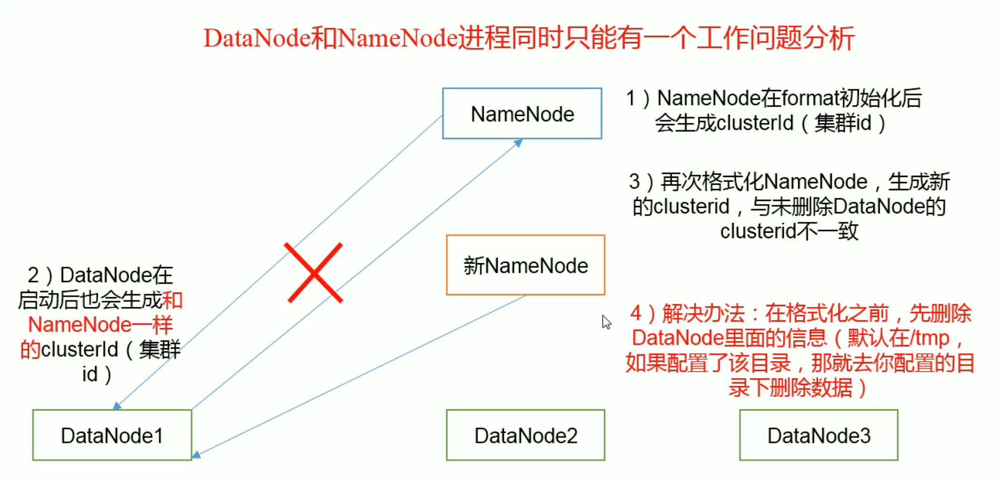

### Hadoop学习笔记三

**安装Hadoop**

- 安装JDK
```
tar -zxvf jdk-8u211-linux-x64.tar.gz -C /opt/module/
```
- 配置环境变量
```
vim /etc/profile
添加
##JAVA_HOME
export JAVA_HOME=/opt/module/jdk1.8.0_211
export PATH=$PATH:$JAVA_HOME/bin
执行
source /etc/profile
```

- 安装Hadoop
```
tar -zxvf hadoop-2.7.7.tar.gz -C /opt/module/
配置环境变量
##HADOOP_HOME
export HADOOP_HOME=/opt/module/hadoop-2.7.7
export PATH=$PATH:$HADOOP_HOME/bin
export PATH=$PATH:$HADOOP_HOME/sbin
执行 hadoop 验证是否成功
```

**配置Hadoop**

Hadoop官网
https://hadoop.apache.org/docs/stable/hadoop-project-dist/hadoop-common/SingleCluster.html

左下角，core-default.xml -》默认配置信息

hadoop解压目录 etc/hadoop/core-site.xml:
```
<!-- 指定HDFS中的NameNode的地址 -->
    <property>
        <name>fs.defaultFS</name>
        <value>hdfs://hadoop100:9000</value>
    </property>
<!-- 指定Hadoop运行时产生文件的存储目录 -->
    <property>
        <name>hadoop.tmp.dir</name>
        <value>/opt/module/hadoop-2.7.7/data/tmp</value>
    </property>
```
设置hadoop-env.sh的java环境变量

```
cd /opt/module/hadoop-2.7.7/etc/hadoop
vim hadoop-env.sh
```

配置：etc/hadoop/hdfs-site.xml
```
<!-- 指定hdfs副本数量 -->
    <property>
        <name>dfs.replication</name>
        <value>3</value>
    </property>
```

**启动Hadoop**

- 格式化NameNode(只在第一次启动的时候格式化，以后不需要)
> 格式化之前先执行jps，把存在的进程全部关掉，然后把之前生成的目录删除，比如data和logs目录

hadoop解压目录下
```
格式化
bin/hdfs namenode -format
启动namenode
sbin/hadoop-daemon.sh start namenode
启动datanode
sbin/hadoop-daemon.sh start datanode
```

**hadoop启动后，服务器上就存在了两个文件系统，一个是linux本地，一个是HDFS。本地文件系统命令不变，HDFS文件系统命令格式为：bin/hdfs dfs -后面跟linux命令，例如**

```
bin/hdfs dfs -mkdir /usr/test
bin/hdfs dfs -ls
```

把本地文件系统的文件上传到HDFS文件系统命令：
```
bin/hdfs dfs -put wcinput/wc.input /usr/test//input
```

不要经常格式化namenode:

/opt/module/hadoop-2.7.7/data/tmp/dfs/data/current/version是datanode的版本号。

它和
/opt/module/hadoop-2.7.7/data/tmp/dfs/name/current/version，即namenode的版本号是一样的。
格式化NameNode，会产生新的集群id，即版本号，导致NameNode和DataNode的集群id不一致，集群找不到以往数据。

所以，格式NameNode时，一定要先删除data数据和log日志，然后在格式化NameNode。

> 一定要先关掉NameNode和DataNode的进程后，删除相关目录再格式化


