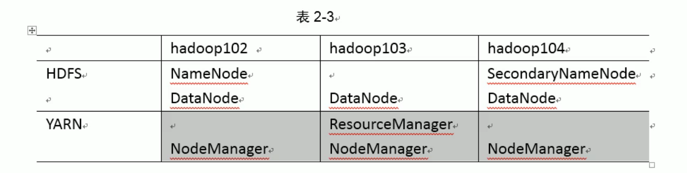
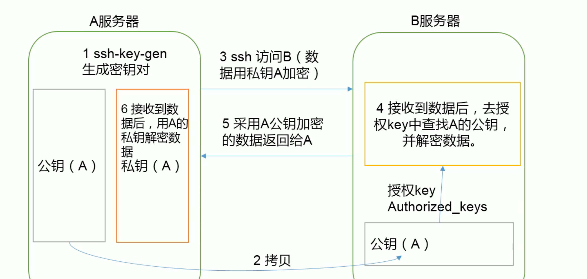

**完全分布式**

批量同步脚本
```
#!/usr/bin/expect

set password 5091125901
set user root

set pdir [lindex $argv 0]

for { set host 102 } { $host<105} {incr host} {
        spawn rsync -rvl $pdir $user@hadoop$host:$pdir
        expect {
                "*assword:*" { send "$password\r"; exp_continue }
                "*es/no)?*" { send "yes\r" }
        }
        set timeout 500
}
```

/usr/local/bin/xsync  或者 /usr/sbin/xsync
```
#!/bin/bash
#1 获取输入参数个数，如果没有参数，直接退出
pcount=$#
if((pcount==0)); then
echo no args;
exit;
fi

#2 获取文件名称
p1=$1
fname=`basename $p1`
echo fname=$fname

#3 获取上级目录到绝对路径
pdir=`cd -P $(dirname $p1); pwd`
echo pdir=$pdir

#4 获取当前用户名称
user=`whoami`

#5 循环
for((host=101; host<103; host++)); do
#echo $pdir/$fname $user@hadoop$host:$pdir
echo --------------- hadoop$host ----------------
rsync -rvl $pdir/$fname $user@hadoop$host:$pdir
done
```



- NameNode和SecondaryNameNode要避免放在一台服务器上
- ResourManager要避免和NameNode和SecondaryNameNode放在同一台服务器。

配置core-site.xml
```
<!-- 指定HDFS中的NameNode的地址 -->
    <property>
        <name>fs.defaultFS</name>
        <value>hdfs://hadoop102:9000</value>
    </property>
```
配置hdfs-site.xml.sh
```
<!-- 指定HDFS中的secondaryNameNode的地址 -->
    <property>
        <name>dfs.namenode.secondary.http-address</name>
        <value>hadoop104:50090</value>
    </property>
```
配置yarn-site.xml
```
<!-- 指定YARN的ResourceManager的地址 -->
<property>
    <name>yarn.resourcemanager.hostname</name>
    <value>hadoop103</value>
</property>
```

利用同步脚本同步所有配置

开始启动：

1. 删除之前所有节点的生成目录，比如data和logs目录

2. 格式化NameNode
```
bin/hdfs namenode -format
```
3. 启动NameNode，DataNode （NameNode有一个，DataNode有多个）

**节点太多的话不可能一个个节点启动，需要配置ssh无密码登录**

命令：ssh hadoop102 可以输密码登录

如果想不输密码：



```
hadoop100：
回到home目录,用户目录下
ls -al
找到.ssh目录
ssh-keygen -t rsa (连续三次回车)
ssh-copy-id hadoop102 (拷贝公钥，输入yes)
hadoop102的.ssh目录就会多一个Authorized_keys文件
现在就可以ssh hadoop102免密登录
ssh-copy-id hadoop101 （目前的节点也要拷贝一份，不然自己访问自己也要输密码）
windows配置linux无密登录
https://blog.csdn.net/qq_40451749/article/details/89348799
```

**存在NameNode和ResourceManager的机器都要配置ssh免密登录**

群起集群

1. 配置slaves （存放的都是DataNode节点）
```
/opt/module/hadoop-2.7.7/etc/hadoop/slaves
删除原有内容
添加
hadoop102
hadoop103
hadoop104
```
> 该文件中添加的内容结尾不允许有空格，文件中不允许有空行

2. 同步所有节点
```
xsync slaves
```
3. 关闭所有DataNode和NameNode

4. sbin/start-dfs.sh (启动所有node)

5. 启动manager,必须在ResourceManager所在的节点才可以
```
sbin/start-yarn.sh
```

6. 集群测试
```
上传测试文件
bin/hdfs dfs -put wcinput/wc.input /
bin/hdfs dfs -put /opt/software/hadoop-2.7.7.tar.gz /
访问 http://hadoop102:50070
文件存放地址：
/opt/module/hadoop-2.7.7/data/tmp/dfs/data/current/............/current/finalized/subdir0/subdir0
如果一个文件分成多块，比如hadoop-2.7.7.tar.gz，可以把多块内容还原：
cat 文件名1 >> tmp.text
cat 文件名2 >> tmp.text
tar -zxvf tmp.text
```

7. 各个模块分开启动停止（配置ssh是前提）常用
```
整体启动停止HDFS
sbin/start-dfs.sh   sbin/stop-dfs.sh
整体启动停止YARN
sbin/start-yarn.sh  sbin/stop-yarn.sh
```
