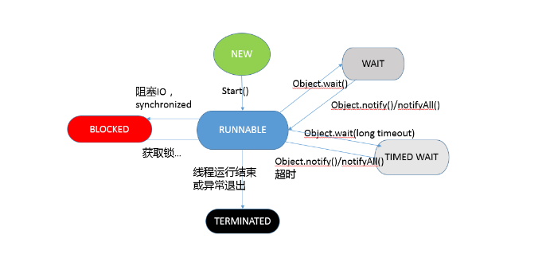

# JAVA 查漏补缺

> 一个线程两次调用start()方法

Java 的线程是不允许启动两次的，第二次调用必然会抛出 IllegalThreadStateException，这是一种运行时异常，多次调用 start 被认为是编程错误。

**线程生命周期的不同状态**

在 Java 5 以后，线程状态被明确定义在其公共内部枚举类型 java.lang.Thread.State 中，分别是：

- 新建（NEW），表示线程被创建出来还没真正启动的状态，可以认为它是个 Java 内部状态。

- 就绪（RUNNABLE），表示该线程已经在 JVM 中执行，当然由于执行需要计算资源，它可能是正在运行，也可能还在等待系统分配给它 CPU 片段，在就绪队列里面排队。在其他一些分析中，会额外区分一种状态 RUNNING，但是从 Java API 的角度，并不能表示出来。
- 阻塞（BLOCKED），这个状态和我们前面两讲介绍的同步非常相关，阻塞表示线程在等待 Monitor lock。比如，线程试图通过 synchronized 去获取某个锁，但是其他线程已经独占了，那么当前线程就会处于阻塞状态。
- 等待（WAITING），表示正在等待其他线程采取某些操作。一个常见的场景是类似生产者消费者模式，发现任务条件尚未满足，就让当前消费者线程等待（wait），另外的生产者线程去准备任务数据，然后通过类似 notify 等动作，通知消费线程可以继续工作了。Thread.join() 也会令线程进入等待状态。
- 计时等待（TIMED_WAIT），其进入条件和等待状态类似，但是调用的是存在超时条件的方法，比如 wait 或 join 等方法的指定超时版本.
- 终止（TERMINATED），不管是意外退出还是正常执行结束，线程已经完成使命，终止运行，也有人把这个状态叫作死亡。

> 在第二次调用 start() 方法的时候，线程可能处于终止或者**其他（非 NEW）状态**，但是不论如何，都是不可以再次启动的。

**线程**

从操作系统的角度，可以简单认为，线程是系统调度的最小单元，一个进程可以包含多个线程，作为任务的真正运作者，有自己的栈（Stack）、寄存器（Register）、本地存储（Thread Local）等，但是会和进程内其他线程共享文件描述符、虚拟地址空间等。

在具体实现中，线程还分为内核线程、用户线程，Java 的线程实现其实是与虚拟机相关的。对于我们最熟悉的 Sun/Oracle JDK，其线程也经历了一个演进过程，基本上在 Java 1.2 之后，JDK 已经抛弃了所谓的Green Thread，也就是用户调度的线程，**现在的模型是一对一映射到操作系统内核线程**。

看 Thread 的源码，你会发现其基本操作逻辑大都是以 JNI 形式调用的本地代码。

```
private native void start0();
private native void setPriority0(int newPriority);
private native void interrupt0();
```

**状态和方法之间的对应图：**




**线程间通信方式**:

- wait-notify/notifyAll
- CountDownLatch、Semaphore和CyclicBarrier
- volatile
- ReentrantLock 结合 Condition
- LockSupport实现线程间的阻塞和唤醒
```
public class TestSync {
    public static void main(String[] args) {
        List<String> list = new ArrayList<>();
        // 实现线程B
        final Thread threadB = new Thread(() -> {
            if (list.size() != 5) {
                LockSupport.park();
            }
            System.out.println("线程B收到通知，开始执行自己的业务...");
        });
        // 实现线程A
        Thread threadA = new Thread(() -> {
            for (int i = 1; i <= 10; i++) {
                list.add("abc");
                System.out.println("线程A向list中添加一个元素，此时list中的元素个数为：" + list.size());
                try {
                    Thread.sleep(500);
                } catch (InterruptedException e) {
                    e.printStackTrace();
                }
                if (list.size() == 5)
                    LockSupport.unpark(threadB);
            }
        });
        threadA.start();
        threadB.start();
    }
}
```

park和unpark的先后顺序并不是那么严格。

```
public class LockSupportDemo {

    public static Object u = new Object();
    static ChangeObjectThread t1 = new ChangeObjectThread("t1");

    public static class ChangeObjectThread extends Thread {

        public ChangeObjectThread(String name) {
            super(name);
        }

        @Override public void run() {
            synchronized (u) {
                System.out.println("in " + getName());
                try {
                    Thread.sleep(1000L);
                } catch (InterruptedException e) {
                    e.printStackTrace();
                }
                LockSupport.park();
                if (Thread.currentThread().isInterrupted()) {
                    System.out.println("被中断了");
                }
                System.out.println("继续执行");
            }
        }
    }

    public static void main(String[] args) {
        t1.start();
        LockSupport.unpark(t1);
        System.out.println("unpark invoked");
    }
}
```

**unpark肯定先于park的调用，但是t1最终仍然可以完结。这是因为park和unpark会对每个线程维持一个许可（boolean值）**

unpark调用时，如果当前线程还未进入park，则许可为true
park调用时，判断许可是否为true，如果是true，则继续往下执行；如果是false，则等待，直到许可为true


**守护线程（Daemon Thread）**，有的时候应用中需要一个长期驻留的服务程序，但是不希望其影响应用退出，就可以将其设置为守护线程，如果 JVM 发现只有守护线程存在时，将结束进程。注意，必须在线程启动之前设置。

```

Thread daemonThread = new Thread();
daemonThread.setDaemon(true);
daemonThread.start();
```

再有就是慎用**ThreadLocal**，这是 Java 提供的一种保存线程私有信息的机制，因为其在整个线程生命周期内有效，所以可以方便地在一个线程关联的不同业务模块之间传递信息，比如事务 ID、Cookie 等上下文相关信息。它的实现结构，可以参考源码，数据存储于线程相关的 ThreadLocalMap，其内部条目是弱引用，如下面片段。

```

static class ThreadLocalMap {
  static class Entry extends WeakReference<ThreadLocal<?>> {
      /** The value associated with this ThreadLocal. */
      Object value;
      Entry(ThreadLocal<?> k, Object v) {
          super(k);
      value = v;
      }
      }
   // …
}
```
当 Key 为 null 时，该条目就变成“废弃条。通常弱引用都会和引用队列配合清理机制使用，但是 ThreadLocal 是个例外，它并没有这么做。这意味着，废弃项目的回收依赖于显式地触发，否则就要等待线程结束，进而回收相应 ThreadLocalMap！这就是很多 OOM 的来源，所以通常都会建议，应用一定要自己负责 remove，并且不要和线程池配合，**因为 worker 线程往往是不会退出的**0


简单的打印 HelloWorld 的程序，说说看，运行这个应用，Java 至少会创建几个线程呢？

```
使用以上两种方式获取的线程总数都是5个。
main
Attach Listener
Signal Dispatcher
Finalizer
Reference Handler
```
