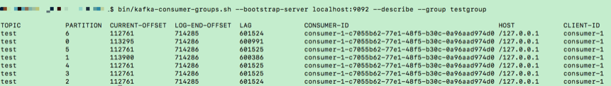

#### 消费者组消费进度监控都怎么实现？

对于 Kafka 消费者来说，最重要的事情就是监控它们的消费进度了，或者说是监控它们消费的滞后程度。这个滞后程度有个专门的名称：消费者 Lag 或 Consumer Lag。

**所谓滞后程度，就是指消费者当前落后于生产者的程度**。比方说，Kafka 生产者向某主题成功生产了 100 万条消息，你的消费者当前消费了 80 万条消息，那么我们就说你的消费者滞后了 20 万条消息，即 Lag 等于 20 万。

通常来说，Lag 的单位是消息数，而且我们一般是在主题这个级别上讨论 Lag 的，但实际上，Kafka 监控 Lag 的层级是在分区上的。

如果要计算主题级别的，你需要手动汇总所有主题分区的 Lag，将它们累加起来，合并成最终的 Lag 值。我们刚刚说过，对消费者而言，Lag 应该算是最最重要的监控指标了。它直接反映了一个消费者的运行情况。**一个正常工作的消费者，它的 Lag 值应该很小，甚至是接近于 0 的，这表示该消费者能够及时地消费生产者生产出来的消息，滞后程度很小。**

反之，如果一个消费者 Lag 值很大，通常就表明它无法跟上生产者的速度，最终 Lag 会越来越大，从而拖慢下游消息的处理速度。**更可怕的是，由于消费者的速度无法匹及生产者的速度，极有可能导致它消费的数据已经不在操作系统的页缓存中了。**

这样的话，消费者就不得不从磁盘上读取它们，这就进一步拉大了与生产者的差距，进而出现马太效应，即那些 Lag 原本就很大的消费者会越来越慢，Lag 也会越来越大。

鉴于这些原因，你在实际业务场景中必须时刻关注消费者的消费进度。一旦出现 Lag 逐步增加的趋势，一定要定位问题，及时处理，避免造成业务损失。

既然消费进度这么重要，我们应该怎么监控它呢？简单来说，有 3 种方法。

- 使用 Kafka 自带的命令行工具 kafka-consumer-groups 脚本。

- 使用 Kafka Java Consumer API 编程。
- 使用 Kafka 自带的 JMX 监控指标。

> Kafka 自带命令

我们先来了解下第一种方法：使用 Kafka 自带的命令行工具 bin/kafka-consumer-groups.sh(bat)。kafka-consumer-groups 脚本是 Kafka 为我们提供的最直接的监控消费者消费进度的工具。当

然，除了监控 Lag 之外，它还有其他的功能。今天，我们主要讨论如何使用它来监控 Lag。如果只看名字，你可能会以为它只是操作和管理消费者组的。实际上，它也能够监控独立消费者（Standalone Consumer）的 Lag。

我们之前说过，独立消费者就是没有使用消费者组机制的消费者程序。

和消费者组相同的是，它们也要配置 group.id 参数值，但和消费者组调用 KafkaConsumer.subscribe() 不同的是，独立消费者调用 KafkaConsumer.assign() 方法直接消费指定分区。

今天的重点不是要学习独立消费者，你只需要了解接下来我们讨论的所有内容都适用于独立消费者就够了。使用 kafka-consumer-groups 脚本很简单。该脚本位于 Kafka 安装目录的 bin 子目录下，我们可以通过下面的命令来查看某个给定消费者的 Lag 值：

```

$ bin/kafka-consumer-groups.sh --bootstrap-server <Kafka broker连接信息> --describe --group <group名称>
```
Kafka 连接信息就是 < 主机名：端口 > 对，而 group 名称就是你的消费者程序中设置的 group.id 值。


kafka-consumer-groups 脚本的输出信息很丰富。首先，它会按照消费者组订阅主题的分区进行展示，每个分区一行数据；其次，除了主题、分区等信息外，它会汇报每个分区当前最新生产的消息的位移值（即 LOG-END-OFFSET 列值）、该消费者组当前最新消费消息的位移值（即 CURRENT-OFFSET 值）、LAG 值（前两者的差值）、消费者实例 ID、消费者连接 Broker 的主机名以及消费者的 CLIENT-ID 信息。毫无疑问，在这些数据中，我们最关心的当属 LAG 列的值了，图中每个分区的 LAG 值大约都是 60 多万，这表明，在我的这个测试中，消费者组远远落后于生产者的进度。理想情况下，我们希望该列所有值都是 0，因为这才表明我的消费者完全没有任何滞后。

还可能出现的一种情况是该命令压根不返回任何结果。此时，你也不用惊慌，这是因为你使用的 Kafka 版本比较老，kafka-consumer-groups 脚本还不支持查询非 active 消费者组。一旦碰到这个问题，你可以选择升级你的 Kafka 版本，也可以采用我接下来说的其他方法来查询。

> Kafka Java Consumer API

```

public static Map<TopicPartition, Long> lagOf(String groupID, String bootstrapServers) throws TimeoutException {
        Properties props = new Properties();
        props.put(CommonClientConfigs.BOOTSTRAP_SERVERS_CONFIG, bootstrapServers);
        try (AdminClient client = AdminClient.create(props)) {
            ListConsumerGroupOffsetsResult result = client.listConsumerGroupOffsets(groupID);
            try {
                Map<TopicPartition, OffsetAndMetadata> consumedOffsets = result.partitionsToOffsetAndMetadata().get(10, TimeUnit.SECONDS);
                props.put(ConsumerConfig.ENABLE_AUTO_COMMIT_CONFIG, false); // 禁止自动提交位移
                props.put(ConsumerConfig.GROUP_ID_CONFIG, groupID);
                props.put(ConsumerConfig.KEY_DESERIALIZER_CLASS_CONFIG, StringDeserializer.class.getName());
                props.put(ConsumerConfig.VALUE_DESERIALIZER_CLASS_CONFIG, StringDeserializer.class.getName());
                try (final KafkaConsumer<String, String> consumer = new KafkaConsumer<>(props)) {
                    Map<TopicPartition, Long> endOffsets = consumer.endOffsets(consumedOffsets.keySet());
                    return endOffsets.entrySet().stream().collect(Collectors.toMap(entry -> entry.getKey(),
                            entry -> entry.getValue() - consumedOffsets.get(entry.getKey()).offset()));
                }
            } catch (InterruptedException e) {
                Thread.currentThread().interrupt();
                // 处理中断异常
                // ...
                return Collections.emptyMap();
            } catch (ExecutionException e) {
                // 处理ExecutionException
                // ...
                return Collections.emptyMap();
            } catch (TimeoutException e) {
                throw new TimeoutException("Timed out when getting lag for consumer group " + groupID);
            }
        }
    }
```

> Kafka JMX 监控指标

Kafka 消费者提供了一个名为 kafka.consumer:type=consumer-fetch-manager-metrics,client-id=“{client-id}”的 JMX 指标，里面有很多属性。和我们今天所讲内容相关的有两组属性：records-lag-max 和 records-lead-min，它们分别表示此消费者在测试窗口时间内曾经达到的最大的 Lag 值和最小的 Lead 值。

这里的 Lead 值是指消费者最新消费消息的位移与分区当前第一条消息位移的差值。很显然，Lag 和 Lead 是一体的两个方面：Lag 越大的话，Lead 就越小，反之也是同理。

其实社区引入 Lead 的原因是，只看 Lag 的话，我们也许不能及时意识到可能出现的严重问题。

试想一下，监控到 Lag 越来越大，可能只会给你一个感受，那就是消费者程序变得越来越慢了，至少是追不上生产者程序了，除此之外，你可能什么都不会做。毕竟，有时候这也是能够接受的。

但反过来，一旦你监测到 Lead 越来越小，甚至是快接近于 0 了，你就一定要小心了，这可能预示着消费者端要丢消息了。为什么？我们知道 Kafka 的消息是有留存时间设置的，默认是 1 周，也就是说 Kafka 默认删除 1 周前的数据。倘若你的消费者程序足够慢，慢到它要消费的数据快被 Kafka 删除了，这时你就必须立即处理，否则一定会出现消息被删除，从而导致消费者程序重新调整位移值的情形。这可能产生两个后果：一个是消费者从头消费一遍数据，另一个是消费者从最新的消息位移处开始消费，之前没来得及消费的消息全部被跳过了，从而造成丢消息的假象。

> Jconsole监控远程Linux的Kafka

```
1、配置启动参数：
-Dcom.sun.management.jmxremote
-Dcom.sun.management.jmxremote.port={port to access}
-Dcom.sun.management.jmxremote.authenticate=false
-Dcom.sun.management.jmxremote.ssl=false
-Djava.rmi.server.hostname={optional, allow what ip to access this Tomcat}


-Dcom.sun.management.jmxremote -Dcom.sun.management.jmxremote.port=9999 -Dcom.sun.management.jmxremote.authenticate=false -Dcom.sun.management.jmxremote.ssl=false

```
vi kafka-run-class.sh
在KAFKA_JVM_OPTS中追加上面的参数

2、hostname命令查看，和hostname -i查看

3、打开Jconsole输入service:jmx:rmi:///jndi/rmi://11.11.11.11:9999/jmxrmi
