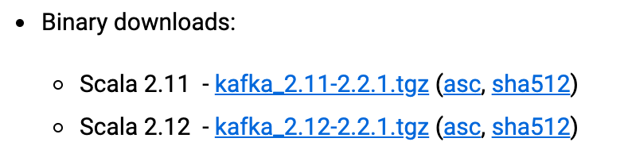

#### Kafka的版本号



前面的版本号是编译 Kafka 源代码的 Scala 编译器版本。Kafka 服务器端的代码完全由 Scala 语言编写。

前面的 2 表示大版本号，即 Major Version；中间的 1 表示小版本号或次版本号，即 Minor Version；最后的 1 表示修订版本号，也就是 Patch 号。Kafka 社区在发布 1.0.0 版本后特意写过一篇文章，宣布 Kafka 版本命名规则正式从 4 位演进到 3 位，比如 0.11.0.0 版本就是 4 位版本号。


像 0.11.0.0 这样的版本虽然有 4 位版本号，但其实它的大版本是 0.11，而不是 0，所以如果这样来看的话 Kafka 版本号从来都是由 3 个部分构成，即“大版本号 - 小版本号 - Patch 号”。

这种视角可以统一所有的 Kafka 版本命名，也方便我们日后的讨论。我们来复习一下，假设碰到的 Kafka 版本是 0.10.2.2，你现在就知道了它的大版本是 0.10，小版本是 2，总共打了两个大的补丁，Patch 号是 2。Kafka 版本演进。

```

0.7版本:
只有基础消息队列功能，无副本；打死也不使用

0.8版本:
增加了副本机制，新的producer API；建议使用0.8.2.2版本；不建议使用0.8.2.0之后的producer API

0.9版本:
增加权限和认证，新的consumer API，Kafka Connect功能；不建议使用consumer API；

0.10版本:
引入Kafka Streams功能，bug修复；建议版本0.10.2.2；建议使用新版consumer API

0.11版本:
producer API幂等，事物API，消息格式重构；建议版本0.11.0.3；谨慎对待消息格式变化

1.0和2.0版本:
Kafka Streams改进；建议版本2.0；
```
