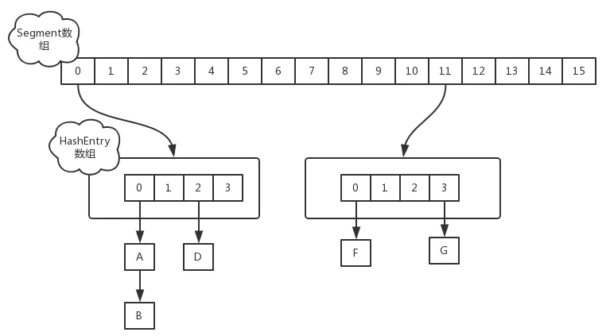

#### ConcurrentHashMap1.7和1.8的不同实现

jdk1.7中采用Segment + HashEntry的方式进行实现



其中Segment在实现上继承了ReentrantLock，这样就自带了锁的功能。

> put实现

当执行put方法插入数据时，根据key的hash值，在Segment数组中找到相应的位置，如果相应位置的Segment还未初始化，则通过CAS进行赋值，接着执行Segment对象的put方法通过加锁机制插入数据，实现如下：

场景：线程A和线程B同时执行相同Segment对象的put方法
```
1、线程A执行tryLock()方法成功获取锁，则把HashEntry对象插入到相应的位置；

2、线程B获取锁失败，则执行scanAndLockForPut()方法，在scanAndLockForPut方法中，会通过重复执行tryLock()方法尝试获取锁.
在多处理器环境下，重复次数为64，单处理器重复次数为1，当执行tryLock()方法的次数超过上限时，则执行lock()方法挂起线程B；

3、当线程A执行完插入操作时，会通过unlock()方法释放锁，接着唤醒线程B继续执行；
```
> size实现

因为ConcurrentHashMap是可以并发插入数据的，所以在准确计算元素时存在一定的难度，一般的思路是统计每个Segment对象中的元素个数，然后进行累加，但是这种方式计算出来的结果并不一样的准确的，因为在计算后面几个Segment的元素个数时，已经计算过的Segment同时可能有数据的插入或则删除，在1.7的实现中，采用了如下方式：
```
try {
    for (;;) {
        if (retries++ == RETRIES_BEFORE_LOCK) {
            for (int j = 0; j < segments.length; ++j)
                ensureSegment(j).lock(); // force creation
        }
        sum = 0L;
        size = 0;
        overflow = false;
        for (int j = 0; j < segments.length; ++j) {
            Segment<K,V> seg = segmentAt(segments, j);
            if (seg != null) {
                sum += seg.modCount;
                int c = seg.count;
                if (c < 0 || (size += c) < 0)
                    overflow = true;
            }
        }
        if (sum == last)
            break;
        last = sum;
    }
} finally {
    if (retries > RETRIES_BEFORE_LOCK) {
        for (int j = 0; j < segments.length; ++j)
            segmentAt(segments, j).unlock();
    }
}

先采用不加锁的方式，连续计算元素的个数，最多计算3次：
1、如果前后两次计算结果相同，则说明计算出来的元素个数是准确的；
2、如果前后两次计算结果都不同，则给每个Segment进行加锁，再计算一次元素的个数；

```

1.8中放弃了Segment臃肿的设计，取而代之的是采用Node + CAS + Synchronized来保证并发安全进行实现，结构如下：


具体参考： https://github.com/giantfoot/giantfoot.github.io/blob/master/blog/concurrent/ConcurrentHashMap.md

> size实现

1.8中使用一个volatile类型的变量baseCount记录元素的个数，当插入新数据或则删除数据时，会通过addCount()方法更新baseCount，实现如下：
```
if ((as = counterCells) != null ||
    !U.compareAndSwapLong(this, BASECOUNT, b = baseCount, s = b + x)) {
    CounterCell a; long v; int m;
    boolean uncontended = true;
    if (as == null || (m = as.length - 1) < 0 ||
        (a = as[ThreadLocalRandom.getProbe() & m]) == null ||
        !(uncontended =
          U.compareAndSwapLong(a, CELLVALUE, v = a.value, v + x))) {
        fullAddCount(x, uncontended);
        return;
    }
    if (check <= 1)
        return;
    s = sumCount();
}
```
1、初始化时counterCells为空，在并发量很高时，如果存在两个线程同时执行CAS修改baseCount值，则失败的线程会继续执行方法体中的逻辑，使用CounterCell记录元素个数的变化；

2、如果CounterCell数组counterCells为空，调用fullAddCount()方法进行初始化，并插入对应的记录数，通过CAS设置cellsBusy字段，只有设置成功的线程才能初始化CounterCell数组，实现如下：
```
else if (cellsBusy == 0 && counterCells == as &&
         U.compareAndSwapInt(this, CELLSBUSY, 0, 1)) {
    boolean init = false;
    try {                           // Initialize table
        if (counterCells == as) {
            CounterCell[] rs = new CounterCell[2];
            rs[h & 1] = new CounterCell(x);
            counterCells = rs;
            init = true;
        }
    } finally {
        cellsBusy = 0;
    }
    if (init)
        break;
}
```
3、如果通过CAS设置cellsBusy字段失败的话，则继续尝试通过CAS修改baseCount字段，如果修改baseCount字段成功的话，就退出循环，否则继续循环插入CounterCell对象；
```
else if (U.compareAndSwapLong(this, BASECOUNT, v = baseCount, v + x))
    break;
```
所以在1.8中的size实现比1.7简单多，因为元素个数保存baseCount中，部分元素的变化个数保存在CounterCell数组中，实现如下：
```
public int size() {
    long n = sumCount();
    return ((n < 0L) ? 0 :
            (n > (long)Integer.MAX_VALUE) ? Integer.MAX_VALUE :
            (int)n);
}

final long sumCount() {
    CounterCell[] as = counterCells; CounterCell a;
    long sum = baseCount;
    if (as != null) {
        for (int i = 0; i < as.length; ++i) {
            if ((a = as[i]) != null)
                sum += a.value;
        }
    }
    return sum;
}
```
**通过累加baseCount和CounterCell数组中的数量，即可得到元素的总个数；**

链接：https://www.jianshu.com/p/e694f1e868ec、
