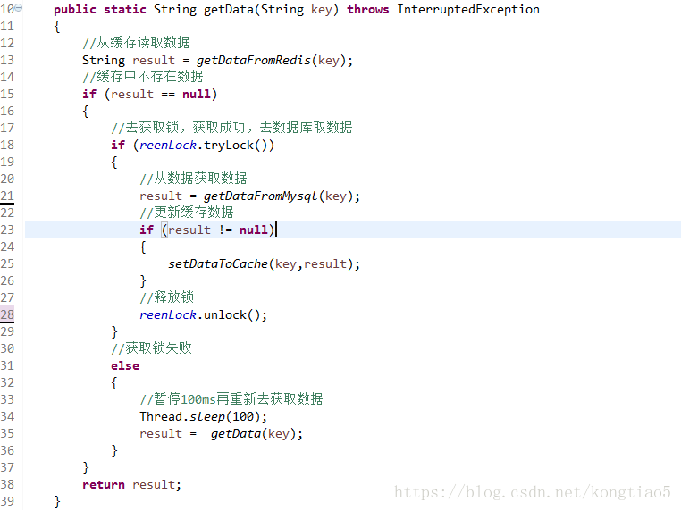

#### 缓存穿透和雪崩

一般请求会先去缓存中查找数据，如果缓存中没有才会去数据库。


> 缓存穿透 （主要是查不到数据）

如果一个数据在缓存和数据库中都没有，那就可以频繁的查询数据库，相当于穿透了缓存。

> 解决方案


从缓存取不到的数据，在数据库中也没有取到，这时也可以将key-value对写为key-null，缓存有效时间可以设置短点，如30秒（设置太长会导致正常情况也没法使用）。这样可以防止攻击用户反复用同一个id暴力攻击

> 缓存击穿

缓存击穿是指缓存中没有但数据库中有的数据（一般是缓存时间到期），这时由于并发用户特别多，同时读缓存没读到数据，又同时去数据库去取数据，引起数据库压力瞬间增大，造成过大压力。

> 解决方案

1、设置热点数据永远不过期。

2、接口限流与熔断，降级。重要的接口一定要做好限流策略，防止用户恶意刷接口，同时要降级准备，当接口中的某些 服务  不可用时候，进行熔断，失败快速返回机制。

3、布隆过滤器。bloomfilter就类似于一个hash set，用于快速判某个元素是否存在于集合中，其典型的应用场景就是快速判断一个key是否存在于某容器，不存在就直接返回。布隆过滤器的关键就在于hash算法和容器大小，

4、加互斥锁，互斥锁参考代码如下：



> 缓存雪崩

 缓存雪崩是指缓存中数据大批量到过期时间，而查询数据量巨大，引起数据库压力过大甚至down机。和缓存击穿不同的是，缓存击穿指并发查同一条数据，缓存雪崩是不同数据都过期了，很多数据都查不到从而查数据库。

> 解决方案

```
缓存数据的过期时间设置随机，防止同一时间大量数据过期现象发生。
如果缓存数据库是分布式部署，将热点数据均匀分布在不同搞得缓存数据库中。
设置热点数据永远不过期。
```
